# BrickAtlas Case、Ground Truth 与模型测试说明

日期：2026-09-14

本文统一解释 BrickAtlas 中“积木”“结构”“任务”“case”“模型调用”和
“操作回放”的含义，并介绍新增 curated 案例的用途。所有数量来自冻结
manifest 或当前生成器，不把派生题数写成独立积木数。

## 一、先回答数量问题

### 1. Casebank v2 的 117,910 是什么

它不是 117,910 个不同积木模型，也不是 117,910 块零件，更不是
117,910 次大模型调用。

| 统计单位 | 实际数量 | 含义 |
| --- | ---: | --- |
| 源结构（source object） | **5,120** | 5,120 个不同的完整装配结构 |
| 源结构中的零件实例 | **119,070** | 把 5,120 个结构里的已放置零件相加；平均 23.26 件/结构 |
| 目录零件类型 | **25** | 可用的矩形 brick/plate 型号 |
| 任务变体 | **66,710** | 每个结构 13 个操作变体，另加 150 个目录题 |
| 任务条件 case | **117,910** | 同一变体在普通图像、分层图或符号输入下可形成不同 case |
| 已知目录题 | **150** | 25 种零件 × 6 种颜色 |

精确关系是：

```text
5,120 个源结构 × 23 个任务条件 + 150 个目录题 = 117,910 cases
```

所以，一个 `case` 表示“某个源结构上的某项任务，在某个信息条件下的一次
可评分题目”。同一座桥可以同时产生重建、补全、改色、装配规划等多个 case，
这些 case 共享源结构，不能当成彼此独立的 11 万多个对象。

### 2. 每个源结构为什么有 23 个 case

| 任务 | 每个源结构的变体/条件 | case 数 |
| --- | --- | ---: |
| relations | 接触、分离 | 2 |
| reconstruct | ordinary、layers、symbolic | 3 |
| generate | 约束生成 | 1 |
| complete | ordinary、layers、symbolic | 3 |
| edit | 旋转、改色、删除 | 3 |
| plan | 装配、拆解 | 2 |
| repair | 无故障、错色、偏移，各自有 ordinary/layers/symbolic | 9 |
| 合计 | 13 个操作变体，展开信息条件后 | **23** |

另有 150 个 `parts` 目录识别题，不依附于 5,120 个装配结构。

全库按任务计数：

| 任务 | case 数 |
| --- | ---: |
| parts | 150 |
| relations | 10,240 |
| reconstruct | 15,360 |
| generate | 5,120 |
| complete | 15,360 |
| edit | 15,360 |
| plan | 10,240 |
| repair | 46,080 |
| 合计 | **117,910** |

## 二、新增 curated 案例有多少

当前 `curated-casebank-1` 是与 v2 分离的人工设计校准层：

- **12 个完整源结构**，easy/medium/hard 各 4 个。
- 合计 **193 个已放置零件实例**。
- **8 个正式任务示例**，八类任务各 1 个，全部有可机读 ground truth。
- manifest 管理 **264 个生成文件**；另外还有总览图、报告和 HTML 入口。
- 这些案例尚未并入 v2 的 117,910，也没有伪装成新的大规模模型实验。

若以后对 12 个结构完整套用 v2 的 23 条条件矩阵，会得到
`12 × 23 = 276` 个结构任务 case；这是可执行的扩展方向，**当前实际发布量仍是
8 个 curated 任务 case**。若只做八任务各一题的最小交叉，则是 96 题。

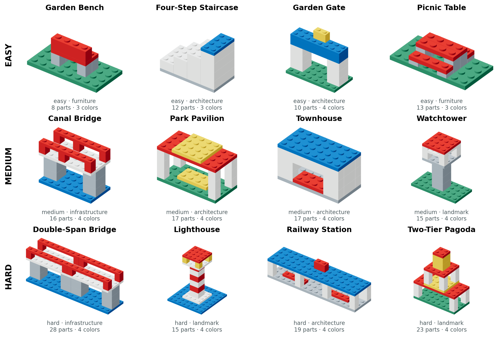

## 三、12 个结构分别做什么

| 难度 | 结构 | 主要用途 |
| --- | --- | --- |
| easy | Garden Bench | 零件识别；低遮挡、短支撑链 |
| easy | Four-Step Staircase | 递增高度、重复模块和顺序依赖校准 |
| easy | Garden Gate | 多视图重建；左右对称、中央开口、跨接梁 |
| easy | Picnic Table | 家具语义、上下层功能和前后对称 |
| medium | Canal Bridge | 补全；保留桥面和桥墩，只恢复缺失护栏 |
| medium | Park Pavilion | 多解约束生成；四柱支撑、开放内部 |
| medium | Townhouse | 封闭外壳、门洞和遮挡结构 |
| medium | Watchtower | 接触、上下和最短连接路径查询 |
| hard | Double-Span Bridge | 28 件装配规划与“先封顶后堵塞”的死路 |
| hard | Lighthouse | 错位屋顶修复和故障零件定位 |
| hard | Railway Station | 整体顶棚改色，同时保持几何和非目标零件 |
| hard | Two-Tier Pagoda | 多层支撑、嵌套尺度和长依赖链 |

目前八任务的绑定是：

```text
parts       -> Garden Bench
relations   -> Watchtower
reconstruct -> Garden Gate
generate    -> Park Pavilion
complete    -> Canal Bridge
edit        -> Railway Station
plan        -> Double-Span Bridge
repair      -> Lighthouse
```

楼梯、野餐桌、住宅和宝塔用于补足样式、遮挡和难度覆盖，目前没有被重复计算成
额外任务 case。

## 四、任务输入与 Ground Truth

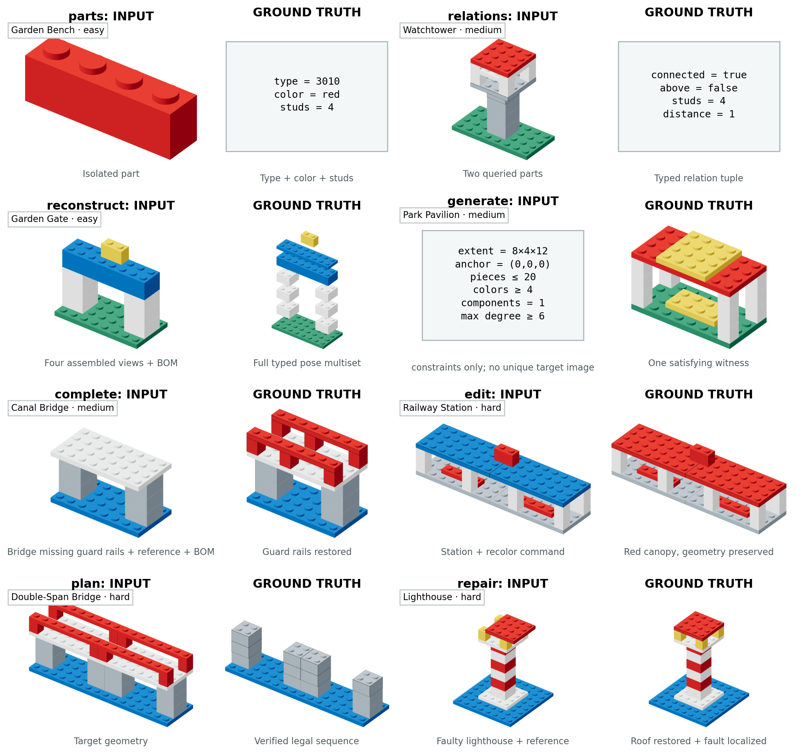

八类任务并不都要求“输出同一张积木图”：

| 任务 | 模型输出 | 正确性定义 |
| --- | --- | --- |
| parts | `partId/color/studs` 三字段 JSON | 三字段分别评分，并报告 exact |
| relations | 连接、上下、接触 stud 数、图距离 | 字段正确且类型合法 |
| reconstruct | 完整结构 JSON | 普通 RGB 按可见表面等价；layers/symbolic 要求完整结构 |
| generate | 任意合法结构 JSON | 满足尺寸、原点、件数、颜色、连通和分支约束；参考图仅是一个 witness |
| complete | 完整结构 JSON | 补齐目标、保持输入零件、增件集合正确 |
| edit | 修改后的完整结构 JSON | 指令生效且非目标区域保持不变 |
| plan | 全部零件 ID 的有序列表 | 按原顺序执行；合法前缀、覆盖率、重复和首个失败步骤均记录 |
| repair | 修复结构与 `faultIds` | 结构恢复、故障定位、正确区域保持；正常样本不得误报 |

Ground truth 包含的不只是最终图片，还包括精确零件类型、颜色、整数位姿、BOM、
连接关系、修改区域、保持区域、合法顺序见证和评分语义。图片用于观察和审核，
JSON 才是确定性 evaluator 的输入。

## 五、正确操作与错误操作

### 1. 正确的双跨桥装配

正确顺序先放水面基座和四组桥墩，再放两块桥面，最后安装护栏。每一步都经过
碰撞、下方 stud 支撑和竖直插入通道检查。

| 7/28：基座与低层支撑 | 14/28：桥墩完成 |
| --- | --- |
| 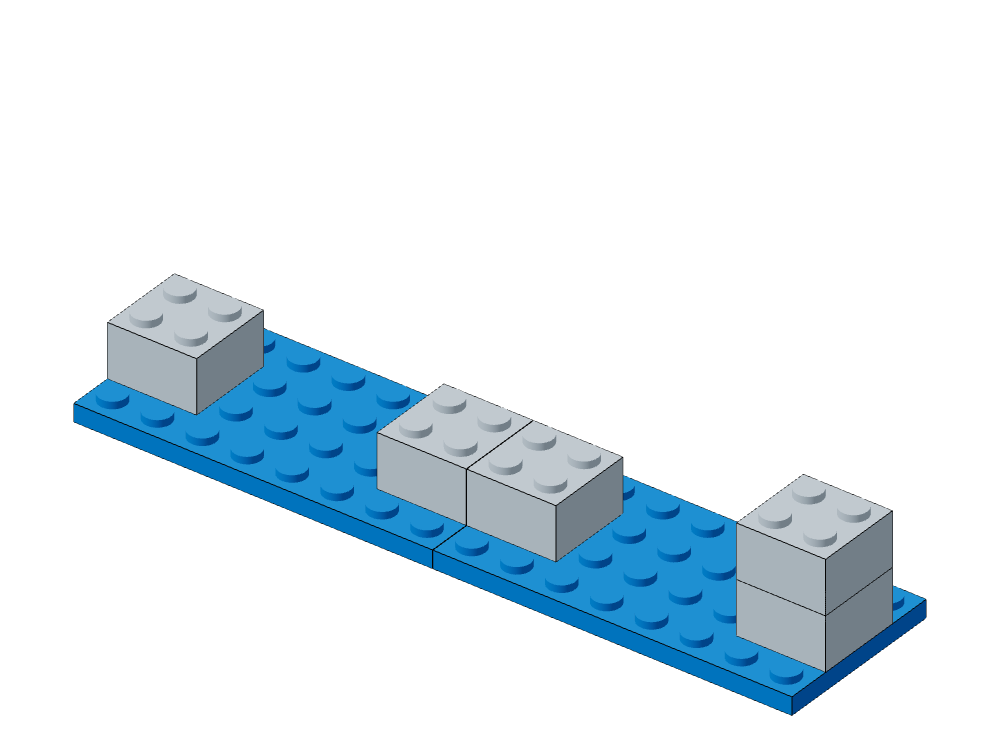 | 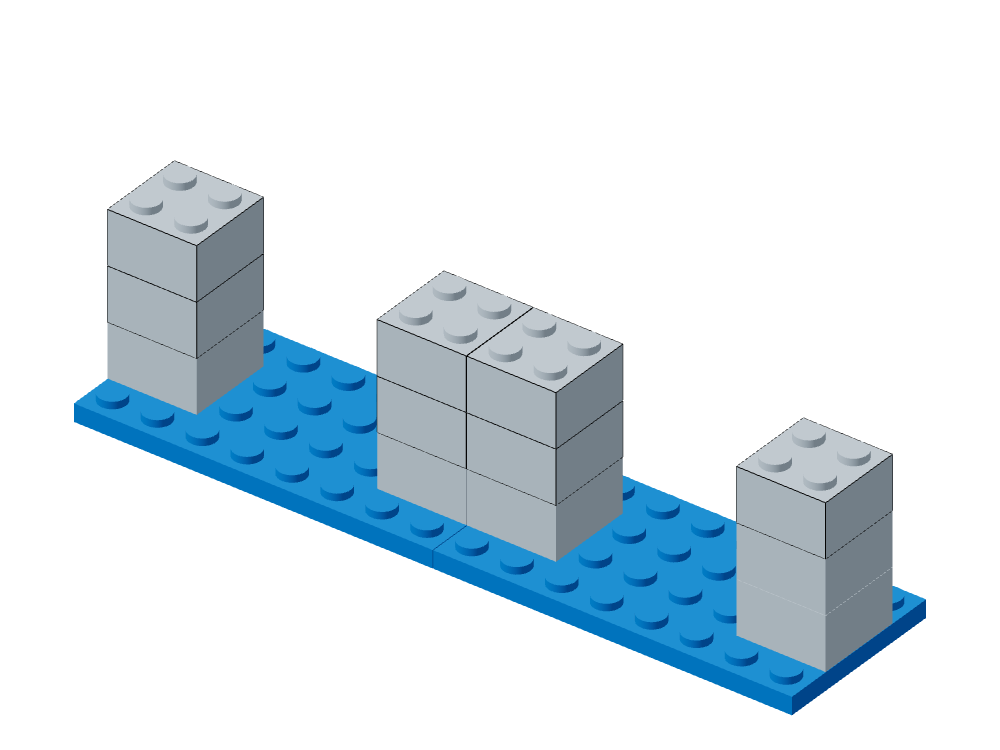 |

| 21/28：桥面与护栏柱 | 28/28：完整目标 |
| --- | --- |
| 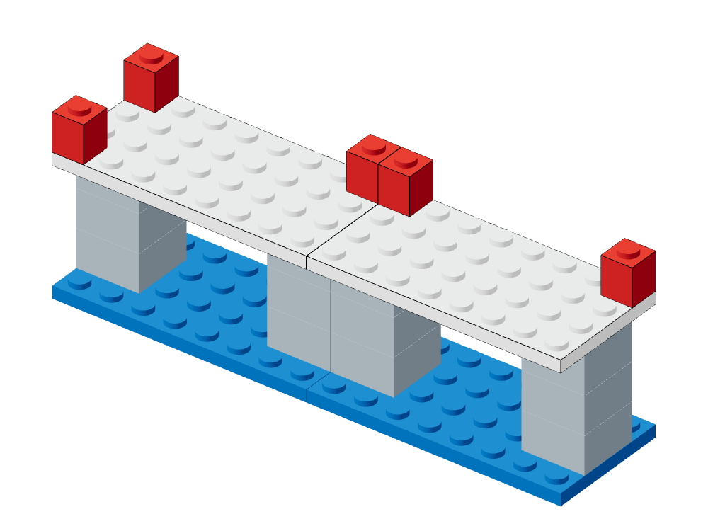 | 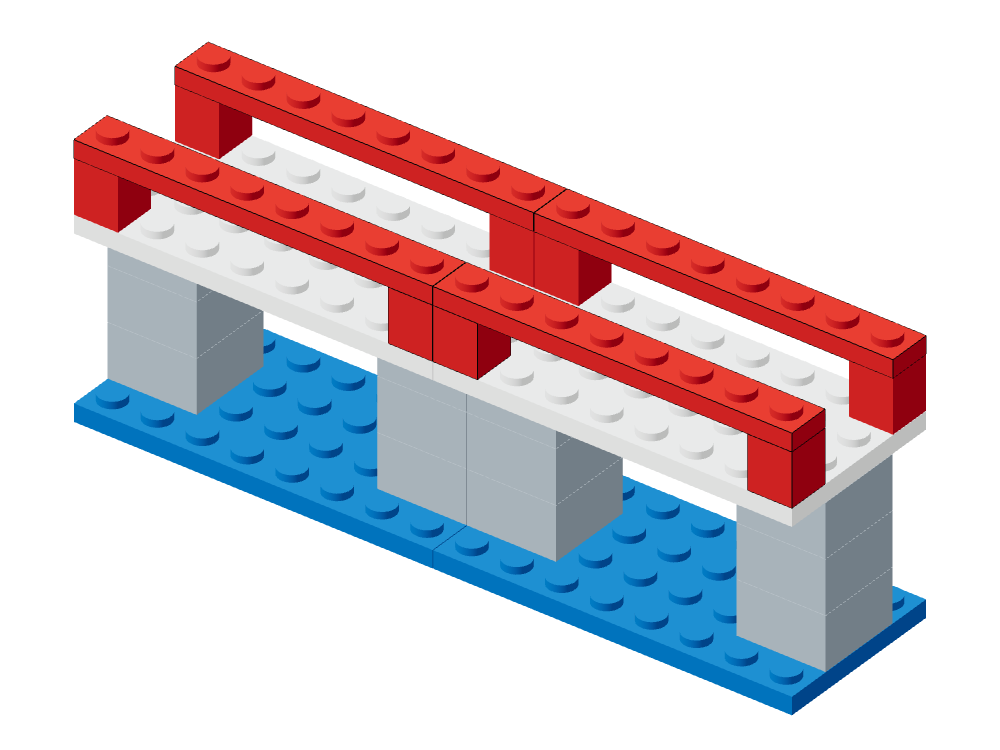 |

### 2. 错误操作：桥面安装过早

下面的错误前缀先靠外侧桥墩放入两块桥面。当前状态本身仍可保持，但内侧
`pier-4` 已无法从上方向下穿过桥面，执行器在该步返回 `blocked`。评测器不会
偷偷重排步骤或补放零件。

| 错误前缀：桥面过早封住通道 | 被阻挡的内侧桥墩 |
| --- | --- |
| 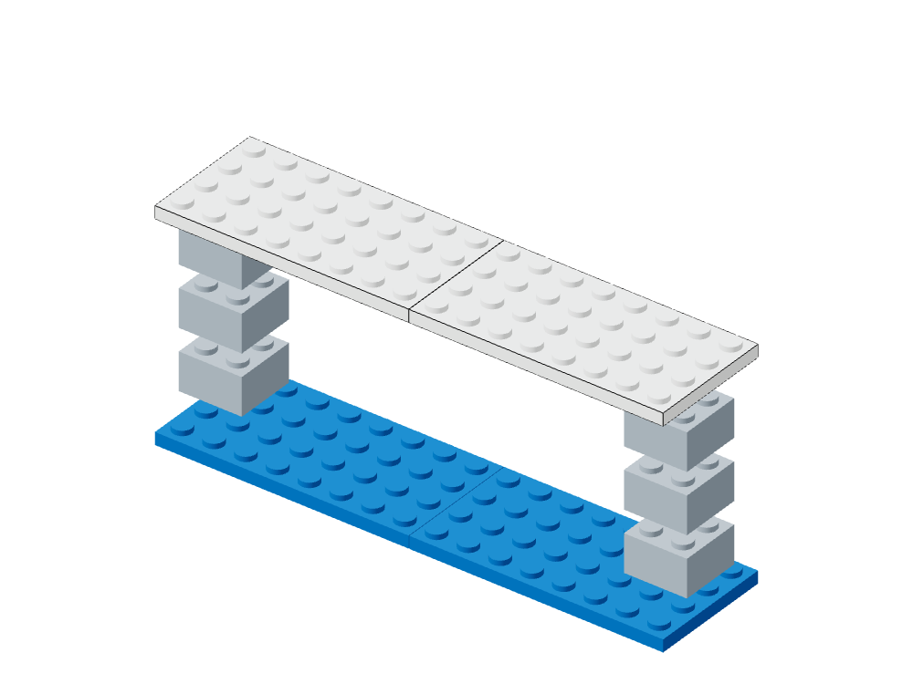 | 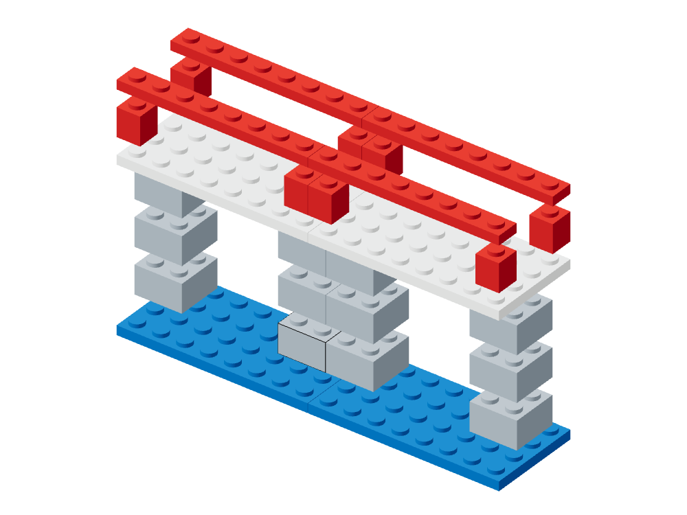 |

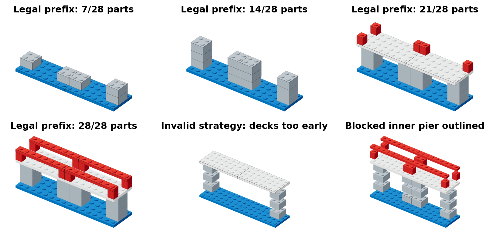

### 3. 补全、编辑和修复的正误边界

| 任务 | 输入 | 正确操作 | 典型错误 |
| --- | --- | --- | --- |
| complete | 桥面和桥墩已存在，护栏缺失 | 只增加全部护栏并保留现有件 | 重建桥面、移动桥墩、少加护栏 |
| edit | 蓝色车站顶棚 | 只把所有蓝色顶棚改红 | 漏改一块、移动结构、改到长凳 |
| repair | 灯塔屋顶偏移一 stud | 恢复屋顶位姿并报告 `roof-1` | 只修结构不定位、报错其他零件、正常样本误报 |
| generate | 六项硬约束 | 任一合法满足解均可 | 把参考 witness 当唯一答案，或尺寸/原点/连通性不满足 |

| 补全输入：缺护栏 | 补全 Ground Truth |
| --- | --- |
| 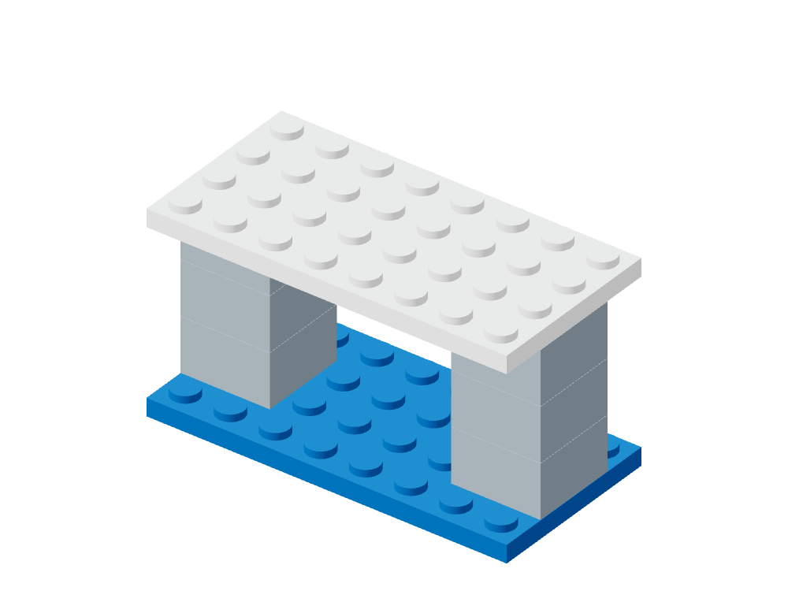 | 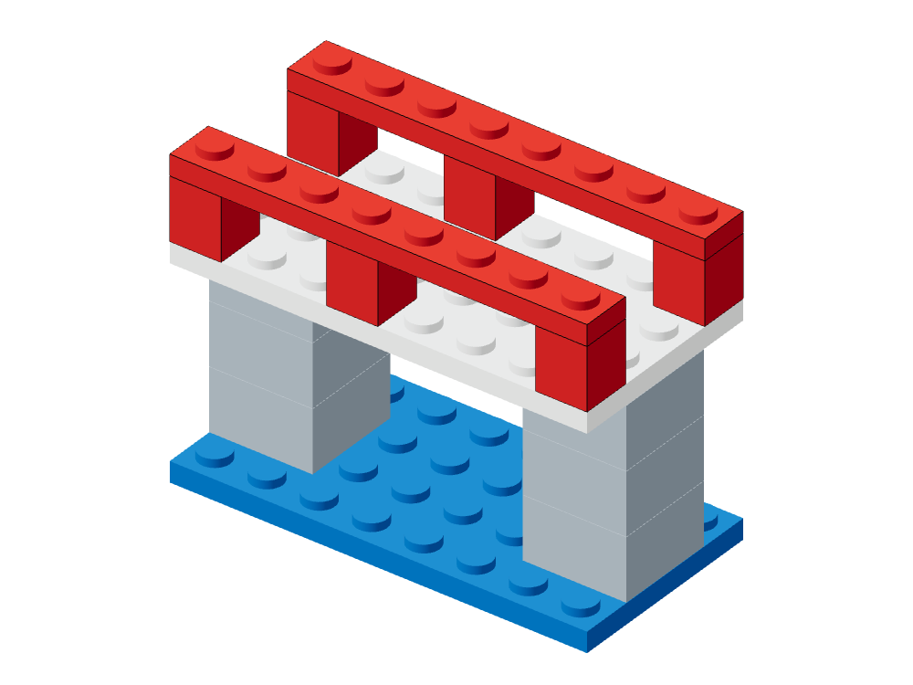 |

| 编辑输入：蓝色顶棚 | 编辑 Ground Truth：红色顶棚 |
| --- | --- |
| 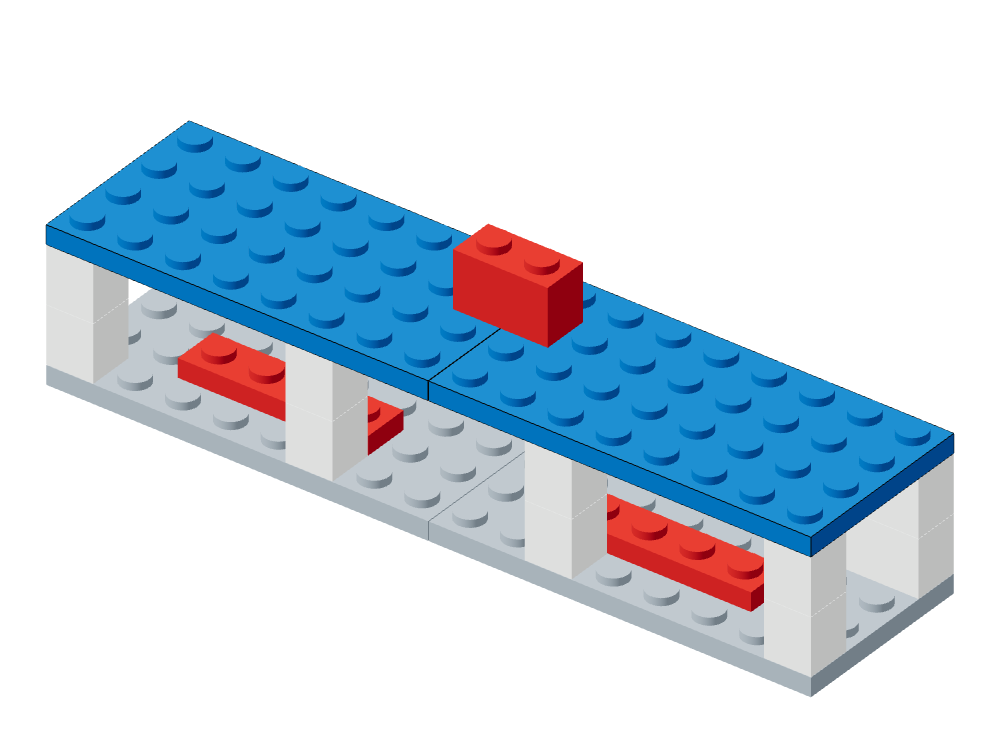 | 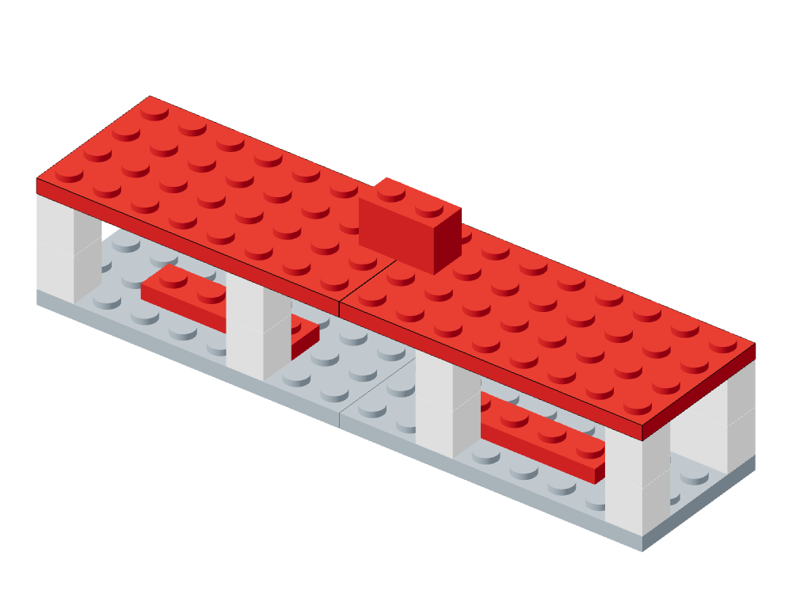 |

| 修复输入：屋顶偏移 | 修复 Ground Truth |
| --- | --- |
| 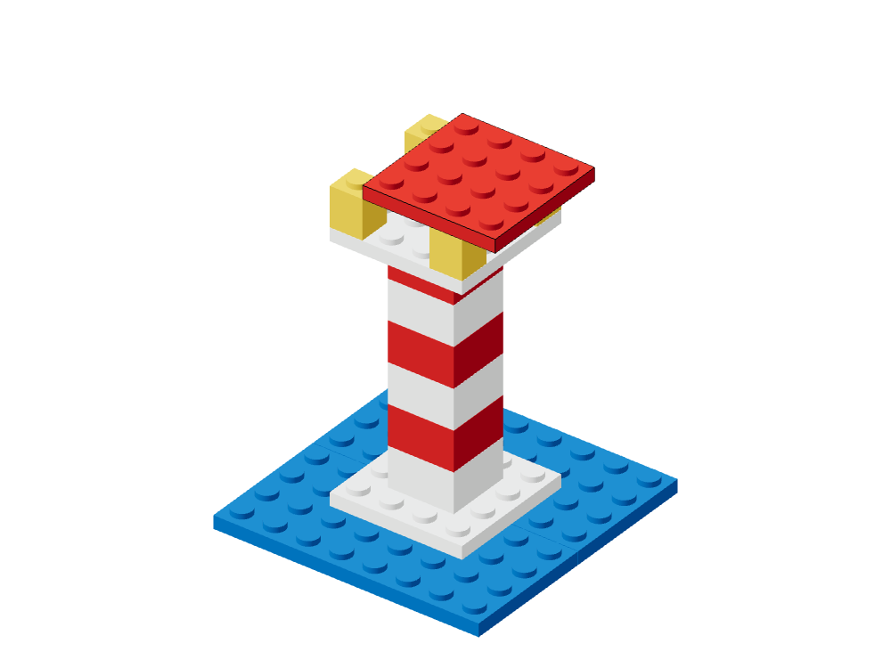 | 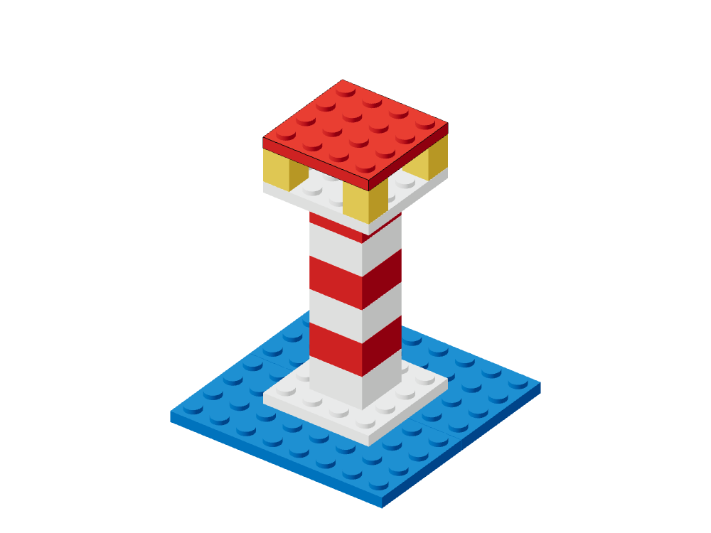 |

## 六、它是 QA，还是可操作环境

两种形式都存在，但必须区分。

### Casebank v2 与 curated：结构化答题

模型收到文本 JSON 和按条件允许的图像，返回一个 JSON 答案：

- `parts/relations` 接近结构化 QA。
- `reconstruct/generate/complete/edit/repair` 返回完整结构程序。
- `plan` 返回动作顺序，随后由确定性环境逐步执行。

接口包括：

```text
GET  /api/v2/cases
GET  /api/v2/cases/:id/input
POST /api/v2/evaluate
GET  /api/v2/evaluations/:run/trace?caseId=:id
```

模型看不到 `/truth`。测试场可以显示模型原始输入、原始响应、解析结果、当前结构、
目标结构、逐项指标和事件时间轴。

需要特别说明：对结构 JSON 的逐件展开是**事后可视化**，不能声称那是模型真实输出
的装配顺序。只有 `plan` 的 ID 序列会按模型提交顺序真实执行，并能看到在哪一步
碰撞、失去支撑或被竖直通道阻挡。

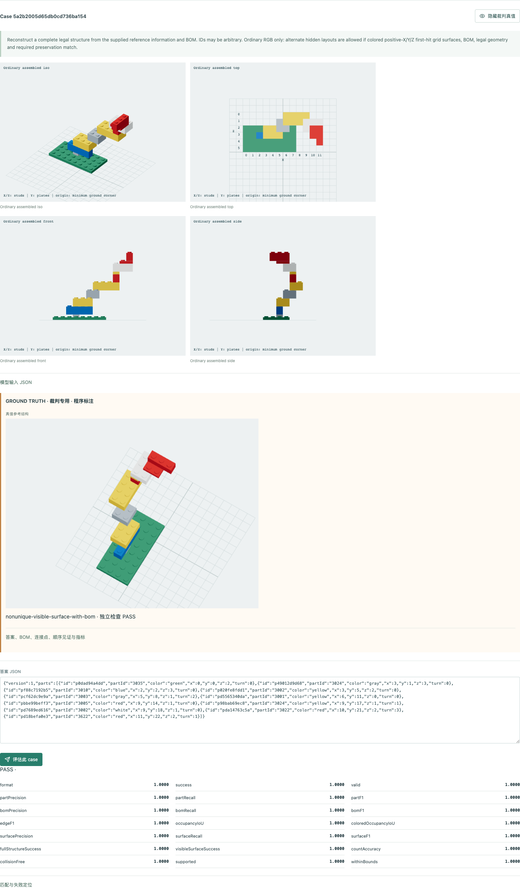

### CARE-mini：交互式操作

早期 CARE-mini 使用真正的 `Environment.step()` 循环，支持：

```text
look -> detach -> blueprint -> place/build -> finish
```

模型每轮看到当前观察和执行反馈，可改变视角、拆件检查、提交蓝图、逐件放置并在
故障后修复。测试场会重放记录的模型动作、环境接受/拒绝和最终评分。这是工具型
agent 接口，但仍是离散数字积木环境，不是机械臂控制。

## 七、文字模型、视觉模型和 VLA 怎么公平比较

原则不是“给所有模型强行完全相同的字节”，而是：

1. 同一种模型条件内，所有模型必须使用相同 case ID、图像、prompt、顺序和评分器。
2. 跨模态比较尽量共享同一源结构和任务，但输入权限必须单独标记、分表报告。
3. 不能把看过完整符号坐标的文字模型与只看外观图的视觉模型混成一个总分。
4. 工具反馈、重试和交互动作属于额外条件，不能并入 one-shot 成绩。

| 模型类别 | 合法输入 | 输出/动作 | 当前测试方式 |
| --- | --- | --- | --- |
| 文字 LLM | `symbolic` 完整结构，或本来就是文字的关系/编辑/规划约束 | 严格 JSON | 单独报告 symbolic/text 条件 |
| 视觉语言模型 VLM | ordinary RGB 或 layers，加同一公开 JSON/BOM | 严格 JSON | 同一 cohort 使用完全相同的冻结题目和图像 |
| 公开输入算法 | 只读 `PublicTask`，不得读取 oracle | 字段、结构或计划 | 与其支持的任务分项比较，不冒充 VLM |
| 工具型 agent | 图像、当前状态和目标盲合法性反馈 | 多轮 JSON 工具调用 | CARE-mini 单独协议与事件回放 |
| VLA/机器人 | 相机与机器人状态，连续控制或技能动作 | 真实/仿真控制 | **当前未实现，不能与上述成绩混报** |

当前论文八模型矩阵中的八个模型都是视觉语言模型。它们使用同样的 3 个源对象、
同样的 39 个 ordinary/default case、相同输入哈希和同一个 scorer；每个源对象
对应 13 个任务变体，不含目录零件识别。模型之间题目相同。

文字/结构训练结果来自单独实验条件。它与 RGB VLM 可以共享源对象和任务语义，
但输入信息不同，因此只做配对诊断，不能直接用一个合并总分宣称谁更强。

真正的 VLA 还需要增加机械臂状态、抓取点、连续运动、碰撞轨迹、扣合力和真实执行
成功判据。当前系统只有名义网格放置/移除，不能把可视化回放称为机器人实验。

## 八、当前可下的结论

- v2 是 5,120 个程序源结构和 117,910 个任务条件，不是 11 万多个独立积木模型。
- 新 curated 层解决了论文示例随机、颜色混乱和语义不清的问题，但目前只有
  12 个结构和 8 个任务示例。
- 八任务都有明确输入、输出和 evaluator；规划能真实回放顺序，其他结构输出的
  逐件动画仅是解释性展开。
- 同一 VLM 实验内使用相同题目；跨文字、视觉、工具条件必须分开报告。
- curated 案例已经通过程序几何与 strict evaluator，但其“像不像真实物体”和
  难度标签仍需独立真人审核，不能用自动测试替代。

更详细的冻结数据说明见
[`suite/v2/REPORT.zh-CN.md`](suite/v2/REPORT.zh-CN.md)，
指标公式见 [`suite/v2/METRICS.md`](suite/v2/METRICS.md)。
