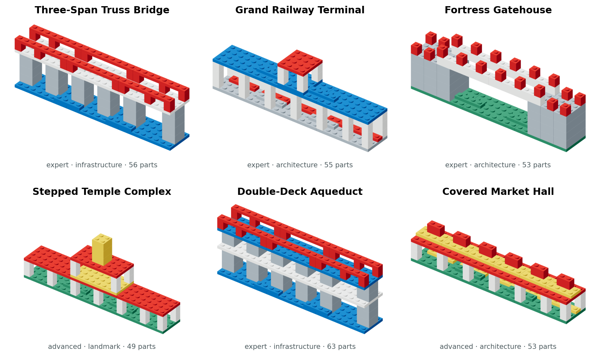
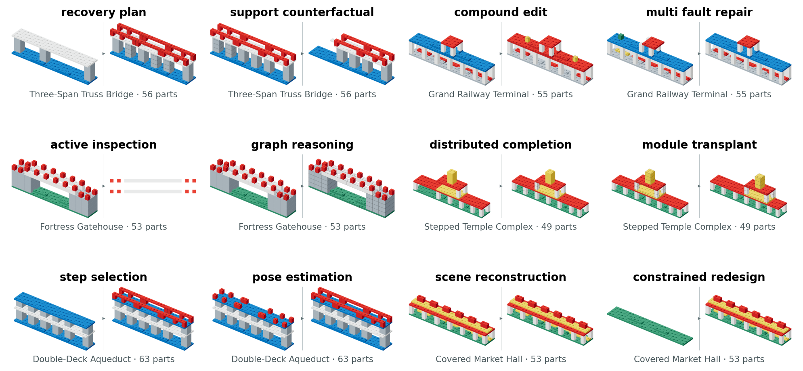

# BrickAtlas 难度升级与 Challenge Casebank 报告

日期：2026-09-14

## 一、结论先行

用户对旧任务的判断是正确的：单步改色、删件和无故障修复过于基础，不应继续作为
BrickAtlas 的主要难度证据。

现有 24 源对象实测中：

| 任务 | GPT-4.1 mini | Gemini 2.5 Flash | 结论 |
| --- | ---: | ---: | --- |
| edit / recolor | 24/24 | 24/24 | 已饱和 |
| edit / remove | 24/24 | 24/24 | 已饱和 |
| repair / no fault | 21/24 | 17/24 | 接近天花板 |
| repair / wrong color | 4/24 | 6/24 | 尚有区分度 |
| repair / shifted pose | 0/24 | 0/24 | 困难 |
| reconstruct / ordinary RGB | 0/24 | 0/24 | 地板效应 |
| complete / ordinary RGB | 0/24 | 0/24 | 地板效应 |
| plan / assemble | 1/24 | 12/24 | 模型间有差异 |

但当前规划域又被确定性高度排序算法做到 `10,240/10,240`，说明“模型失败”部分来自
接口、坐标和长 JSON，而不是强搜索问题。继续复制简单改色题不会增加研究贡献。

因此本轮新增 `brickatlas-challenge-casebank-1`，把重点从单步操作升级为：

1. 大结构上的长程恢复规划；
2. 多故障联合定位和修复；
3. 多条指令的原子执行与保持约束；
4. 非后缀、跨层缺失的分布式补全；
5. 子装配整体变换；
6. 候选零件选择与精确位姿；
7. 反事实支撑传播和长程图推理；
8. 主动检查和库存约束下的多解设计。

旧 v2、旧模型分数和 12 个 curated 校准对象全部保持不变。

## 二、和 BrickNet 等工作的差距

### BrickNet

[BrickNet](https://arxiv.org/abs/2604.22984) 面向复杂 LDraw 生成，公开论文报告
320,808 个样本、9,743 个零件变体和 40,549,969 个放置零件，并建模 stud、hinge、
axle、ball、fixed 五类连接。它的贡献是大规模人类设计数据、typed connectors、
图程序表示和自回归生成。

BrickAtlas 当前只有 25 种矩形 brick/plate、整数 stud/plate 网格和竖直装拆。
即使新增 63 件结构，也不能声称在零件多样性、真实对象规模或连接器表达力上接近
BrickNet。

### BrickGPT

[BrickGPT](https://arxiv.org/abs/2505.05469) 研究文本到积木结构生成，StableText2Brick
包含 47,000+ 稳定结构、28,000+ 唯一 3D 对象和 21 个类别，并使用物理稳定性分析、
拒绝采样与 rollback。它还展示了人工和机器人装配。

BrickAtlas 的单 stud 支撑、碰撞和竖直通道只是名义规则，不是力学稳定性分析。
因此我们的约束生成不能替代 BrickGPT，也不能使用“物理稳定”作为当前结论。

### BC-Bench / Brick-Composer

[BC-Bench](https://arxiv.org/abs/2606.05445) 把装配拆成逐步选件和 3D 位姿估计，输入
说明书、当前装配状态和候选零件。论文报告 80 个人类设计对象约产生 3K 步监督，
合成对象覆盖 20–100 件并产生约 40K 步；基础 MLLM 的严格步骤成功接近 0%，训练后
平均约 15%，峰值约 42%。

本轮为此补充 `step-selection` 和 `pose-estimation`，但尚未适配 BC-Bench 资产或
复制其成绩。不同零件库和输入协议下的数字不能直接横向排名。

## 三、BrickAtlas 的目标应是什么

BrickAtlas 不应把自己定位成“比 BrickNet 生成更漂亮模型”的生成器。合理目标是：

> 在同一结构上，用受控信息条件、结构扰动和可执行环境，测量模型从感知、关系推理、
> 状态修改到动作执行和错误恢复的可靠性，并明确哪些失败来自观察不足、输出表示、
> 规划顺序或环境反馈。

与生成数据集相比，核心差异应是：

- **共享源对象**：同一对象跨重建、补全、编辑、规划、修复，避免任务数据各自为政。
- **干预式任务**：单故障、多故障、模块移动、支撑删除和死路恢复都有明确前后状态。
- **信息条件**：ordinary RGB、layers、symbolic 和主动检查分开，不混榜。
- **原顺序执行**：规划按模型顺序逐步执行，系统不替模型排序。
- **多解合同**：约束生成按合法性和要求评分，不强迫复制一个参考答案。
- **可审计回放**：模型响应、解析、环境动作、拒绝原因和最终评分分开保存。

## 四、新增大结构

本轮新增 6 个原创结构，合计 329 个零件实例：

| 结构 | 件数 | 层级 | 主要难点 |
| --- | ---: | --- | --- |
| Three-Span Truss Bridge | 56 | expert | 三跨、六组桥墩、死路恢复 |
| Grand Railway Terminal | 55 | expert | 重复站台、长顶棚、钟楼 |
| Fortress Gatehouse | 53 | expert | 双塔、长图路径、遮挡 |
| Stepped Temple Complex | 49 | advanced | 双层子装配、分布式缺失 |
| Double-Deck Aqueduct | 63 | expert | 两层支撑、重复 bay、选件与位姿 |
| Covered Market Hall | 53 | advanced | 53 件重建、库存约束多解设计 |

范围从上一层的 8–28 件提高到 **49–63 件**。所有结构：

- 连通、无碰撞、无悬空；
- 通过主检查器和独立 cell 检查器；
- 存在逐件竖直插入的完整合法顺序；
- 仍限制为 25 种矩形零件和最多 64 件。

## 五、12 个高级任务

| 新任务 | 输入 | 输出 | 主要能力 |
| --- | --- | --- | --- |
| recovery-plan | 合法但被桥面封死的中间状态、目标 | remove/place 动作序列 | 回退、重规划、长程执行 |
| support-counterfactual | 完整桥、同时移除的两组支撑 | 级联失去支撑的 ID 集合 | 反事实、因果传播 |
| compound-edit | 55 件车站和三条编辑指令 | 完整目标结构 | 多指令绑定、保持 |
| multi-fault-repair | 错色、错位、额外件同时存在 | 修复结构和三个 fault IDs | 联合诊断 |
| active-inspection | 初始视图和不同成本的查询 | 最小查询及答案 | 信息获取、成本意识 |
| graph-reasoning | 53 件连接图与两个查询点 | 最短路径和 articulation IDs | 全局拓扑 |
| distributed-completion | 两层八根柱子分散缺失 | 完整结构 | 非后缀补全 |
| module-transplant | 上层亭阁 ID 集与平移指令 | 完整结构 | 子装配级变换 |
| step-selection | 当前 43 件状态和 9 个候选 | 所有合法下一件 | 细粒度选件 |
| pose-estimation | 当前状态、指定重复桥墩、参考视图 | `x/y/z/turn` | 精确定位 |
| scene-reconstruction | 四视图、BOM、53 件市场 | 完整结构 | 大场景对应 |
| constrained-redesign | 库存、固定基础、尺寸和覆盖约束 | 任一满足解 | 多目标多解设计 |

## 六、正确和错误操作

### 死路恢复

`recovery-plan` 的初始状态本身合法，但桥面已经放在缺失的内侧桥墩上方。直接继续
放桥墩会被判 `blocked`。正确 oracle 必须：

1. 移除三块桥面；
2. 按从低到高补齐缺失桥墩；
3. 重新安装桥面和接缝；
4. 完成护栏。

评分逐动作执行，记录合法前缀、第一处拒绝和最终结构；只提交最终桥图不能通过。

### 多故障修复

车站同时包含：

- `bench-1` 错色；
- `clock-roof-1` 平移一 stud；
- `intruder-1` 为额外零件。

模型必须同时修复结构并返回全部三个当前错误 ID。少报一个故障、只返回正确终态但
不定位，或误改无关站台件都不能 exact success。

### 分布式补全

旧 completion 删除数组末端的一段，容易形成“补后缀”捷径。新任务从寺庙上下两层
分散移除 8 根柱子，保留的零件顺序不能暴露缺失集合。评分同时检查补件 F1、原结构
保持和完整目标。

### 选件与位姿

Double-Deck Aqueduct 在 41 件主体完成状态下提供 9 个外观相同或相似的候选：
6 个当前可合法插入，3 个因下层未安装而悬空。另一个任务固定所选桥墩，只要求精确
预测 `x/y/z/turn`，避免把选错零件和位姿错误混成同一种失败。

## 七、模型怎么测

### 现有结果能说明什么

- 简单改色和删除已饱和，保留为 sanity check，不再作为主挑战。
- 普通 RGB 重建和补全全零，存在地板效应；仅增加零件数不会自动提高测量质量。
- 错位修复和规划仍有难度，但旧规划被高度排序完全解决。
- 八模型三对象矩阵只能说明开发样本表现，不能建立稳定模型排名。

### Challenge 层的冻结测试计划

所有模型应使用同一 12 个 task ID。结果表在执行前保持空值：

| 模型/方法 | Recovery | Counterfactual | Compound | Multi-fault | Inspect | Graph | Completion | Module | Selection | Pose | Recon. | Redesign |
| --- | --- | --- | --- | --- | --- | --- | --- | --- | --- | --- | --- | --- |
| GPT-4.1 | — | — | — | — | — | — | — | — | — | — | — | — |
| Gemini 2.5 Flash | — | — | — | — | — | — | — | — | — | — | — | — |
| Qwen3-VL-32B | — | — | — | — | — | — | — | — | — | — | — | — |
| Claude Haiku 4.5 | — | — | — | — | — | — | — | — | — | — | — | — |
| BrickAtlas symbolic/search baseline | — | — | — | — | — | — | — | — | — | — | — | — |

破折号表示**尚未运行**，不是 0 分。运行前还需冻结模型版本、图像输入、最大输出、
费用上限和失败处理；不能用旧 39 题结果填入新表。

文字模型只运行 symbolic/graph/constraint 条件；VLM 运行 RGB 或 layer 条件；
交互 agent 运行 recovery/inspection 条件。不同权限分别报告，不合并成一个排名。
当前仍无真实 VLA/机器人轨迹。

## 八、评分升级

新 evaluator 除 exact success 外，分别记录：

- `recovery-plan`：合法前缀、动作完整性、最终 exact；
- `support-counterfactual`：级联集合 exact；
- `compound-edit`：目标 exact、修改区域和保持区域；
- `multi-fault-repair`：结构 exact 与 fault set exact；
- `active-inspection`：查询成本与答案；
- `graph-reasoning`：路径长度和 articulation 集合；
- `distributed-completion`：补件与保持；
- `module-transplant`：模块内部关系和非目标保持；
- `step-selection`：合法候选集合；
- `pose-estimation`：位置与朝向；
- `scene-reconstruction`：部件、边、占用和 exact；
- `constrained-redesign`：合法性、尺寸、库存、基础保持、屋顶覆盖和颜色角色。

所有 12 个 oracle 已通过，新加入的近错答案测试必须失败。

## 九、仍然不能声称

这次升级提高了结构规模和推理链长度，但没有解决以下差距：

- 没有 BrickNet 的数千 LDraw 零件和 hinge/axle/ball/fixed 连接；
- 没有 BrickGPT 的力学稳定性求解；
- 没有 BC-Bench 的真实说明书资产和完整人类设计训练规模；
- 没有真人难度校准、外部许可结构和独立确认集；
- 没有真实机器人或 VLA 控制。

所以新的论文定位应是“受控、跨任务、可干预、可执行并可审计的结构推理压力测试”，
而不是“大规模真实 LEGO 生成数据集”。
