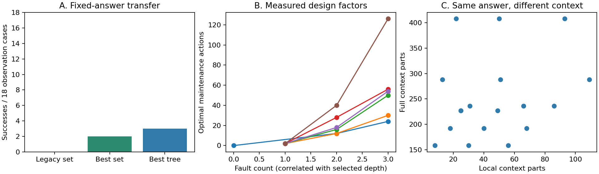

# Diagnostic-2：按审稿意见进行的机制修订

## 结论与研究目标

本轮不是再堆积木数量，而是修正“模型做对题是否意味着理解了结构”的测量机制。
核心问题收敛为：**同一对象上的诊断、访问集合与维修动作，是否正确且相互一致？**
目前只有算法和构造控制的证据，不宣称已经发现学习模型的新能力矛盾。

一致性本身已有[GQA](https://arxiv.org/abs/1902.09506)及
[CVPR 2022组合问答一致性研究](https://openaccess.thecvf.com/content/CVPR2022/papers/Jing_Maintaining_Reasoning_Consistency_in_Compositional_Visual_Question_Answering_CVPR_2022_paper.pdf)。
本项目区别仅在可执行维修约束，不能再把“一致性”换个名称当成领域空白。

新版本为 `brickatlas-diagnostic-2`，输出独立放在 `diagnostic-v2/`。
旧11万题、Frontier-1源码和成绩不改写；Frontier-1两个固定模板缺陷在本文公开承认。
仍使用6个原创设计来源。新增局部视图、难度层次和图像条件，不增加独立源对象数量。

## 对审稿缺陷的逐项处理

| 审稿问题 | 已落地改变 | 本轮证据与剩余限制 |
|---|---|---|
| 隐藏集合和查询树可用固定答案拿满分 | 隐藏槽位数、相关候选约束、扫描方向/位置/范围/代价变化；返回值由实际几何计算，不公开返回表 | 旧集合0/18；本批最优固定集合2/18、固定策略树3/18。是已枚举答案间的迁移审计，不证明消除了所有捷径 |
| 新版没有视觉输入 | 维修与混合位姿修复都有符号/标定分层图像两轨；图像轨不提供目标JSON | 36个图像维修条件的已知渲染器基线通过36/36；混合位姿图像基线尚未测。不能称纯RGB场景理解：当前结构仍以JSON给出 |
| 408件可能只是在测试长上下文 | 每个维修配置有局部/完整场景对照；故障、最优动作与正确输出完全相同 | 18对自动验证；可直接测无关上下文影响。尚未做学习模型的长度控制实验 |
| 任务成功不能代表跨任务一致 | 新增诊断、访问、执行三个子分数，一致性，以及全部正确且一致的联合指标 | “一致但全错”和“执行正确但诊断矛盾”均有负对照；支持三阶段独立请求合并评分 |
| 调度用串行高度排序也满分 | 2/4/8工位任务增加真实截止轮次要求，分别报告合法性与按期完成 | 串行捷径0/18；可行并行证书18/18。截止轮次由可行构造给出，不宣称全局最优 |
| 大结构题依旧只有简单改色 | 维修链先用颜色故障隔离访问/执行因素，另设平移、朝向、颜色混合补丁任务 | 12个混合位姿条件，包含6个图像条件。补丁不冒充从非法初始状态进行物理维修 |
| 缺少独立来源和人审 | 固定来源分组、预冻结输入哈希、独立阶段协议和真实人审空表 | 本轮没有外部数据采集或真人标签；代表性与抗污染性不能因此涨分 |
| 论文贡献与实验展示不一致 | 主文明确区分历史模型实测、本轮算法控制、新版未测模型；新增机制审计图与合同 | PDF更新并不构成CVPR接收证据，主实验仍需在新版重跑 |

## 版本组成

| 任务条件 | 数量 | 输入与输出 |
|---|---:|---|
| 维修能力链 | 72 | 6源×3层级×局部/完整×符号/分层图；输出诊断、访问证书和维修动作 |
| 隐藏结构可行集 | 18 | 完整候选几何、扫描定义及一个扫描观测；返回所有兼容候选 |
| 条件扫描策略 | 18 | 候选几何与扫描定义，无答案表；返回预算内覆盖所有世界的条件树 |
| 有截止轮次的调度 | 18 | 6源×2/4/8工位，输出合法并行批次 |
| 混合位姿补丁 | 12 | 6源×符号/分层图；定位并修正平移、朝向与颜色故障 |
| 合计 | **138** | 共用6个设计源，绝非138个独立对象 |

还导出了216份独立阶段题面：72个维修条件×诊断/访问/维修三个请求。
它们是同一评测的另一种调用协议，**不额外计入138条，也不能混合两种调用预算比较**。

## 难度不再只报件数

每个维修配置记录总件数、相关访问集合大小、故障数量、访问深度和最优动作数。
本轮局部上下文8–109件，完整上下文158–408件；最优维修0–126步，访问深度最高16。
0步是明确的无故障控制，不从平均分母中移除。

三级配置同时改变故障数量和选取的埋藏位置，因此**不是完全正交的难度实验**。
严格配对的是局部/完整条件：相同目标故障、相同访问闭包、相同最优答案，仅改变上下文。
图像/符号条件也配对，但信息编码不同，不能把性能差异全归因为视觉感知。



## 视觉条件究竟测什么

模型获得当前结构JSON，以及参考结构的全部bottom-Y顶视图。
每张图公开原点、坐标方向与每stud像素数，不显示参考实例ID。
不能访问目标JSON、私有答案或其他评测条件的图像。
执行器必须逐条隔离输入，不能把整个`public.json`传给被测模型，因为同一源的符号条件包含额外权限。

维护轨的几何固定、颜色故障有意保持初始结构合法，用于隔离诊断与访问执行。
已知渲染器控制只从PNG像素恢复颜色，再根据公开当前结构计算维修链。
它是显式的信号控制，不是通用视觉重建系统，也不是学习模型。
混合位姿补丁轨加入平移与旋转，目标仍只有图像；不能拿颜色控制的满分作为该轨成绩。
当前分层图是理想化、强披露的视觉条件，没有自然照片、遮挡不确定性或真实相机噪声。

## 新的观测机制

每题有2/3/4个可替换槽位。每槽的两种内部接缝布局具有相同占据体积和BOM。
中间层引入候选间的相关限制，完整候选世界数分别为4、6、16。
候选ID仍为共享的h0、h1等，没有靠跨题随机命名让常量基线“自动失败”。

扫描沿明确的X或Z截线读取砖块内部的连续段长度；同一零件的相邻格合并，
不同零件不能合并，空白输出gap。扫描范围、位置和代价随问题变化。
较宽扫描有时能同时揭示多个槽位，因此并非简单问完三个固定变量。

枚举求解器根据几何计算所有扫描分组，再做最坏代价决策树求解。
评分器对全部候选世界执行策略，拒绝超预算、未知查询、重复查询、缺失分支和错误叶子。
`ScanEpisode`另提供真实的query→返回观测→submit接口。
这仍是符号剖面观测，不是机器人拿相机移动，也不声称它是全新主动感知问题。

## 一致性和正确性分别报告

`diagnosisExact`：故障ID和修正零件正确。
`accessExact`：最小访问集合正确，并且提交顺序可执行。
`repairExact`：动作合法、库存守恒，最终目标和实例ID正确。
`minimumRepair`：完整修复且动作数达到该任务可证明下界。
`coherent`：预测诊断的访问闭包与提交访问集合、实际移除集合和补丁落点相容。
`allCorrectAndCoherent`：前三阶段正确、最小维修且相互一致。

“全部不操作”的三个答案可以相互一致但全错，因此不能只报一致性。
“诊断说没有故障，但维修正确”的回答可能执行得分高，却不能算联合理解成功。
目前这些现象由构造控制验证，不是已发现的模型行为。

## 复现与下一实验

```bash
npm --prefix benchmark run diagnostic:export
npm --prefix benchmark run diagnostic:render
npm --prefix benchmark run diagnostic:replay-render
npm --prefix benchmark run diagnostic:visual-control
npm --prefix benchmark run diagnostic:score -- diagnostic-v2/visual-predictions.json diagnostic-v2/visual-scores.json
npm --prefix benchmark run diagnostic:compose
node benchmark/paper/verify-diagnostic.mjs
```

完整结果格式为`[{id,answer}]`。独立阶段格式为`[{id,stage,answer}]`，
使用`diagnostic:score -- predictions.json scores.json --stages`。
未知ID、重复ID/阶段被拒绝，缺失答案和格式错误保留分母。
不同轨道单独汇总，不发布混合排行榜。
三维回放渲染需要运行中的suite服务；分层图、评分和其他校验无需API密钥。

下一轮在任何新模型调用前应固定每类输入/输出预算，验证最长合法答案能容纳，
记录截断、模型/provider、tokens、延迟及费用。先跑局部/完整、符号/图像和几何移除配对，
再判断失败来自信息、结构依赖或输出接口。

独立确认必须来自未参与任务设计的新对象。当前6源只能做开发和留一源诊断，
不能改名隐藏测试集。`human-review-template.json`全部留空，至少两个真实独立评审完成后
才报告人类正确率、耗时、相关性、难度和分歧；程序测试与子代理不能代替真人。

## 成果

- [新版案例浏览](diagnostic-v2/index.html)
- [公开题面](diagnostic-v2/public.json)
- [独立阶段题面](diagnostic-v2/stage-public.json)
- [捷径与配对审计](diagnostic-v2/audit.json)
- [冻结协议](diagnostic-v2/frozen-protocol.json)
- [论文](paper/main.pdf)与[附录](paper/supplement.pdf)

**本轮新增LLM/VLM推理为0。** 因此“任务机制改进、视觉输入可用、固定模板不再满分”
有实证支持；“具有良好模型区分度、外部代表性和独立人审有效性”仍未得到证明。
