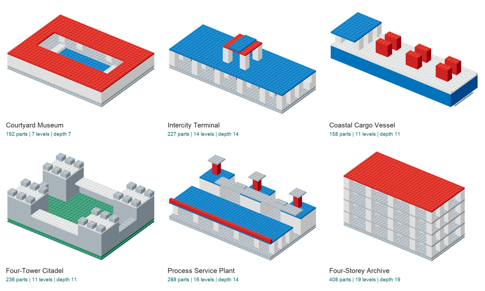

# BrickAtlas：相关工作核查与 Frontier 大结构升级

> 历史报告。后续审稿发现本版本隐藏集合/查询策略可跨六对象复用固定答案。
> 新评测请使用[Diagnostic-2修订报告](DIAGNOSTIC_UPGRADE.zh-CN.md)及新版本协议；
> 这里保留原始数据与当时结论，不代表上述问题已在本版本中修复。

日期：2026-09-15。新协议：`brickatlas-frontier-1`。旧 v2、curated 和 Challenge v2 不覆盖。

## 结论先行

**旧有“生成、重建、问答、装配、修复”任务名称不能证明新颖性；目前也没有证据说整个领域是空白。**
这次升级的研究定位是：在同一复杂结构上，把“诊断、最小干预、可执行维修、
资源预算、观测不确定性”连接起来，提供可重算的证书与跨任务一致性检查。
这是一个相对欠覆盖的组合协议，不是已经证明全球首创的新能力。

**旧版 117,910 题降为历史测量/回归数据，不计入本次新结构或新任务规模。**
原 12 个对象保留为基础示例，49–63件 Challenge 保留为中间层。
本次从头设计6个有纵深的大结构，合计 **1,509 件，48道任务**，每模型8类任务。
这些题共用6个源对象，不是48个独立对象，更不是新的十万级数据集。

## 调研：哪些别人已经做过

检索范围：截至本报告日期公开的论文、项目页和正式论文集。
重点检索 brick/LEGO assembly、budget、repair、active inspection、ambiguity、
physical understanding、planning，并沿直接相关工作交叉核查。
“本文没有报告某项”不等于“作者系统不能做”，更不能据此证明全领域不存在。

| 工作 | 已明确覆盖 | 对我们新颖性主张的约束 |
|---|---|---|
| [BrickNet，2026](https://arxiv.org/html/2604.22984v1) | 人工设计LDraw资产、任意连接语义、图程序生成；320,808样本、9,743零件变体 | 不能拿更多矩形积木或生成序列声称超过其结构丰富度 |
| [BrickGPT，2025](https://arxiv.org/pdf/2505.05469v2) | 文本生成、可搭建性、物理检查与回退、机器人示例 | “能生成稳定积木”不是空白，我们也没有其力学验证 |
| [BrECS，2024](https://arxiv.org/abs/2210.01021) | 预算感知的顺序生成/补全、多型号与约束检查 | 库存、件数预算本身不是创新；本轮区别是已有结构的等体积替代及可证最小件数 |
| [Break and Make，2022](https://arxiv.org/pdf/2207.13738.pdf) | 主动观察、拆卸理解、重新搭建；1,727模型、1,790形状 | “可以拆开看”“交互式装配”早已有，不能称首次 |
| [MEPNet，2022](https://www.jiajunwu.com/papers/lego_eccv.pdf) | 手册到机器计划、未见子装配的位姿推断、旋转对称 | 子装配、位姿和对称评分都有先例 |
| [TreeSBA，2024](https://www.ecva.net/papers/eccv_2024/papers_ECCV/papers/11535.pdf) | 多视图到顺序动作、连接树、自监督迁移 | 多视图装配和连接建模不是空白 |
| [BC-Bench / Brick-Composer，2026](https://arxiv.org/html/2606.05445v1) | 多样零件选件、精确位姿、世界反馈与训练 | 选件/位姿不能作为独有贡献，也不应与不同信息条件的成绩直接比较 |
| [LEGO-Puzzles](https://openreview.net/forum?id=jQh9SUrnev) | 11类VQA、多步空间推理、1–8步计划、图像生成 | 不能说“别人只有单步QA”；修订稿已包含规划 |
| [PhyBlock，NeurIPS 2025](https://proceedings.neurips.cc/paper_files/paper/2025/hash/9e97206b14d09c0da5c7fea47a67c6ac-Abstract-Datasets_and_Benchmarks_Track.html) | 分级能力、400装配与2,200 VQA、失败诊断、鲁棒性、反事实 | 诊断、反事实和难度分级均非独有；不能只增加任务名 |
| [LEGO Co-builder，2026修订版](https://arxiv.org/html/2507.05515v4) | 手册、指令、细粒度物体及状态检测 | 状态错误检测已有直接邻近工作 |
| [WorkBenchMark，2026](https://arxiv.org/html/2606.19358v2) | 400 Duplo任务、4档难度、装拆规划、运动规划、VLA比较 | 真实机器人与端到端装配不是空白；我们尚未实现 |
| [Eye-in-Finger，2025](https://arxiv.org/pdf/2503.06848.pdf) | 遮挡下高精度装拆与视觉误差校正 | 微小位姿修正不是全新能力；离散网格任务不能代替真实精密操作 |

## 相对欠覆盖的具体协议与本次落实

| 候选研究机会 | 本次可执行实现 | 保留边界 |
|---|---|---|
| 诊断后最小扰动维护，而不只是生成目标 | 同源的最小访问集合、合法拆除证书、最少动作维修；三者结果需一致 | 垂直动作下闭包可多项式求解，不伪称通用困难规划 |
| 从“一个GT”到全部可行隐藏接缝 | 每结构3个可替换底板、每板2种同BOM同占据布局，枚举8个完整世界 | 显式有限语法；不是开放世界所有结构，不宣称RGB像素不可分 |
| 最坏情况而非单次猜中的信息策略 | 条件查询树在全部8世界回放，最坏查询成本≤6 | 查询是符号观测表，不是真实机器人主动视觉 |
| 同一维修目标兼顾正确性与代价 | 10–50动作最优维修证书、超预算但最终正确也不通过 | 单位动作成本；没有抓取时间/力学成本 |
| 对现有结构做库存受限替代 | 大板缺货，混合小板库存，接缝可变但体积不变，要求最少件数 | 局部8×4铺砖仍是校准子问题，不包装成高难全局设计 |
| 同一对象的能力链条可核查 | service-plan移除集合与access-certificate一致性断言；公开输入算法独立求解 | 当前是算法一致性，不是已观察到模型跨任务一致 |

没有新增“通用力学”“真实VLA”“任意CAD连接”标签，因为没有实现和验证这些能力。
这些方向已有研究，而且需要新的资产许可、连接库、物理模拟/硬件和外部方法适配。

## 结构升级



| 模型 | 件数 | 底高层数 | 依赖深度 | X×Z占地 | 结构内容 |
|---|---:|---:|---:|---|---|
| Courtyard Museum | 192 | 7 | 7 | 32×24 | 四侧展廊、开放中庭、成对柱廊、中央水池 |
| Intercity Terminal | 227 | 14 | 14 | 40×16 | 深站台、连续雨棚、10座椅、独立高钟楼 |
| Coastal Cargo Vessel | 158 | 11 | 11 | 40×14 | 龙骨、加宽船体、封闭货舱、甲板、6组货物和驾驶台 |
| Four-Tower Citadel | 236 | 11 | 11 | 32×24 | 四座空心六层塔、围墙、步道和整齐垛口 |
| Process Service Plant | 288 | 16 | 14 | 40×24 | 三座空心设施塔、排气栈、服务连桥和后方检修廊 |
| Four-Storey Archive | 408 | 19 | 19 | 32×16 | 四个完整楼层、48个书架砖、分区楼板与顶盖 |

相对上一轮49–63件、进深4 stud，件数和纵深均实质增加。
但更大≠更难：支撑深度、维修闭包、动作数与资源预算逐项报告。
色彩按功能分配，每模型3–4色；没有随机颜色或为增加件数而随机插砖。
所有结构均通过两种实现的碰撞/支撑核验，以及连通性与合法装配验证。
这些检查只证实离散几何合法，不证实真积木承重、扣合力和外观的人类评分。

## 八类题目

1. **最小拆装修复**：定位埋在结构内部的目标，合法拆走所有阻挡件，再复装；10–50步。
2. **最小访问证书**：给出必须移除的最小集合及合法顺序，不能只列故障件。
3. **多工位依赖调度**：4个抽象工位，同批最多4件，所有下方遮挡依赖必须先完成；报告工期。
4. **最小支撑干预**：从候选集合选择最少强制删除，传播失去直接支撑的影响，并给出完整集合。
5. **库存受限替代**：用有限大小混合库存替代8×4板，零重叠、零孔洞且件数最少。
6. **隐藏接缝可行集**：根据局部披露列出全部兼容世界，不奖励猜中单个私有GT。
7. **条件检查策略**：提交根据观察分支的查询树，对全部世界执行并核算最坏成本。
8. **跨区域混合故障修复**：同时纠正平移、朝向、颜色问题，只输出必要补丁，保护其余结构。

[完整浏览入口](frontier-cases/index.html) · [每模型8题正反对照报告](frontier-cases/REPORT.zh-CN.md)

正式本轮48题是符号和有限观测任务，不冒充纯图像视觉评测。
三维、四视图、分层和爆炸图是审核资产；只有`*-public.json`中的字段允许进入模型输入。
VLM可参加同信息轨道，但不能把没有视觉输入的成绩称为视觉能力。
旧Challenge中的显式分层视觉题保留，尚未把512件新结构直接塞进未经审计的旧runner。

## 评分与实测范围

最优维修动作下界为`2 × 最小访问闭包大小`：每个阻挡件必须移除并复装，
故障件必须替换；当前动作语义不允许原地重涂或组移动。
反事实最小集合由公开候选的穷举求得。库存下界按可用板面积降序累计，
本批每题均有达到下界的合法铺砖，因此下界就是本批最优值。
调度只要求合法和完整，工期单列；**不声称基线全局最优，也不把多工位叫多机器人**。

本轮运行了公开输入算法与捷径控制，不调用付费模型API：

| 类别 | 公开输入算法 | 简单捷径 |
|---|---:|---:|
| 最小拆装修复 | 6/6 | 0/6，仅尝试放置故障件 |
| 最小访问证书 | 6/6 | 0/6，仅移除故障件 |
| 多工位调度 | 6/6 | 6/6，逐件高度排序合法但较慢 |
| 最小支撑干预 | 6/6 | 0/6，单候选猜测 |
| 库存替代 | 6/6 | 0/6，忽略缺货的四大板模板 |
| 可行隐藏集合 | 6/6 | 0/6，猜一个世界 |
| 条件检查策略 | 6/6 | 0/6，无查询猜测 |
| 跨区域修复 | 6/6 | 0/6，不操作 |

算法只接收公开导出字段，不读取GT或内部模块命名；原始结果、耗时和输入哈希见
[baselines.json](frontier-cases/baselines.json)。48对正反例均经过评分器。
公开求解器全部通过说明题目可解、协议可复算，不说明LLM已经被拉开差距。
**本轮新LLM/VLM实测=0，真人难度校准=0；模型结果继续留空。**

## 对论文贡献的判断

当前更可辩护的论点是“有显式信息边界、代价和一致性证据的维护诊断评测”，
不是“我们第一个让模型搭积木”，也不是“我们比BrickNet复杂”。
本轮提升了结构规模、模块纵深和任务合同覆盖，但没有足够证据提高真实应用代表性、
模型区分度或抗污染性分数。六对象仍是开发集；公开后不得改称隐藏测试集。

下一科学门槛是冻结新的独立设计来源、相同预算多模型与专用算法比较，
做盲法语义/难度人审，并实测同对象的诊断→维修一致性。
不能用本轮图集和可解性代替这些实验。

## 复现

```bash
npm --prefix benchmark test
npm --prefix benchmark run check
npm --prefix benchmark run frontier:publish
npm --prefix benchmark run frontier:compose
node benchmark/paper/verify-frontier.mjs
npm --prefix benchmark run frontier:score -- predictions.json scores.json
```

提交格式为`[{"id":"公开题面中的id","answer":{...}}]`。
评分器拒绝未知/重复题目ID；缺答和格式错误仍保留在每类6题的分母中。

产物：[论文](paper/main.pdf)、[完整附录](paper/supplement.pdf)、[文献库](paper/references.bib)。
