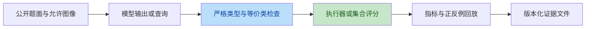
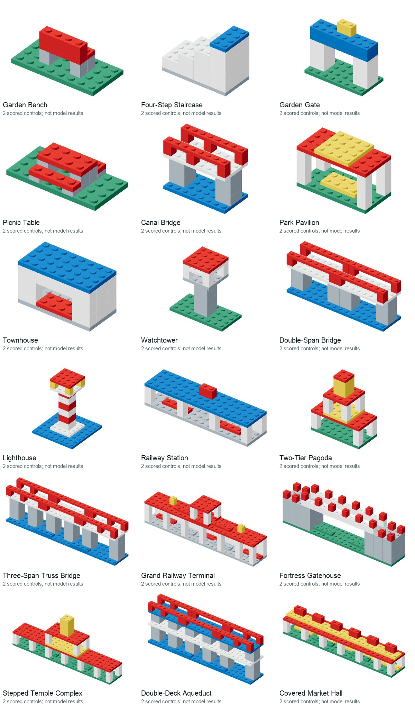

# BrickAtlas 审稿式九维度评估与全模型审核报告

日期：2026-09-14。基线版本：`374ca4a`。

## 结论

**当前是可审计的受控数字结构 benchmark，但不是成熟的综合真实积木能力 benchmark。**
最弱的是代表性、区分度和抗污染性，不能靠更多图或更多派生题提高分数。
本次首先修正可确认的输入/评分问题，再补全方法类别、引用、附录和全模型图集。
以下分数是基于产物的内部审稿判断，不是 CVPR 官方标准、真人评审或模型实测。

## 九维度评分

采用 10 分制：0=缺失；2=概念/极小演示；4=狭窄域内可运行；
6=多次验证但独立性不足；8=充分跨域/独立证据；10=长期外部验证。
不给平均“录用分”；严重的有效性缺口不能被工程分抵消。

| 维度 | 修订前 | 本次后 | 证据、限制和下一门槛 |
|---|---:|---:|---|
| 代表性/相关性 | 3 | 3 | 25 种矩形目录、整数网格；18 个设计模型主要是家具/建筑。无真实作业分布、复杂 CAD、真实力学或人审。新报告不增加代表性证据。 |
| 区分度/敏感性 | 2 | 2 | 改色/删件两模型各 24/24，普通重建/补全各 0/24；旧规划高度排序全解。Challenge 无新模型结果，不能预先涨分。 |
| 全面性/多维度 | 4 | 5 | 补充方法分轨、逐项 metrics、效率/显存缺失字段、36 对正反例。效率、鲁棒性仍缺充分同预算实测。 |
| 难度梯度 | 3 | 4 | 8–28 件校准层与49–63件压力层全部可查；每模型有case。难度仍是设计分层，非真人或IRT校准；尚无规模匹配对照。 |
| 可复现性 | 6 | 6 | 有固定源码、输入哈希、离线重放、PDF和oracle验证。无独立安装者复现，API温度0不保证返回一致。 |
| 公平性 | 4 | 6 | 修正候选坐标缺失、错误类型接受、方砖等价角度误判；完整目标任务增加分层观察。仍有专用方法适配与provider差异。 |
| 透明性/可审计 | 7 | 8 | 全5,120源结构可见、10,240真实case关联、18模型36对评分示例，版本缺陷公开。用户可读不等于模型允许访问裁判材料。 |
| 抗污染性 | 2 | 2 | 公开开发数据；完整几何分组不排除子装配复用或预训练污染。本次进一步公开图集，不会把它说成新隐藏集。 |
| 稳定性 | 5 | 7 | Challenge v1保留；v2新ID、公开输入文件、对称/格式/图算法回归测试；不把新旧分数横向混算。 |

**离投稿级证据仍有距离。** 下一轮最有价值的是在新来源上预冻结同预算模型评估、
独立人审和专用基线，而非再增加几十万条相关派生题。

## 已确认的问题与修复

两次独立代码复核均确认以下四项；均非真人审稿：

| 编号 | 问题 | 本次处理 |
|---|---|---|
| 1 | step-selection 的裁判使用候选位姿，但模型只收到型号/颜色/ID | 公开完整候选位姿；测试仅凭公开输入重算合法候选集合 |
| 2 | active-inspection 直接评分固定query/answer，没有真正返回查询观测 | 增加 `InspectionEpisode`：query→观测→answer；不同有效披露策略均可通过，成本单列 |
| 3 | challenge 调用旧decoder，数组型号/颜色会被隐式转为字符串 | 复用strict结构schema前置检查；旧v2实现不改动 |
| 4 | 1×1方砖只有turn=0被判正确 | 按目录footprint对称接受0/1/2/3；非法turn和错位仍拒绝 |

另有一项风险：外观图是否足以确定完整隐藏结构。没有构造出满足全部条件的歧义对，
因此不把它报告成已证实的错误；完整结构任务现在增加逐层图，明确测试信息条件。
这会改变任务难度，必须作为新版本，不能声称旧成绩改善。



## 全部模型在哪里

- [18 个设计模型的完整图文报告](review-gallery/REPORT.zh-CN.md)
- [18 模型交互式目录](review-gallery/index.html)
- [旧版全部 5,120 个源结构，80 页](review-gallery/procedural-001.html)
- [图集覆盖与哈希验证](review-gallery/verification.json)
- [修订后的12项Challenge公开输入与图](challenge-cases-v2/manifest.json)



每个设计模型展示两道案例，共 **36 对正/反例**。12个curated对象各新增装配顺序和
符号修复对照，6个challenge对象各有两个实际challenge任务。这是“审核对照集”，
不是36次模型调用，不并入旧117,910题。

全5,120目录每个对象可展开：完整结构JSON、ordinary重建与assemble规划两个真实case ID。
该索引只是对旧数据的可视化，不生成新的10,240个源对象。所有缩略图检查尺寸与非空；
原始结构、完整公开题面和GT分别在冻结压缩分片，不能把GT上传给被测模型。

## 不同方法的题目类别

**不同类别应匹配输入/输出能力，但同一类别内必须同题同规则。**
不能给不同厂商各自擅长的题，再把分数合并成榜单。

| 类别 | 方法 | 题型与输入 | 当前状态 |
|---|---|---|---|
| 符号结构推理 | 文字LLM、图算法、代码求解器 | 图关系、支撑反事实、复合编辑、模块移动、候选合法性、库存约束 | 有可执行任务和公开输入 |
| 显式分层视觉 | VLM、重建专用网络 | 逐层图+组装图的重建、分布式补全、多故障修复 | 新合同已实现；无新推理结果 |
| 局部位姿 | VLM、几何估计器 | 指定构件、当前结构、参考图，输出位姿 | 有对称评分 |
| 程序与搜索 | LLM、搜索/规划算法 | 初始与目标结构，输出拆除/重装动作程序 | 按原顺序执行，256动作上限 |
| 信息获取 | 工具agent | 先查询、收到观测、再作答 | 一次查询的episode API；非通用实时agent平台 |
| 机器人控制 | OpenVLA、RT-2等 | 相机、机器人状态、抓取和连续控制 | 未实现，标不适用，不填0分 |

机器可读类别/分母/效率字段见 [protocol.json](challenge-cases-v2/protocol.json)。
未来的方法×任务×输入条件×反馈预算要交叉设计；改变图像、解码器与训练集不能一起
变化后把收益归因于单一因素。公开字段题、构造任务、动作程序和交互episode是不同输出类别，
不是所有任务都称为QA，也不是所有动画都称为模型动作。

## 正确、错误和指标

图文报告逐例包含输入/上下文、正确参考、构造错误、JSON和实际评分。
字段/图关系题的图只是上下文，不以“两个图看起来一样”判答案正确。
装配反例是倒序或错误回退，执行器拒绝后不把完整错误顺序补成合法步骤。

- 格式：字段必须是正确类型；未知目录、坐标越界、重复ID拒绝。
- 精确结构：类型/颜色/位姿多重集，接受同类零件ID替换与对称yaw，不做全局自动配准。
- Part/BOM/Edge F1：分别反映精确零件、忽略位姿的库存、正确接触边。
- 保持率：非修改区域必须原样保留；全局F1高不代表改对了。
- 增件F1是v2指标；challenge目前报告changed-target recall，不能改名冒充addition F1。
- fault-set exact：完整故障集合；正常样本应空集。新challenge多故障题不用于估计正常误报率。
- 规划：legalPrefix与finalExact同时看；只输出一个合法动作不能得到完整成功。
- 支撑反事实：离散失去支撑的固定点传播，不是力学坍塌。
- 主动检查：有效信息政策、答案正确、query cost分别报告；不声称已证明最优信息增益。
- redesign：实际为Y>=7零件的占据体积阈值和颜色数量，不是语义屋顶质量或美学评分。

## 引用与附录

论文新增数据/模型报告规范、综合评测、bootstrap/Wilson统计、图算法、
近重复筛查、shortcut学习、工具agent、迭代修正、VLA、实测模型来源和软件引用。
每项引用在正文或附录有明确用途，不把引用数本身当论文质量。
引用官方页面是说明模型家族，不证明远端权重版本固定；准确模型ID、tokens和费用以收据为准。

新增完整参考手册包括：版本计数、八任务合同、12个challenge说明、所有主要metrics与
空集合约定、方法分轨、效率字段、鲁棒性、公平性、污染边界与全18模型36对案例。
未执行的模型结果、显存和独立人审继续留空。

## 可复现与下一门槛

```bash
npm --prefix benchmark test
npm --prefix benchmark run check
node node_modules/tsx/dist/cli.mjs benchmark/suite/challenge/render.ts
python3 benchmark/suite/challenge/compose.py
node node_modules/tsx/dist/cli.mjs benchmark/suite/challenge/review-gallery.ts
python3 benchmark/suite/challenge/compose-review.py
```

渲染需先启动suite服务；图集HTML可直接打开，不依赖服务浏览已生成图片。
所有新增正反例是程序自测。下一门槛按优先级：
1. 先冻结新来源、输入合同、可运行基线与输出预算，测地板/天花板。
2. 真实独立设计对象和许可；不能以公开URL代替资产授权。
3. 两名真实盲审者判断语义/难度/指标，保留分歧和不确定。
4. 第二执行者独立环境复验，并报告API重复波动、成本和延迟。
5. 最后再评估更大规模、多连接器或真实VLA，不把这些列为已实现。
