# Frontier 逐模型案例报告

六个原创大结构；每个8类任务，共48对已评分正反例。不是模型预测。
图片是审核上下文，正式输入以每题 public.json 为准；字段题看JSON，不能根据图是否相同判答案。


## Courtyard Museum

192 件，7 个底高层，依赖深度 7。
[交互目录](courtyard-museum.html) · [完整结构](courtyard-museum.json)


### 最小拆装修复

| 正确参考 | 构造错误 |
|---|---|
|  |  |

正例=1；反例=0；失败原因：`blocked`。
[公开题面](courtyard-museum-service-plan-public.json) · [完整答案及评分](courtyard-museum-service-plan-review.json)

```json
{
  "positiveMetrics": {
    "actions": 10,
    "lowerBound": 10,
    "finalExact": 1,
    "legalPrefix": 1,
    "excessActions": 0
  },
  "negative": {
    "actions": [
      {
        "op": "remove",
        "id": "p0095"
      },
      {
        "op": "place",
        "id": "p0095"
      }
    ]
  }
}
```

### 最小访问集合与可执行证书

| 正确参考 | 构造错误 |
|---|---|
| 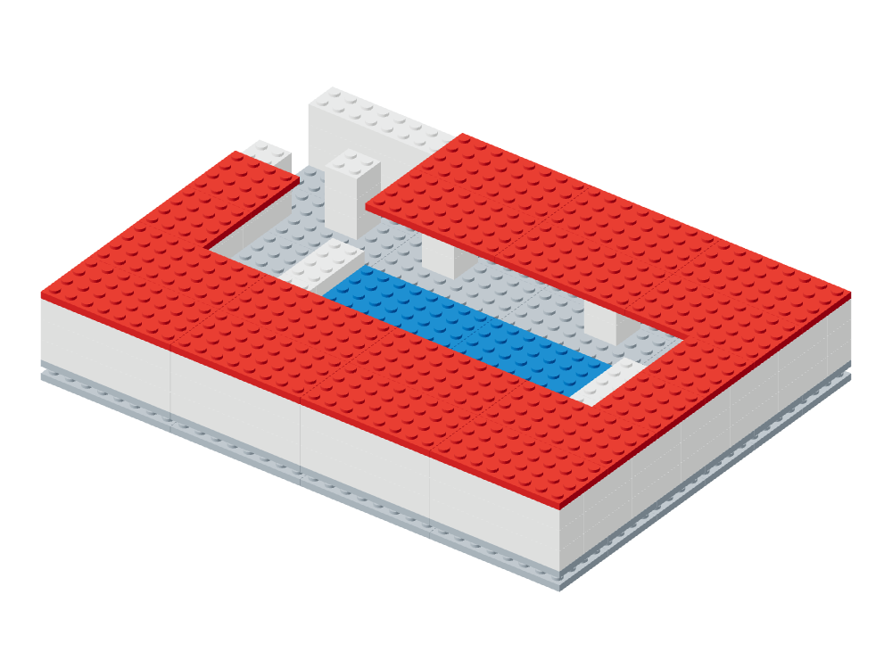 | 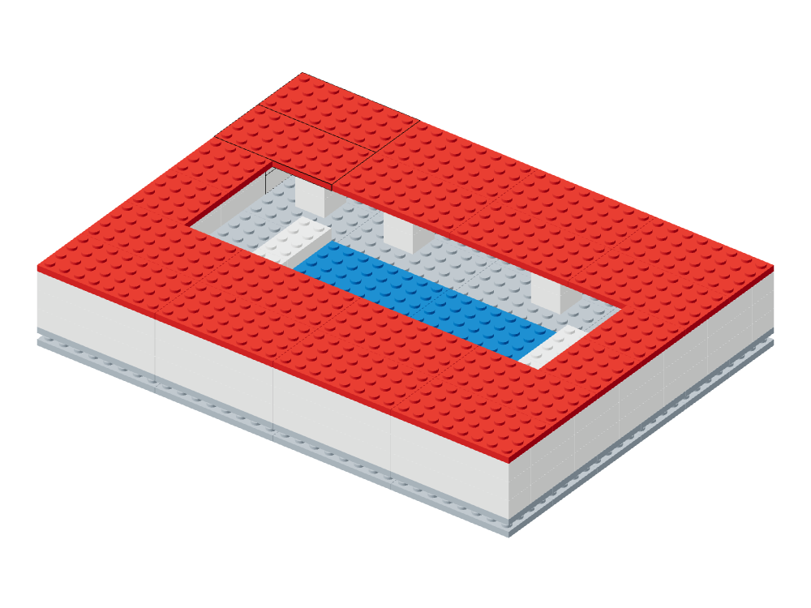 |

正例=1；反例=0；失败原因：`minimum_set`。
[公开题面](courtyard-museum-access-certificate-public.json) · [完整答案及评分](courtyard-museum-access-certificate-review.json)

```json
{
  "positiveMetrics": {
    "removals": 5
  },
  "negative": {
    "removeIds": [
      "p0095"
    ],
    "order": [
      "p0095"
    ]
  }
}
```

### 多工位依赖调度

| 正确参考 | 构造错误 |
|---|---|
|  |  |

正例=1；反例=0；失败原因：`batch_schema`。
[公开题面](courtyard-museum-parallel-schedule-public.json) · [完整答案及评分](courtyard-museum-parallel-schedule-review.json)

```json
{
  "positiveMetrics": {
    "coverage": 1,
    "makespan": 48,
    "workerLowerBound": 48
  },
  "negative": {
    "batches": [
      [
        "p0001",
        "p0002",
        "p0003",
        "p0004",
        "p0005",
        "p0006",
        "p0007",
        "p0008",
        "p0009",
        "p0010",
        "p0011",
        "p0012",
        "p0013",
        "p0014",
        "p0015",
        "p0016",
        "p0017",
        "p0018",
        "p0019",
        "p0020",
        "p0021",
        "p0022",
        "p0023",
        "p0024",
        "p0025",
        "p0026",
        "p0027",
        "p0028",
        "p0029",
        "p0030",
        "p0031",
        "p0032",
        "p0033",
        "p0034",
        "p0035",
        "p0036",
        "p0037",
        "p0038",
        "p0039",
        "p0040",
        "p0041",
        "p0042",
        "p0043",
        "p0044",
        "p0045",
        "p0046",
        "p0047",
        "p0048",
        "p0049",
        "p0050",
        "p0051",
        "p0052",
        "p0053",
        "p0054",
        "p0055",
        "p0056",
        "p0057",
        "p0058",
        "p0059",
        "p0060",
        "p0061",
        "p0062",
        "p0063",
        "p0064",
        "p0065",
        "p0066",
        "p0067",
        "p0068",
        "p0069",
        "p0070",
        "p0071",
        "p0072",
        "p0073",
        "p0074",
        "p0075",
        "p0076",
        "p0077",
        "p0078",
        "p0079",
        "p0080",
        "p0081",
        "p0082",
        "p0083",
        "p0084",
        "p0085",
        "p0086",
        "p0087",
        "p0088",
        "p0089",
        "p0090",
        "p0091",
        "p0092",
        "p0093",
        "p0094",
        "p0095",
        "p0096",
        "p0097",
        "p0098",
        "p0099",
        "p0100",
        "p0101",
        "p0102",
        "p0103",
        "p0104",
        "p0105",
        "p0106",
        "p0107",
        "p0108",
        "p0109",
        "p0110",
        "p0111",
        "p0112",
        "p0113",
        "p0114",
        "p0115",
        "p0116",
        "p0117",
        "p0118",
        "p0119",
        "p0120",
        "p0121",
        "p0122",
        "p0123",
        "p0124",
        "p0125",
        "p0126",
        "p0127",
        "p0128",
        "p0129",
        "p0130",
        "p0131",
        "p0132",
        "p0133",
        "p0134",
        "p0135",
        "p0136",
        "p0137",
        "p0138",
        "p0139",
        "p0140",
        "p0141",
        "p0142",
        "p0143",
        "p0144",
        "p0145",
        "p0146",
        "p0147",
        "p0148",
        "p0149",
        "p0150",
        "p0151",
        "p0152",
        "p0153",
        "p0154",
        "p0155",
        "p0156",
        "p0157",
        "p0158",
        "p0159",
        "p0160",
        "p0161",
        "p0162",
        "p0163",
        "p0164",
        "p0165",
        "p0166",
        "p0167",
        "p0168",
        "p0169",
        "p0170",
        "p0171",
        "p0172",
        "p0173",
        "p0174",
        "p0175",
        "p0176",
        "p0177",
        "p0178",
        "p0179",
        "p0180",
        "p0181",
        "p0182",
        "p0183",
        "p0184",
        "p0185",
        "p0186",
        "p0187",
        "p0188",
        "p0189",
        "p0190",
        "p0191",
        "p0192"
      ]
    ]
  }
}
```

### 最小支撑干预

| 正确参考 | 构造错误 |
|---|---|
| 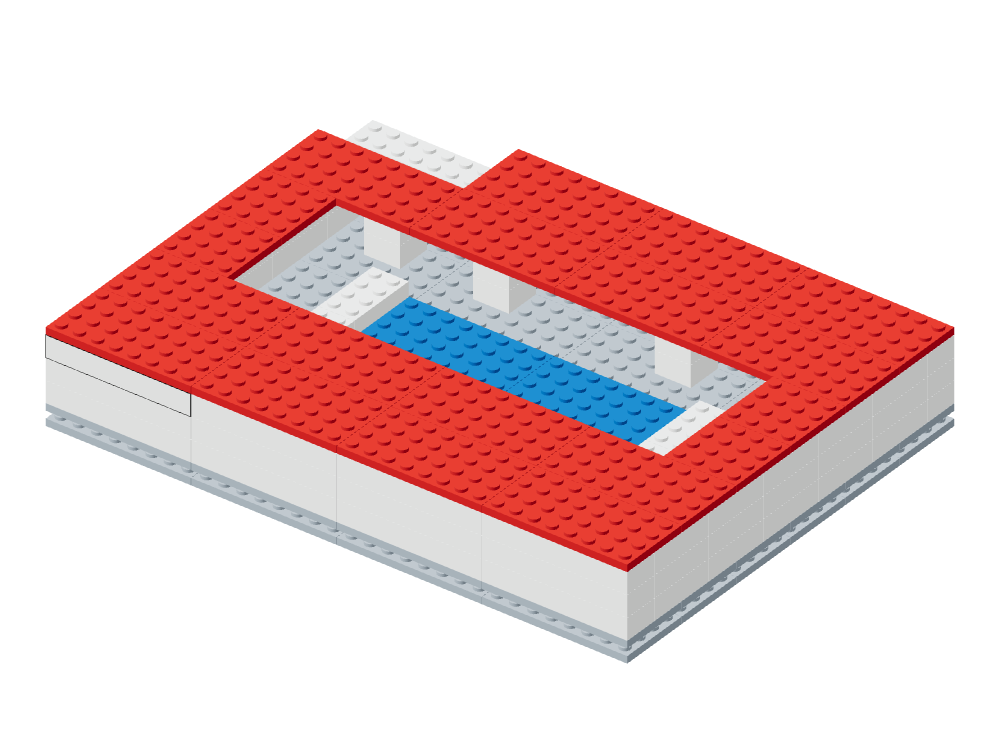 |  |

正例=1；反例=0；失败原因：`goal_survives`。
[公开题面](courtyard-museum-minimal-intervention-public.json) · [完整答案及评分](courtyard-museum-minimal-intervention-review.json)

```json
{
  "positiveMetrics": {
    "removals": 2,
    "optimum": 2
  },
  "negative": {
    "removeIds": [],
    "cascadeIds": []
  }
}
```

### 库存受限等体积替代

| 正确参考 | 构造错误 |
|---|---|
|  |  |

正例=1；反例=0；失败原因：`uncovered`。
[公开题面](courtyard-museum-inventory-cover-public.json) · [完整答案及评分](courtyard-museum-inventory-cover-review.json)

```json
{
  "positiveMetrics": {
    "coverage": 1,
    "tiles": 7,
    "lowerBound": 7
  },
  "negative": {
    "tiles": [
      {
        "partId": "3022",
        "x": 0,
        "z": 2,
        "turn": 0
      },
      {
        "partId": "3022",
        "x": 2,
        "z": 2,
        "turn": 0
      },
      {
        "partId": "3022",
        "x": 4,
        "z": 0,
        "turn": 0
      },
      {
        "partId": "3022",
        "x": 6,
        "z": 0,
        "turn": 0
      },
      {
        "partId": "3022",
        "x": 4,
        "z": 2,
        "turn": 0
      },
      {
        "partId": "3022",
        "x": 6,
        "z": 2,
        "turn": 0
      }
    ]
  }
}
```

### 隐藏接缝的可行解集合

| 正确参考 | 构造错误 |
|---|---|
|  |  |

正例=1；反例=0；失败原因：`admissible_set`。
[公开题面](courtyard-museum-ambiguity-set-public.json) · [完整答案及评分](courtyard-museum-ambiguity-set-review.json)

```json
{
  "positiveMetrics": {
    "admissible": 4,
    "falseCertainty": 0
  },
  "negative": {
    "possibleIds": [
      "h0"
    ]
  }
}
```

### 预算内条件查询策略

| 正确参考 | 构造错误 |
|---|---|
|  |  |

正例=1；反例=0；失败原因：`policy_coverage_or_budget`。
[公开题面](courtyard-museum-inspection-policy-public.json) · [完整答案及评分](courtyard-museum-inspection-policy-review.json)

```json
{
  "positiveMetrics": {
    "worldCoverage": 1,
    "worstCost": 6
  },
  "negative": {
    "hypothesisId": "h0"
  }
}
```

### 跨区域混合故障修复

| 正确参考 | 构造错误 |
|---|---|
|  |  |

正例=1；反例=0；失败原因：`fault_set`。
[公开题面](courtyard-museum-distributed-repair-public.json) · [完整答案及评分](courtyard-museum-distributed-repair-review.json)

```json
{
  "positiveMetrics": {
    "finalExact": 1,
    "changedRecall": 1
  },
  "negative": {
    "faultIds": [],
    "replacements": []
  }
}
```

## Intercity Terminal

227 件，14 个底高层，依赖深度 14。
[交互目录](intercity-terminal.html) · [完整结构](intercity-terminal.json)


### 最小拆装修复

| 正确参考 | 构造错误 |
|---|---|
|  |  |

正例=1；反例=0；失败原因：`blocked`。
[公开题面](intercity-terminal-service-plan-public.json) · [完整答案及评分](intercity-terminal-service-plan-review.json)

```json
{
  "positiveMetrics": {
    "actions": 30,
    "lowerBound": 30,
    "finalExact": 1,
    "legalPrefix": 1,
    "excessActions": 0
  },
  "negative": {
    "actions": [
      {
        "op": "remove",
        "id": "p0108"
      },
      {
        "op": "place",
        "id": "p0108"
      }
    ]
  }
}
```

### 最小访问集合与可执行证书

| 正确参考 | 构造错误 |
|---|---|
| 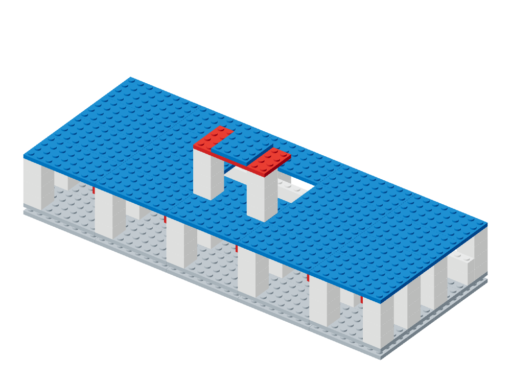 |  |

正例=1；反例=0；失败原因：`minimum_set`。
[公开题面](intercity-terminal-access-certificate-public.json) · [完整答案及评分](intercity-terminal-access-certificate-review.json)

```json
{
  "positiveMetrics": {
    "removals": 15
  },
  "negative": {
    "removeIds": [
      "p0108"
    ],
    "order": [
      "p0108"
    ]
  }
}
```

### 多工位依赖调度

| 正确参考 | 构造错误 |
|---|---|
|  |  |

正例=1；反例=0；失败原因：`batch_schema`。
[公开题面](intercity-terminal-parallel-schedule-public.json) · [完整答案及评分](intercity-terminal-parallel-schedule-review.json)

```json
{
  "positiveMetrics": {
    "coverage": 1,
    "makespan": 58,
    "workerLowerBound": 57
  },
  "negative": {
    "batches": [
      [
        "p0001",
        "p0002",
        "p0003",
        "p0004",
        "p0005",
        "p0006",
        "p0007",
        "p0008",
        "p0009",
        "p0010",
        "p0011",
        "p0012",
        "p0013",
        "p0014",
        "p0015",
        "p0016",
        "p0017",
        "p0018",
        "p0019",
        "p0020",
        "p0021",
        "p0022",
        "p0023",
        "p0024",
        "p0025",
        "p0026",
        "p0027",
        "p0028",
        "p0029",
        "p0030",
        "p0031",
        "p0032",
        "p0033",
        "p0034",
        "p0035",
        "p0036",
        "p0037",
        "p0038",
        "p0039",
        "p0040",
        "p0041",
        "p0042",
        "p0043",
        "p0044",
        "p0045",
        "p0046",
        "p0047",
        "p0048",
        "p0049",
        "p0050",
        "p0051",
        "p0052",
        "p0053",
        "p0054",
        "p0055",
        "p0056",
        "p0057",
        "p0058",
        "p0059",
        "p0060",
        "p0061",
        "p0062",
        "p0063",
        "p0064",
        "p0065",
        "p0066",
        "p0067",
        "p0068",
        "p0069",
        "p0070",
        "p0071",
        "p0072",
        "p0073",
        "p0074",
        "p0075",
        "p0076",
        "p0077",
        "p0078",
        "p0079",
        "p0080",
        "p0081",
        "p0082",
        "p0083",
        "p0084",
        "p0085",
        "p0086",
        "p0087",
        "p0088",
        "p0089",
        "p0090",
        "p0091",
        "p0092",
        "p0093",
        "p0094",
        "p0095",
        "p0096",
        "p0097",
        "p0098",
        "p0099",
        "p0100",
        "p0101",
        "p0102",
        "p0103",
        "p0104",
        "p0105",
        "p0106",
        "p0107",
        "p0108",
        "p0109",
        "p0110",
        "p0111",
        "p0112",
        "p0113",
        "p0114",
        "p0115",
        "p0116",
        "p0117",
        "p0118",
        "p0119",
        "p0120",
        "p0121",
        "p0122",
        "p0123",
        "p0124",
        "p0125",
        "p0126",
        "p0127",
        "p0128",
        "p0129",
        "p0130",
        "p0131",
        "p0132",
        "p0133",
        "p0134",
        "p0135",
        "p0136",
        "p0137",
        "p0138",
        "p0139",
        "p0140",
        "p0141",
        "p0142",
        "p0143",
        "p0144",
        "p0145",
        "p0146",
        "p0147",
        "p0148",
        "p0149",
        "p0150",
        "p0151",
        "p0152",
        "p0153",
        "p0154",
        "p0155",
        "p0156",
        "p0157",
        "p0158",
        "p0159",
        "p0160",
        "p0161",
        "p0162",
        "p0163",
        "p0164",
        "p0165",
        "p0166",
        "p0167",
        "p0168",
        "p0169",
        "p0170",
        "p0171",
        "p0172",
        "p0173",
        "p0174",
        "p0175",
        "p0176",
        "p0177",
        "p0178",
        "p0179",
        "p0180",
        "p0181",
        "p0182",
        "p0183",
        "p0184",
        "p0185",
        "p0186",
        "p0187",
        "p0188",
        "p0189",
        "p0190",
        "p0191",
        "p0192",
        "p0193",
        "p0194",
        "p0195",
        "p0196",
        "p0197",
        "p0198",
        "p0199",
        "p0200",
        "p0201",
        "p0202",
        "p0203",
        "p0204",
        "p0205",
        "p0206",
        "p0207",
        "p0208",
        "p0209",
        "p0210",
        "p0211",
        "p0212",
        "p0213",
        "p0214",
        "p0215",
        "p0216",
        "p0217",
        "p0218",
        "p0219",
        "p0220",
        "p0221",
        "p0222",
        "p0223",
        "p0224",
        "p0225",
        "p0226",
        "p0227"
      ]
    ]
  }
}
```

### 最小支撑干预

| 正确参考 | 构造错误 |
|---|---|
| 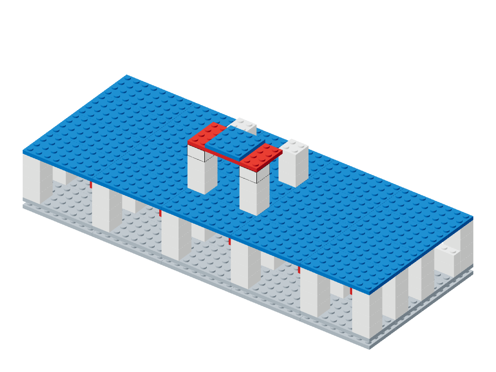 | 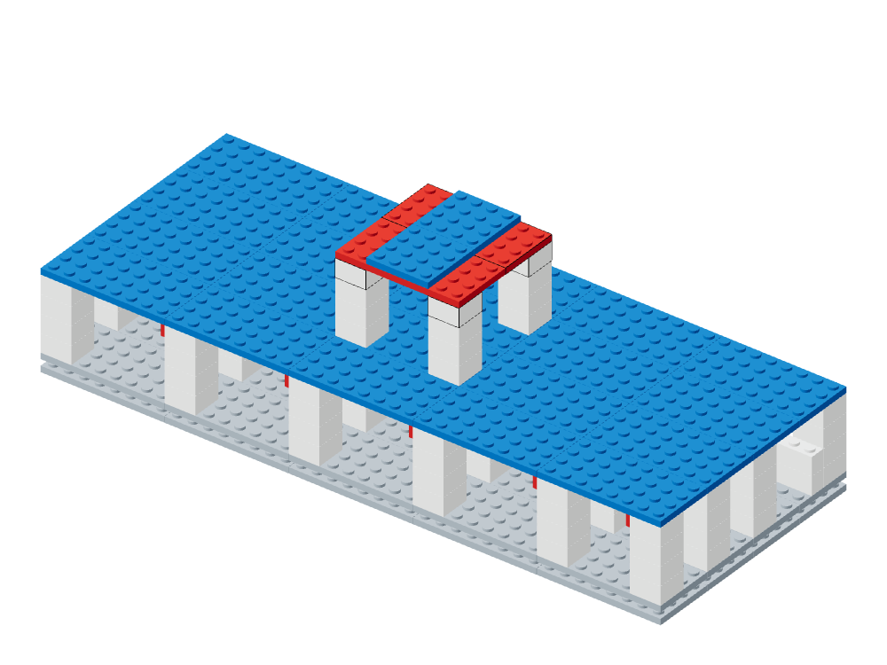 |

正例=1；反例=0；失败原因：`goal_survives`。
[公开题面](intercity-terminal-minimal-intervention-public.json) · [完整答案及评分](intercity-terminal-minimal-intervention-review.json)

```json
{
  "positiveMetrics": {
    "removals": 2,
    "optimum": 2
  },
  "negative": {
    "removeIds": [],
    "cascadeIds": []
  }
}
```

### 库存受限等体积替代

| 正确参考 | 构造错误 |
|---|---|
|  |  |

正例=1；反例=0；失败原因：`uncovered`。
[公开题面](intercity-terminal-inventory-cover-public.json) · [完整答案及评分](intercity-terminal-inventory-cover-review.json)

```json
{
  "positiveMetrics": {
    "coverage": 1,
    "tiles": 5,
    "lowerBound": 5
  },
  "negative": {
    "tiles": [
      {
        "partId": "3020",
        "x": 0,
        "z": 2,
        "turn": 0
      },
      {
        "partId": "3020",
        "x": 4,
        "z": 0,
        "turn": 0
      },
      {
        "partId": "3022",
        "x": 4,
        "z": 2,
        "turn": 0
      },
      {
        "partId": "3022",
        "x": 6,
        "z": 2,
        "turn": 0
      }
    ]
  }
}
```

### 隐藏接缝的可行解集合

| 正确参考 | 构造错误 |
|---|---|
|  |  |

正例=1；反例=0；失败原因：`admissible_set`。
[公开题面](intercity-terminal-ambiguity-set-public.json) · [完整答案及评分](intercity-terminal-ambiguity-set-review.json)

```json
{
  "positiveMetrics": {
    "admissible": 4,
    "falseCertainty": 0
  },
  "negative": {
    "possibleIds": [
      "h0"
    ]
  }
}
```

### 预算内条件查询策略

| 正确参考 | 构造错误 |
|---|---|
|  |  |

正例=1；反例=0；失败原因：`policy_coverage_or_budget`。
[公开题面](intercity-terminal-inspection-policy-public.json) · [完整答案及评分](intercity-terminal-inspection-policy-review.json)

```json
{
  "positiveMetrics": {
    "worldCoverage": 1,
    "worstCost": 6
  },
  "negative": {
    "hypothesisId": "h0"
  }
}
```

### 跨区域混合故障修复

| 正确参考 | 构造错误 |
|---|---|
|  | 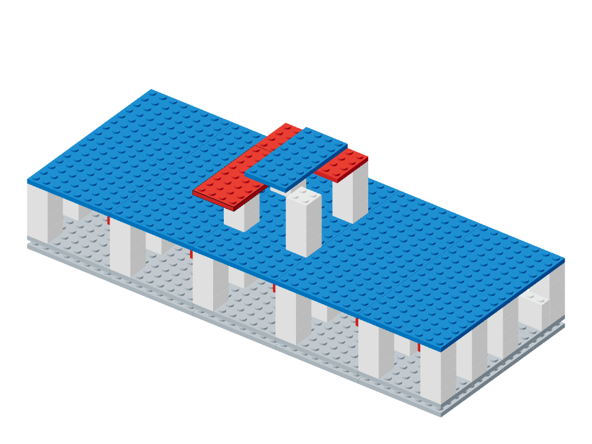 |

正例=1；反例=0；失败原因：`fault_set`。
[公开题面](intercity-terminal-distributed-repair-public.json) · [完整答案及评分](intercity-terminal-distributed-repair-review.json)

```json
{
  "positiveMetrics": {
    "finalExact": 1,
    "changedRecall": 1
  },
  "negative": {
    "faultIds": [],
    "replacements": []
  }
}
```

## Coastal Cargo Vessel

158 件，11 个底高层，依赖深度 11。
[交互目录](coastal-cargo-vessel.html) · [完整结构](coastal-cargo-vessel.json)


### 最小拆装修复

| 正确参考 | 构造错误 |
|---|---|
|  |  |

正例=1；反例=0；失败原因：`blocked`。
[公开题面](coastal-cargo-vessel-service-plan-public.json) · [完整答案及评分](coastal-cargo-vessel-service-plan-review.json)

```json
{
  "positiveMetrics": {
    "actions": 38,
    "lowerBound": 38,
    "finalExact": 1,
    "legalPrefix": 1,
    "excessActions": 0
  },
  "negative": {
    "actions": [
      {
        "op": "remove",
        "id": "p0050"
      },
      {
        "op": "place",
        "id": "p0050"
      }
    ]
  }
}
```

### 最小访问集合与可执行证书

| 正确参考 | 构造错误 |
|---|---|
|  | 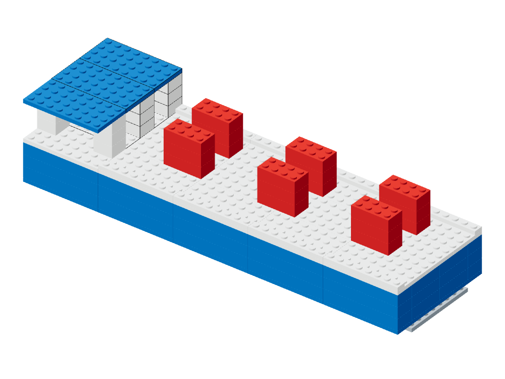 |

正例=1；反例=0；失败原因：`minimum_set`。
[公开题面](coastal-cargo-vessel-access-certificate-public.json) · [完整答案及评分](coastal-cargo-vessel-access-certificate-review.json)

```json
{
  "positiveMetrics": {
    "removals": 19
  },
  "negative": {
    "removeIds": [
      "p0050"
    ],
    "order": [
      "p0050"
    ]
  }
}
```

### 多工位依赖调度

| 正确参考 | 构造错误 |
|---|---|
|  |  |

正例=1；反例=0；失败原因：`batch_schema`。
[公开题面](coastal-cargo-vessel-parallel-schedule-public.json) · [完整答案及评分](coastal-cargo-vessel-parallel-schedule-review.json)

```json
{
  "positiveMetrics": {
    "coverage": 1,
    "makespan": 40,
    "workerLowerBound": 40
  },
  "negative": {
    "batches": [
      [
        "p0001",
        "p0002",
        "p0003",
        "p0004",
        "p0005",
        "p0006",
        "p0007",
        "p0008",
        "p0009",
        "p0010",
        "p0011",
        "p0012",
        "p0013",
        "p0014",
        "p0015",
        "p0016",
        "p0017",
        "p0018",
        "p0019",
        "p0020",
        "p0021",
        "p0022",
        "p0023",
        "p0024",
        "p0025",
        "p0026",
        "p0027",
        "p0028",
        "p0029",
        "p0030",
        "p0031",
        "p0032",
        "p0033",
        "p0034",
        "p0035",
        "p0036",
        "p0037",
        "p0038",
        "p0039",
        "p0040",
        "p0041",
        "p0042",
        "p0043",
        "p0044",
        "p0045",
        "p0046",
        "p0047",
        "p0048",
        "p0049",
        "p0050",
        "p0051",
        "p0052",
        "p0053",
        "p0054",
        "p0055",
        "p0056",
        "p0057",
        "p0058",
        "p0059",
        "p0060",
        "p0061",
        "p0062",
        "p0063",
        "p0064",
        "p0065",
        "p0066",
        "p0067",
        "p0068",
        "p0069",
        "p0070",
        "p0071",
        "p0072",
        "p0073",
        "p0074",
        "p0075",
        "p0076",
        "p0077",
        "p0078",
        "p0079",
        "p0080",
        "p0081",
        "p0082",
        "p0083",
        "p0084",
        "p0085",
        "p0086",
        "p0087",
        "p0088",
        "p0089",
        "p0090",
        "p0091",
        "p0092",
        "p0093",
        "p0094",
        "p0095",
        "p0096",
        "p0097",
        "p0098",
        "p0099",
        "p0100",
        "p0101",
        "p0102",
        "p0103",
        "p0104",
        "p0105",
        "p0106",
        "p0107",
        "p0108",
        "p0109",
        "p0110",
        "p0111",
        "p0112",
        "p0113",
        "p0114",
        "p0115",
        "p0116",
        "p0117",
        "p0118",
        "p0119",
        "p0120",
        "p0121",
        "p0122",
        "p0123",
        "p0124",
        "p0125",
        "p0126",
        "p0127",
        "p0128",
        "p0129",
        "p0130",
        "p0131",
        "p0132",
        "p0133",
        "p0134",
        "p0135",
        "p0136",
        "p0137",
        "p0138",
        "p0139",
        "p0140",
        "p0141",
        "p0142",
        "p0143",
        "p0144",
        "p0145",
        "p0146",
        "p0147",
        "p0148",
        "p0149",
        "p0150",
        "p0151",
        "p0152",
        "p0153",
        "p0154",
        "p0155",
        "p0156",
        "p0157",
        "p0158"
      ]
    ]
  }
}
```

### 最小支撑干预

| 正确参考 | 构造错误 |
|---|---|
| 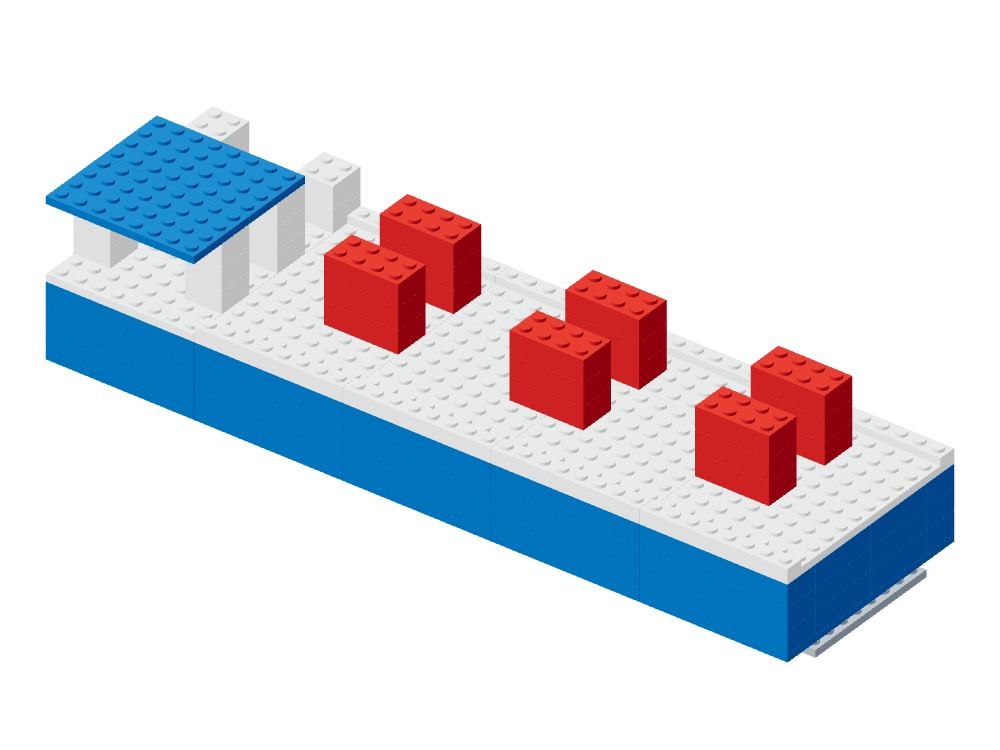 | 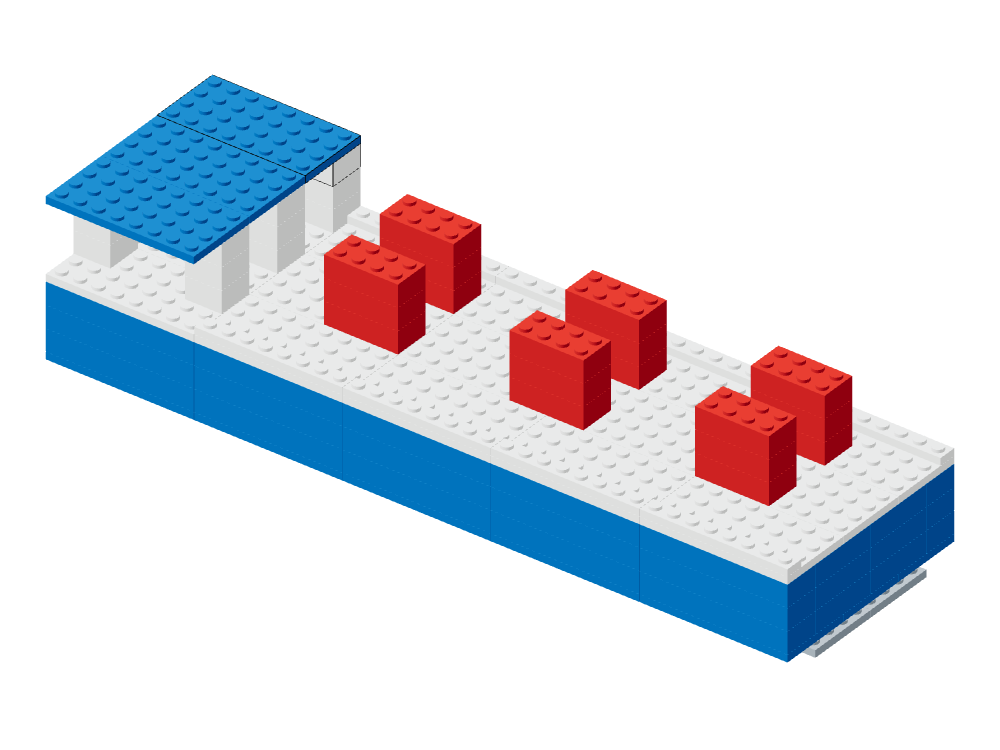 |

正例=1；反例=0；失败原因：`goal_survives`。
[公开题面](coastal-cargo-vessel-minimal-intervention-public.json) · [完整答案及评分](coastal-cargo-vessel-minimal-intervention-review.json)

```json
{
  "positiveMetrics": {
    "removals": 2,
    "optimum": 2
  },
  "negative": {
    "removeIds": [],
    "cascadeIds": []
  }
}
```

### 库存受限等体积替代

| 正确参考 | 构造错误 |
|---|---|
|  | 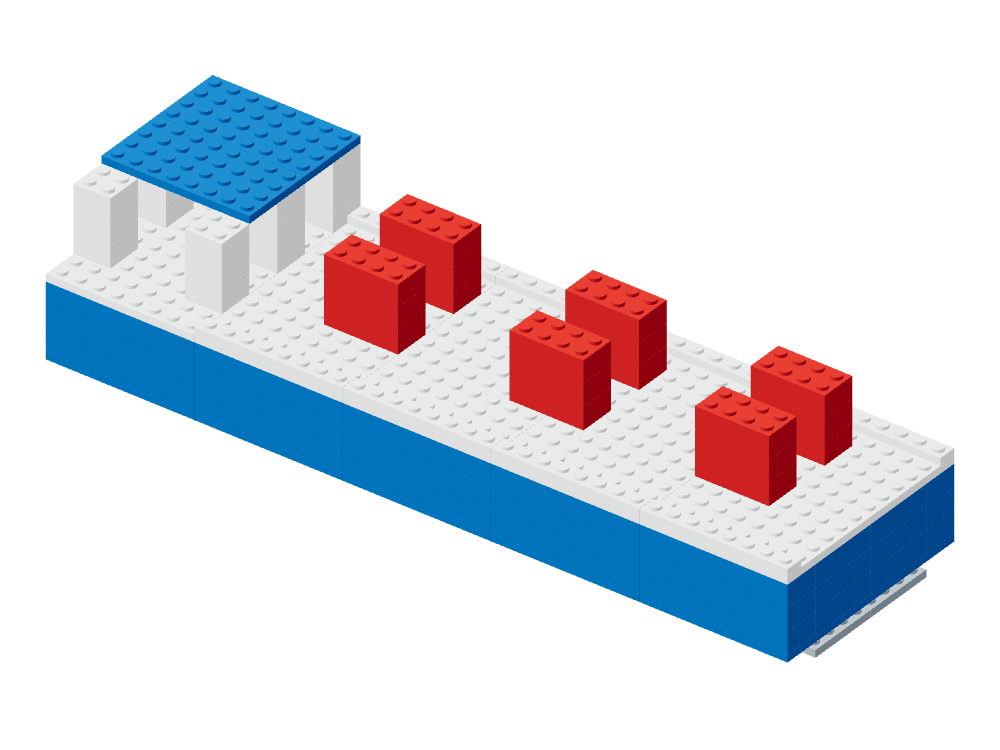 |

正例=1；反例=0；失败原因：`uncovered`。
[公开题面](coastal-cargo-vessel-inventory-cover-public.json) · [完整答案及评分](coastal-cargo-vessel-inventory-cover-review.json)

```json
{
  "positiveMetrics": {
    "coverage": 1,
    "tiles": 5,
    "lowerBound": 5
  },
  "negative": {
    "tiles": [
      {
        "partId": "3020",
        "x": 0,
        "z": 2,
        "turn": 0
      },
      {
        "partId": "3020",
        "x": 4,
        "z": 0,
        "turn": 0
      },
      {
        "partId": "3022",
        "x": 4,
        "z": 2,
        "turn": 0
      },
      {
        "partId": "3022",
        "x": 6,
        "z": 2,
        "turn": 0
      }
    ]
  }
}
```

### 隐藏接缝的可行解集合

| 正确参考 | 构造错误 |
|---|---|
|  |  |

正例=1；反例=0；失败原因：`admissible_set`。
[公开题面](coastal-cargo-vessel-ambiguity-set-public.json) · [完整答案及评分](coastal-cargo-vessel-ambiguity-set-review.json)

```json
{
  "positiveMetrics": {
    "admissible": 4,
    "falseCertainty": 0
  },
  "negative": {
    "possibleIds": [
      "h0"
    ]
  }
}
```

### 预算内条件查询策略

| 正确参考 | 构造错误 |
|---|---|
|  |  |

正例=1；反例=0；失败原因：`policy_coverage_or_budget`。
[公开题面](coastal-cargo-vessel-inspection-policy-public.json) · [完整答案及评分](coastal-cargo-vessel-inspection-policy-review.json)

```json
{
  "positiveMetrics": {
    "worldCoverage": 1,
    "worstCost": 6
  },
  "negative": {
    "hypothesisId": "h0"
  }
}
```

### 跨区域混合故障修复

| 正确参考 | 构造错误 |
|---|---|
| 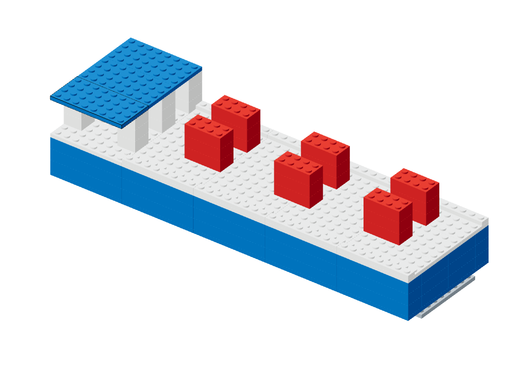 | 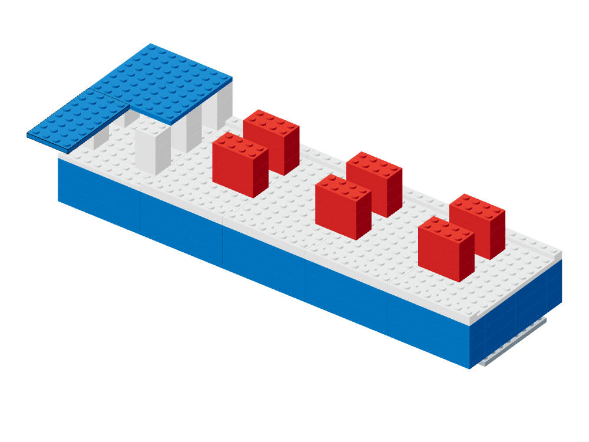 |

正例=1；反例=0；失败原因：`fault_set`。
[公开题面](coastal-cargo-vessel-distributed-repair-public.json) · [完整答案及评分](coastal-cargo-vessel-distributed-repair-review.json)

```json
{
  "positiveMetrics": {
    "finalExact": 1,
    "changedRecall": 1
  },
  "negative": {
    "faultIds": [],
    "replacements": []
  }
}
```

## Four-Tower Citadel

236 件，11 个底高层，依赖深度 11。
[交互目录](four-tower-citadel.html) · [完整结构](four-tower-citadel.json)


### 最小拆装修复

| 正确参考 | 构造错误 |
|---|---|
|  |  |

正例=1；反例=0；失败原因：`blocked`。
[公开题面](four-tower-citadel-service-plan-public.json) · [完整答案及评分](four-tower-citadel-service-plan-review.json)

```json
{
  "positiveMetrics": {
    "actions": 28,
    "lowerBound": 28,
    "finalExact": 1,
    "legalPrefix": 1,
    "excessActions": 0
  },
  "negative": {
    "actions": [
      {
        "op": "remove",
        "id": "p0089"
      },
      {
        "op": "place",
        "id": "p0089"
      }
    ]
  }
}
```

### 最小访问集合与可执行证书

| 正确参考 | 构造错误 |
|---|---|
| 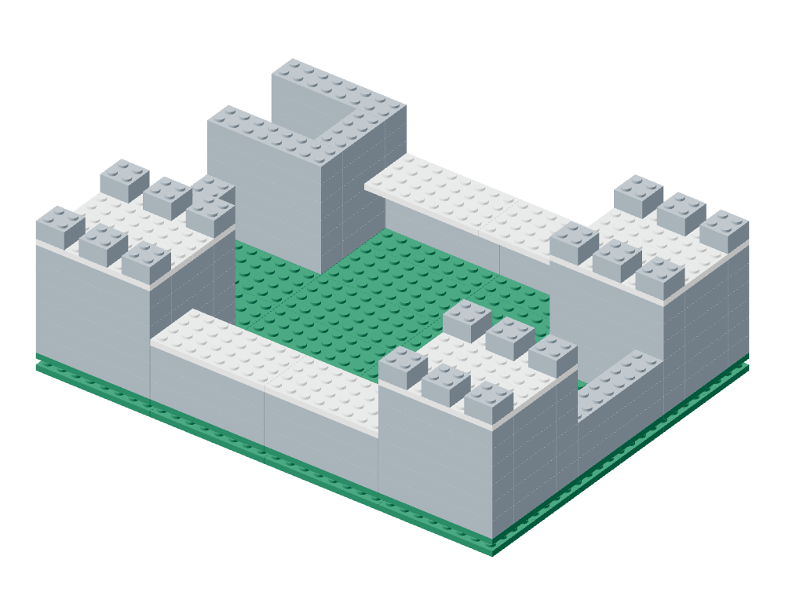 | 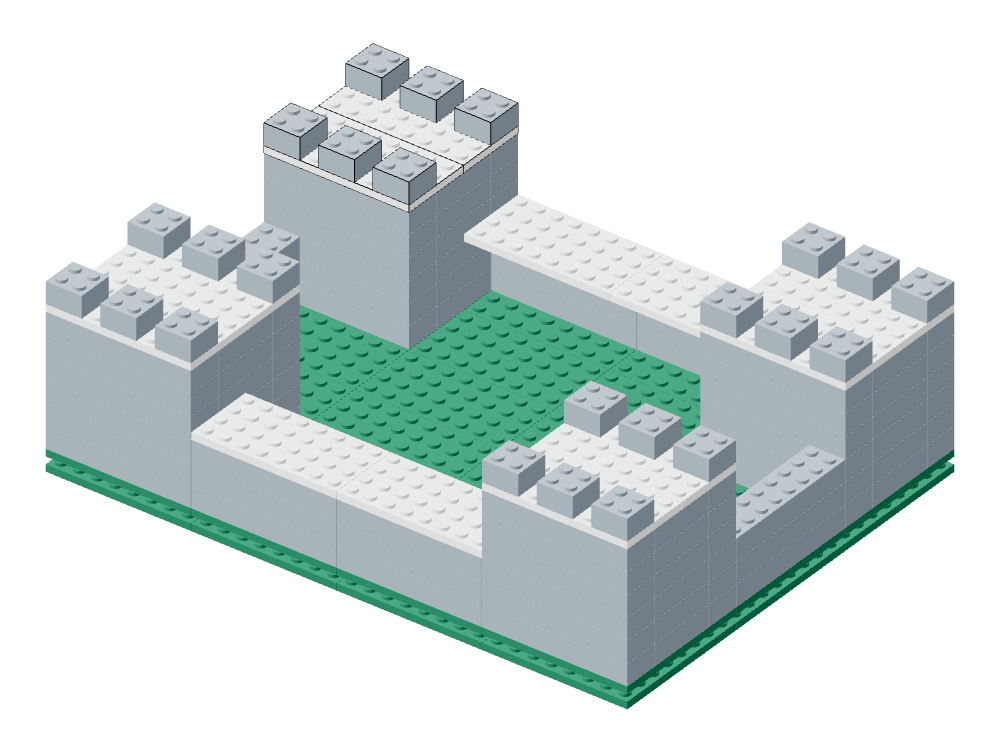 |

正例=1；反例=0；失败原因：`minimum_set`。
[公开题面](four-tower-citadel-access-certificate-public.json) · [完整答案及评分](four-tower-citadel-access-certificate-review.json)

```json
{
  "positiveMetrics": {
    "removals": 14
  },
  "negative": {
    "removeIds": [
      "p0089"
    ],
    "order": [
      "p0089"
    ]
  }
}
```

### 多工位依赖调度

| 正确参考 | 构造错误 |
|---|---|
|  |  |

正例=1；反例=0；失败原因：`batch_schema`。
[公开题面](four-tower-citadel-parallel-schedule-public.json) · [完整答案及评分](four-tower-citadel-parallel-schedule-review.json)

```json
{
  "positiveMetrics": {
    "coverage": 1,
    "makespan": 59,
    "workerLowerBound": 59
  },
  "negative": {
    "batches": [
      [
        "p0001",
        "p0002",
        "p0003",
        "p0004",
        "p0005",
        "p0006",
        "p0007",
        "p0008",
        "p0009",
        "p0010",
        "p0011",
        "p0012",
        "p0013",
        "p0014",
        "p0015",
        "p0016",
        "p0017",
        "p0018",
        "p0019",
        "p0020",
        "p0021",
        "p0022",
        "p0023",
        "p0024",
        "p0025",
        "p0026",
        "p0027",
        "p0028",
        "p0029",
        "p0030",
        "p0031",
        "p0032",
        "p0033",
        "p0034",
        "p0035",
        "p0036",
        "p0037",
        "p0038",
        "p0039",
        "p0040",
        "p0041",
        "p0042",
        "p0043",
        "p0044",
        "p0045",
        "p0046",
        "p0047",
        "p0048",
        "p0049",
        "p0050",
        "p0051",
        "p0052",
        "p0053",
        "p0054",
        "p0055",
        "p0056",
        "p0057",
        "p0058",
        "p0059",
        "p0060",
        "p0061",
        "p0062",
        "p0063",
        "p0064",
        "p0065",
        "p0066",
        "p0067",
        "p0068",
        "p0069",
        "p0070",
        "p0071",
        "p0072",
        "p0073",
        "p0074",
        "p0075",
        "p0076",
        "p0077",
        "p0078",
        "p0079",
        "p0080",
        "p0081",
        "p0082",
        "p0083",
        "p0084",
        "p0085",
        "p0086",
        "p0087",
        "p0088",
        "p0089",
        "p0090",
        "p0091",
        "p0092",
        "p0093",
        "p0094",
        "p0095",
        "p0096",
        "p0097",
        "p0098",
        "p0099",
        "p0100",
        "p0101",
        "p0102",
        "p0103",
        "p0104",
        "p0105",
        "p0106",
        "p0107",
        "p0108",
        "p0109",
        "p0110",
        "p0111",
        "p0112",
        "p0113",
        "p0114",
        "p0115",
        "p0116",
        "p0117",
        "p0118",
        "p0119",
        "p0120",
        "p0121",
        "p0122",
        "p0123",
        "p0124",
        "p0125",
        "p0126",
        "p0127",
        "p0128",
        "p0129",
        "p0130",
        "p0131",
        "p0132",
        "p0133",
        "p0134",
        "p0135",
        "p0136",
        "p0137",
        "p0138",
        "p0139",
        "p0140",
        "p0141",
        "p0142",
        "p0143",
        "p0144",
        "p0145",
        "p0146",
        "p0147",
        "p0148",
        "p0149",
        "p0150",
        "p0151",
        "p0152",
        "p0153",
        "p0154",
        "p0155",
        "p0156",
        "p0157",
        "p0158",
        "p0159",
        "p0160",
        "p0161",
        "p0162",
        "p0163",
        "p0164",
        "p0165",
        "p0166",
        "p0167",
        "p0168",
        "p0169",
        "p0170",
        "p0171",
        "p0172",
        "p0173",
        "p0174",
        "p0175",
        "p0176",
        "p0177",
        "p0178",
        "p0179",
        "p0180",
        "p0181",
        "p0182",
        "p0183",
        "p0184",
        "p0185",
        "p0186",
        "p0187",
        "p0188",
        "p0189",
        "p0190",
        "p0191",
        "p0192",
        "p0193",
        "p0194",
        "p0195",
        "p0196",
        "p0197",
        "p0198",
        "p0199",
        "p0200",
        "p0201",
        "p0202",
        "p0203",
        "p0204",
        "p0205",
        "p0206",
        "p0207",
        "p0208",
        "p0209",
        "p0210",
        "p0211",
        "p0212",
        "p0213",
        "p0214",
        "p0215",
        "p0216",
        "p0217",
        "p0218",
        "p0219",
        "p0220",
        "p0221",
        "p0222",
        "p0223",
        "p0224",
        "p0225",
        "p0226",
        "p0227",
        "p0228",
        "p0229",
        "p0230",
        "p0231",
        "p0232",
        "p0233",
        "p0234",
        "p0235",
        "p0236"
      ]
    ]
  }
}
```

### 最小支撑干预

| 正确参考 | 构造错误 |
|---|---|
| 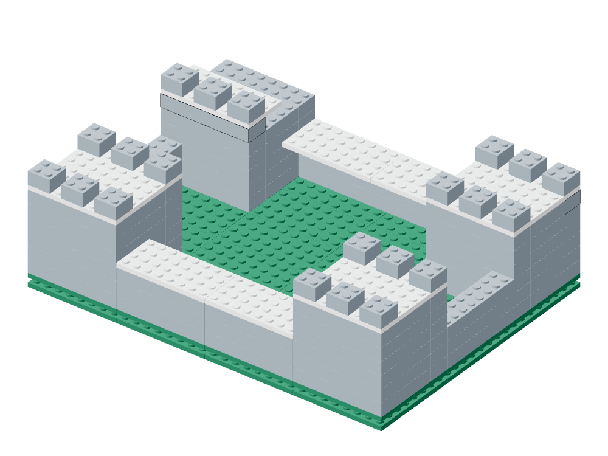 |  |

正例=1；反例=0；失败原因：`goal_survives`。
[公开题面](four-tower-citadel-minimal-intervention-public.json) · [完整答案及评分](four-tower-citadel-minimal-intervention-review.json)

```json
{
  "positiveMetrics": {
    "removals": 3,
    "optimum": 3
  },
  "negative": {
    "removeIds": [],
    "cascadeIds": []
  }
}
```

### 库存受限等体积替代

| 正确参考 | 构造错误 |
|---|---|
| 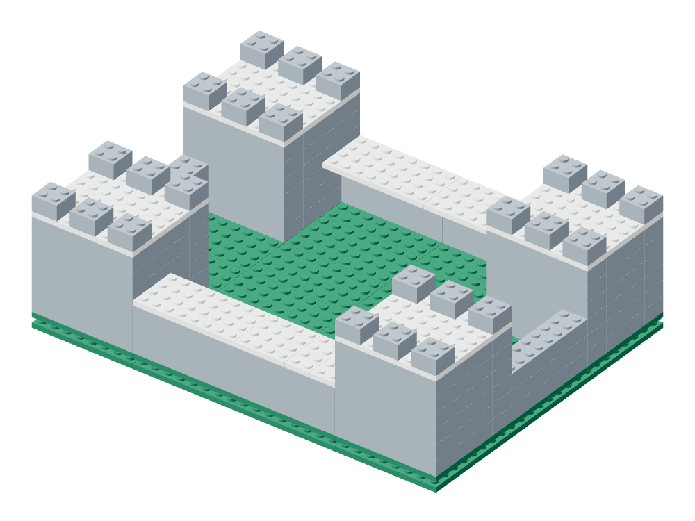 | 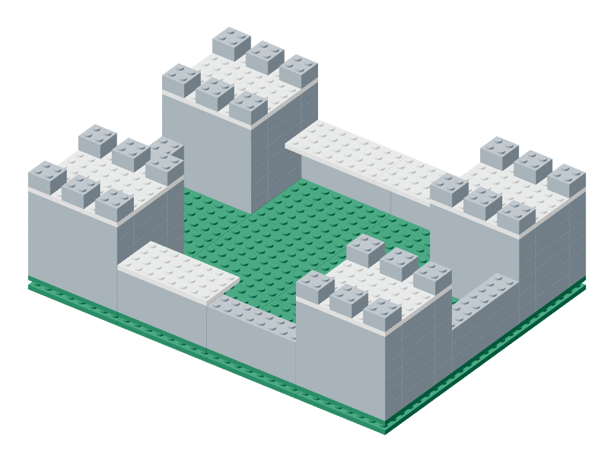 |

正例=1；反例=0；失败原因：`uncovered`。
[公开题面](four-tower-citadel-inventory-cover-public.json) · [完整答案及评分](four-tower-citadel-inventory-cover-review.json)

```json
{
  "positiveMetrics": {
    "coverage": 1,
    "tiles": 5,
    "lowerBound": 5
  },
  "negative": {
    "tiles": [
      {
        "partId": "3020",
        "x": 0,
        "z": 2,
        "turn": 0
      },
      {
        "partId": "3020",
        "x": 4,
        "z": 0,
        "turn": 0
      },
      {
        "partId": "3022",
        "x": 4,
        "z": 2,
        "turn": 0
      },
      {
        "partId": "3022",
        "x": 6,
        "z": 2,
        "turn": 0
      }
    ]
  }
}
```

### 隐藏接缝的可行解集合

| 正确参考 | 构造错误 |
|---|---|
|  |  |

正例=1；反例=0；失败原因：`admissible_set`。
[公开题面](four-tower-citadel-ambiguity-set-public.json) · [完整答案及评分](four-tower-citadel-ambiguity-set-review.json)

```json
{
  "positiveMetrics": {
    "admissible": 4,
    "falseCertainty": 0
  },
  "negative": {
    "possibleIds": [
      "h0"
    ]
  }
}
```

### 预算内条件查询策略

| 正确参考 | 构造错误 |
|---|---|
|  |  |

正例=1；反例=0；失败原因：`policy_coverage_or_budget`。
[公开题面](four-tower-citadel-inspection-policy-public.json) · [完整答案及评分](four-tower-citadel-inspection-policy-review.json)

```json
{
  "positiveMetrics": {
    "worldCoverage": 1,
    "worstCost": 6
  },
  "negative": {
    "hypothesisId": "h0"
  }
}
```

### 跨区域混合故障修复

| 正确参考 | 构造错误 |
|---|---|
| 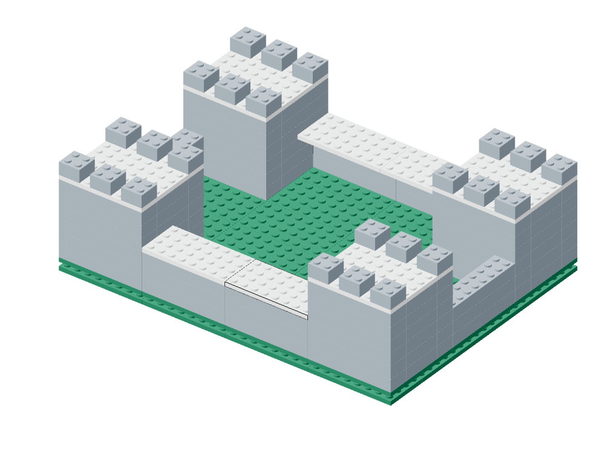 | 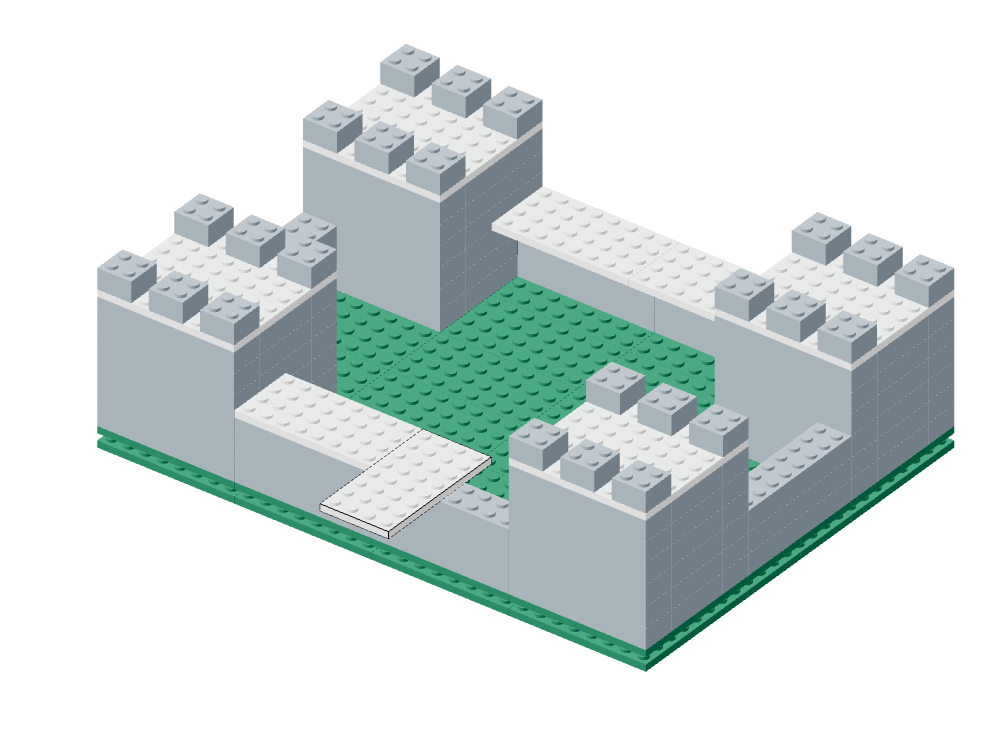 |

正例=1；反例=0；失败原因：`fault_set`。
[公开题面](four-tower-citadel-distributed-repair-public.json) · [完整答案及评分](four-tower-citadel-distributed-repair-review.json)

```json
{
  "positiveMetrics": {
    "finalExact": 1,
    "changedRecall": 1
  },
  "negative": {
    "faultIds": [],
    "replacements": []
  }
}
```

## Process Service Plant

288 件，16 个底高层，依赖深度 14。
[交互目录](process-service-plant.html) · [完整结构](process-service-plant.json)


### 最小拆装修复

| 正确参考 | 构造错误 |
|---|---|
|  |  |

正例=1；反例=0；失败原因：`blocked`。
[公开题面](process-service-plant-service-plan-public.json) · [完整答案及评分](process-service-plant-service-plan-review.json)

```json
{
  "positiveMetrics": {
    "actions": 32,
    "lowerBound": 32,
    "finalExact": 1,
    "legalPrefix": 1,
    "excessActions": 0
  },
  "negative": {
    "actions": [
      {
        "op": "remove",
        "id": "p0147"
      },
      {
        "op": "place",
        "id": "p0147"
      }
    ]
  }
}
```

### 最小访问集合与可执行证书

| 正确参考 | 构造错误 |
|---|---|
| 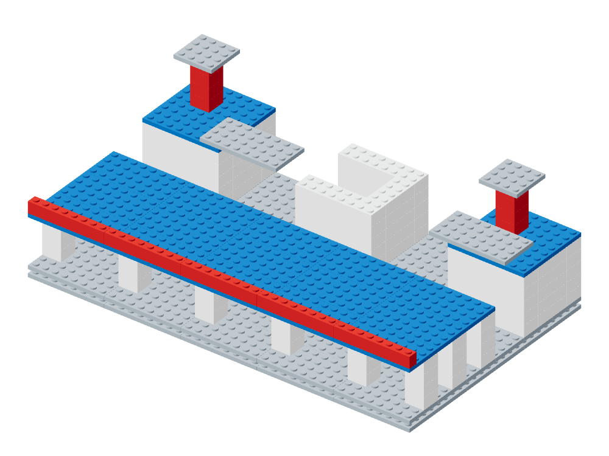 |  |

正例=1；反例=0；失败原因：`minimum_set`。
[公开题面](process-service-plant-access-certificate-public.json) · [完整答案及评分](process-service-plant-access-certificate-review.json)

```json
{
  "positiveMetrics": {
    "removals": 16
  },
  "negative": {
    "removeIds": [
      "p0147"
    ],
    "order": [
      "p0147"
    ]
  }
}
```

### 多工位依赖调度

| 正确参考 | 构造错误 |
|---|---|
|  |  |

正例=1；反例=0；失败原因：`batch_schema`。
[公开题面](process-service-plant-parallel-schedule-public.json) · [完整答案及评分](process-service-plant-parallel-schedule-review.json)

```json
{
  "positiveMetrics": {
    "coverage": 1,
    "makespan": 73,
    "workerLowerBound": 72
  },
  "negative": {
    "batches": [
      [
        "p0001",
        "p0002",
        "p0003",
        "p0004",
        "p0005",
        "p0006",
        "p0007",
        "p0008",
        "p0009",
        "p0010",
        "p0011",
        "p0012",
        "p0013",
        "p0014",
        "p0015",
        "p0016",
        "p0017",
        "p0018",
        "p0019",
        "p0020",
        "p0021",
        "p0022",
        "p0023",
        "p0024",
        "p0025",
        "p0026",
        "p0027",
        "p0028",
        "p0029",
        "p0030",
        "p0031",
        "p0032",
        "p0033",
        "p0034",
        "p0035",
        "p0036",
        "p0037",
        "p0038",
        "p0039",
        "p0040",
        "p0041",
        "p0042",
        "p0043",
        "p0044",
        "p0045",
        "p0046",
        "p0047",
        "p0048",
        "p0049",
        "p0050",
        "p0051",
        "p0052",
        "p0053",
        "p0054",
        "p0055",
        "p0056",
        "p0057",
        "p0058",
        "p0059",
        "p0060",
        "p0061",
        "p0062",
        "p0063",
        "p0064",
        "p0065",
        "p0066",
        "p0067",
        "p0068",
        "p0069",
        "p0070",
        "p0071",
        "p0072",
        "p0073",
        "p0074",
        "p0075",
        "p0076",
        "p0077",
        "p0078",
        "p0079",
        "p0080",
        "p0081",
        "p0082",
        "p0083",
        "p0084",
        "p0085",
        "p0086",
        "p0087",
        "p0088",
        "p0089",
        "p0090",
        "p0091",
        "p0092",
        "p0093",
        "p0094",
        "p0095",
        "p0096",
        "p0097",
        "p0098",
        "p0099",
        "p0100",
        "p0101",
        "p0102",
        "p0103",
        "p0104",
        "p0105",
        "p0106",
        "p0107",
        "p0108",
        "p0109",
        "p0110",
        "p0111",
        "p0112",
        "p0113",
        "p0114",
        "p0115",
        "p0116",
        "p0117",
        "p0118",
        "p0119",
        "p0120",
        "p0121",
        "p0122",
        "p0123",
        "p0124",
        "p0125",
        "p0126",
        "p0127",
        "p0128",
        "p0129",
        "p0130",
        "p0131",
        "p0132",
        "p0133",
        "p0134",
        "p0135",
        "p0136",
        "p0137",
        "p0138",
        "p0139",
        "p0140",
        "p0141",
        "p0142",
        "p0143",
        "p0144",
        "p0145",
        "p0146",
        "p0147",
        "p0148",
        "p0149",
        "p0150",
        "p0151",
        "p0152",
        "p0153",
        "p0154",
        "p0155",
        "p0156",
        "p0157",
        "p0158",
        "p0159",
        "p0160",
        "p0161",
        "p0162",
        "p0163",
        "p0164",
        "p0165",
        "p0166",
        "p0167",
        "p0168",
        "p0169",
        "p0170",
        "p0171",
        "p0172",
        "p0173",
        "p0174",
        "p0175",
        "p0176",
        "p0177",
        "p0178",
        "p0179",
        "p0180",
        "p0181",
        "p0182",
        "p0183",
        "p0184",
        "p0185",
        "p0186",
        "p0187",
        "p0188",
        "p0189",
        "p0190",
        "p0191",
        "p0192",
        "p0193",
        "p0194",
        "p0195",
        "p0196",
        "p0197",
        "p0198",
        "p0199",
        "p0200",
        "p0201",
        "p0202",
        "p0203",
        "p0204",
        "p0205",
        "p0206",
        "p0207",
        "p0208",
        "p0209",
        "p0210",
        "p0211",
        "p0212",
        "p0213",
        "p0214",
        "p0215",
        "p0216",
        "p0217",
        "p0218",
        "p0219",
        "p0220",
        "p0221",
        "p0222",
        "p0223",
        "p0224",
        "p0225",
        "p0226",
        "p0227",
        "p0228",
        "p0229",
        "p0230",
        "p0231",
        "p0232",
        "p0233",
        "p0234",
        "p0235",
        "p0236",
        "p0237",
        "p0238",
        "p0239",
        "p0240",
        "p0241",
        "p0242",
        "p0243",
        "p0244",
        "p0245",
        "p0246",
        "p0247",
        "p0248",
        "p0249",
        "p0250",
        "p0251",
        "p0252",
        "p0253",
        "p0254",
        "p0255",
        "p0256",
        "p0257",
        "p0258",
        "p0259",
        "p0260",
        "p0261",
        "p0262",
        "p0263",
        "p0264",
        "p0265",
        "p0266",
        "p0267",
        "p0268",
        "p0269",
        "p0270",
        "p0271",
        "p0272",
        "p0273",
        "p0274",
        "p0275",
        "p0276",
        "p0277",
        "p0278",
        "p0279",
        "p0280",
        "p0281",
        "p0282",
        "p0283",
        "p0284",
        "p0285",
        "p0286",
        "p0287",
        "p0288"
      ]
    ]
  }
}
```

### 最小支撑干预

| 正确参考 | 构造错误 |
|---|---|
| 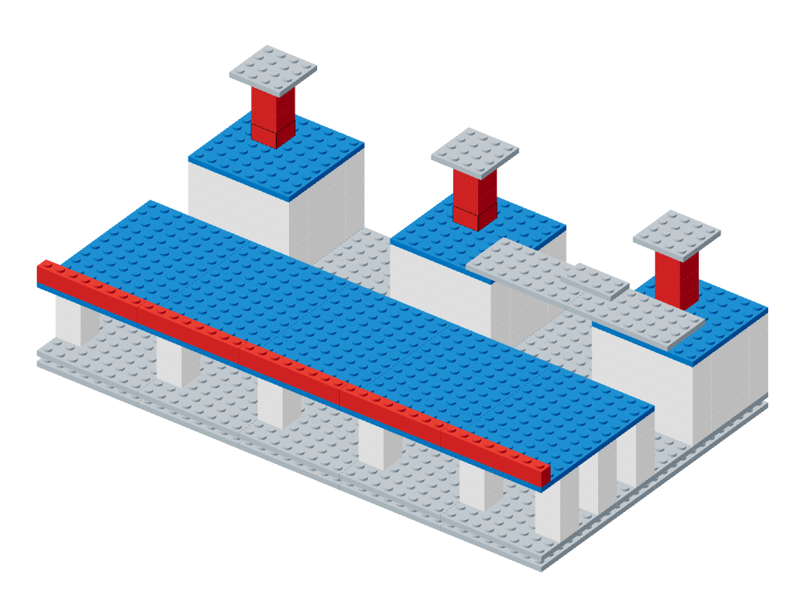 | 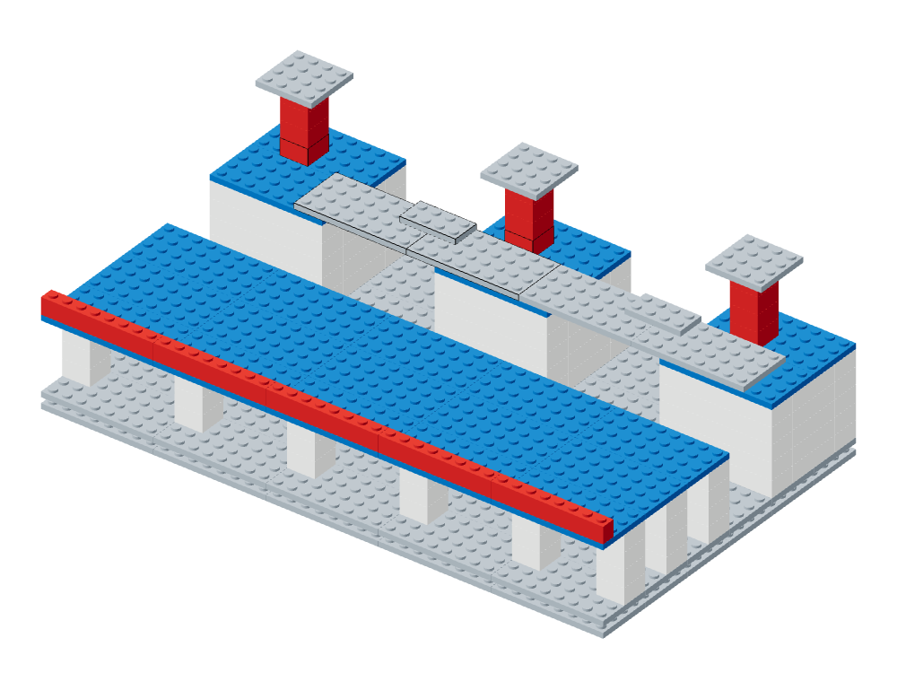 |

正例=1；反例=0；失败原因：`goal_survives`。
[公开题面](process-service-plant-minimal-intervention-public.json) · [完整答案及评分](process-service-plant-minimal-intervention-review.json)

```json
{
  "positiveMetrics": {
    "removals": 2,
    "optimum": 2
  },
  "negative": {
    "removeIds": [],
    "cascadeIds": []
  }
}
```

### 库存受限等体积替代

| 正确参考 | 构造错误 |
|---|---|
|  | 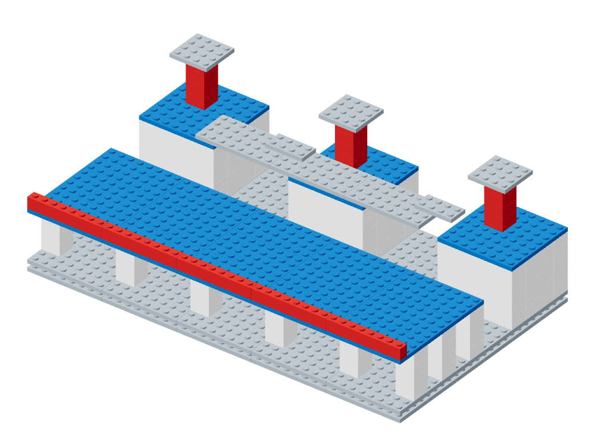 |

正例=1；反例=0；失败原因：`uncovered`。
[公开题面](process-service-plant-inventory-cover-public.json) · [完整答案及评分](process-service-plant-inventory-cover-review.json)

```json
{
  "positiveMetrics": {
    "coverage": 1,
    "tiles": 7,
    "lowerBound": 7
  },
  "negative": {
    "tiles": [
      {
        "partId": "3022",
        "x": 0,
        "z": 2,
        "turn": 0
      },
      {
        "partId": "3022",
        "x": 2,
        "z": 2,
        "turn": 0
      },
      {
        "partId": "3022",
        "x": 4,
        "z": 0,
        "turn": 0
      },
      {
        "partId": "3022",
        "x": 6,
        "z": 0,
        "turn": 0
      },
      {
        "partId": "3022",
        "x": 4,
        "z": 2,
        "turn": 0
      },
      {
        "partId": "3022",
        "x": 6,
        "z": 2,
        "turn": 0
      }
    ]
  }
}
```

### 隐藏接缝的可行解集合

| 正确参考 | 构造错误 |
|---|---|
|  |  |

正例=1；反例=0；失败原因：`admissible_set`。
[公开题面](process-service-plant-ambiguity-set-public.json) · [完整答案及评分](process-service-plant-ambiguity-set-review.json)

```json
{
  "positiveMetrics": {
    "admissible": 4,
    "falseCertainty": 0
  },
  "negative": {
    "possibleIds": [
      "h0"
    ]
  }
}
```

### 预算内条件查询策略

| 正确参考 | 构造错误 |
|---|---|
|  |  |

正例=1；反例=0；失败原因：`policy_coverage_or_budget`。
[公开题面](process-service-plant-inspection-policy-public.json) · [完整答案及评分](process-service-plant-inspection-policy-review.json)

```json
{
  "positiveMetrics": {
    "worldCoverage": 1,
    "worstCost": 6
  },
  "negative": {
    "hypothesisId": "h0"
  }
}
```

### 跨区域混合故障修复

| 正确参考 | 构造错误 |
|---|---|
| 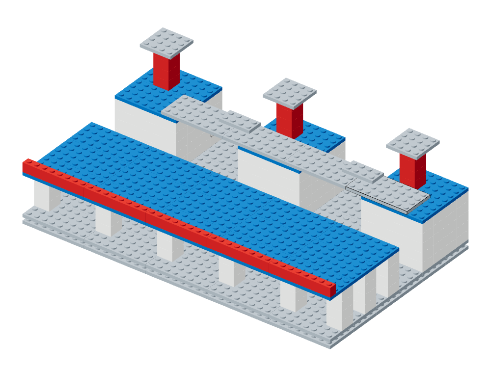 |  |

正例=1；反例=0；失败原因：`fault_set`。
[公开题面](process-service-plant-distributed-repair-public.json) · [完整答案及评分](process-service-plant-distributed-repair-review.json)

```json
{
  "positiveMetrics": {
    "finalExact": 1,
    "changedRecall": 1
  },
  "negative": {
    "faultIds": [],
    "replacements": []
  }
}
```

## Four-Storey Archive

408 件，19 个底高层，依赖深度 19。
[交互目录](four-storey-archive.html) · [完整结构](four-storey-archive.json)


### 最小拆装修复

| 正确参考 | 构造错误 |
|---|---|
|  |  |

正例=1；反例=0；失败原因：`blocked`。
[公开题面](four-storey-archive-service-plan-public.json) · [完整答案及评分](four-storey-archive-service-plan-review.json)

```json
{
  "positiveMetrics": {
    "actions": 50,
    "lowerBound": 50,
    "finalExact": 1,
    "legalPrefix": 1,
    "excessActions": 0
  },
  "negative": {
    "actions": [
      {
        "op": "remove",
        "id": "p0093"
      },
      {
        "op": "place",
        "id": "p0093"
      }
    ]
  }
}
```

### 最小访问集合与可执行证书

| 正确参考 | 构造错误 |
|---|---|
| 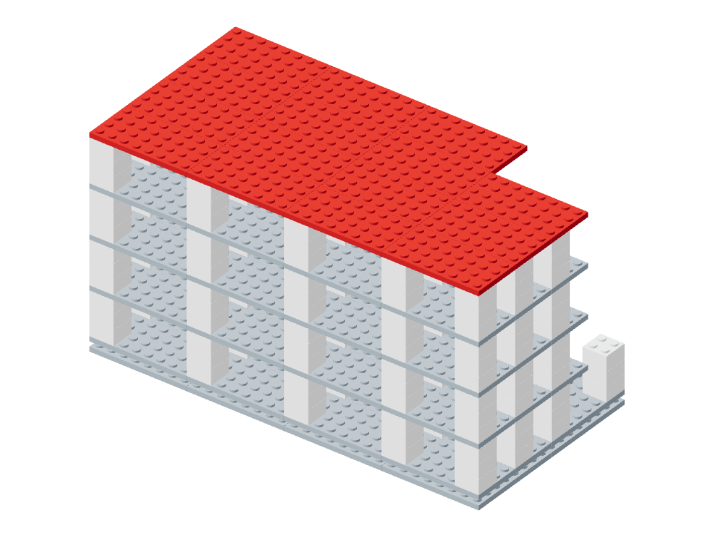 | 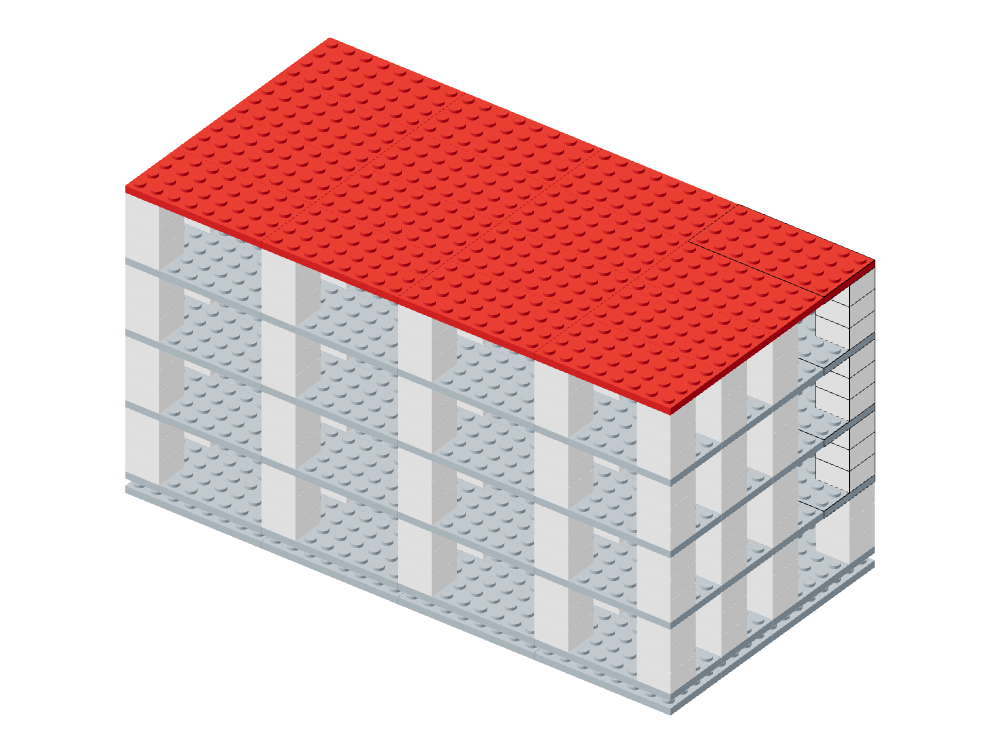 |

正例=1；反例=0；失败原因：`minimum_set`。
[公开题面](four-storey-archive-access-certificate-public.json) · [完整答案及评分](four-storey-archive-access-certificate-review.json)

```json
{
  "positiveMetrics": {
    "removals": 25
  },
  "negative": {
    "removeIds": [
      "p0093"
    ],
    "order": [
      "p0093"
    ]
  }
}
```

### 多工位依赖调度

| 正确参考 | 构造错误 |
|---|---|
|  |  |

正例=1；反例=0；失败原因：`batch_schema`。
[公开题面](four-storey-archive-parallel-schedule-public.json) · [完整答案及评分](four-storey-archive-parallel-schedule-review.json)

```json
{
  "positiveMetrics": {
    "coverage": 1,
    "makespan": 102,
    "workerLowerBound": 102
  },
  "negative": {
    "batches": [
      [
        "p0001",
        "p0002",
        "p0003",
        "p0004",
        "p0005",
        "p0006",
        "p0007",
        "p0008",
        "p0009",
        "p0010",
        "p0011",
        "p0012",
        "p0013",
        "p0014",
        "p0015",
        "p0016",
        "p0017",
        "p0018",
        "p0019",
        "p0020",
        "p0021",
        "p0022",
        "p0023",
        "p0024",
        "p0025",
        "p0026",
        "p0027",
        "p0028",
        "p0029",
        "p0030",
        "p0031",
        "p0032",
        "p0033",
        "p0034",
        "p0035",
        "p0036",
        "p0037",
        "p0038",
        "p0039",
        "p0040",
        "p0041",
        "p0042",
        "p0043",
        "p0044",
        "p0045",
        "p0046",
        "p0047",
        "p0048",
        "p0049",
        "p0050",
        "p0051",
        "p0052",
        "p0053",
        "p0054",
        "p0055",
        "p0056",
        "p0057",
        "p0058",
        "p0059",
        "p0060",
        "p0061",
        "p0062",
        "p0063",
        "p0064",
        "p0065",
        "p0066",
        "p0067",
        "p0068",
        "p0069",
        "p0070",
        "p0071",
        "p0072",
        "p0073",
        "p0074",
        "p0075",
        "p0076",
        "p0077",
        "p0078",
        "p0079",
        "p0080",
        "p0081",
        "p0082",
        "p0083",
        "p0084",
        "p0085",
        "p0086",
        "p0087",
        "p0088",
        "p0089",
        "p0090",
        "p0091",
        "p0092",
        "p0093",
        "p0094",
        "p0095",
        "p0096",
        "p0097",
        "p0098",
        "p0099",
        "p0100",
        "p0101",
        "p0102",
        "p0103",
        "p0104",
        "p0105",
        "p0106",
        "p0107",
        "p0108",
        "p0109",
        "p0110",
        "p0111",
        "p0112",
        "p0113",
        "p0114",
        "p0115",
        "p0116",
        "p0117",
        "p0118",
        "p0119",
        "p0120",
        "p0121",
        "p0122",
        "p0123",
        "p0124",
        "p0125",
        "p0126",
        "p0127",
        "p0128",
        "p0129",
        "p0130",
        "p0131",
        "p0132",
        "p0133",
        "p0134",
        "p0135",
        "p0136",
        "p0137",
        "p0138",
        "p0139",
        "p0140",
        "p0141",
        "p0142",
        "p0143",
        "p0144",
        "p0145",
        "p0146",
        "p0147",
        "p0148",
        "p0149",
        "p0150",
        "p0151",
        "p0152",
        "p0153",
        "p0154",
        "p0155",
        "p0156",
        "p0157",
        "p0158",
        "p0159",
        "p0160",
        "p0161",
        "p0162",
        "p0163",
        "p0164",
        "p0165",
        "p0166",
        "p0167",
        "p0168",
        "p0169",
        "p0170",
        "p0171",
        "p0172",
        "p0173",
        "p0174",
        "p0175",
        "p0176",
        "p0177",
        "p0178",
        "p0179",
        "p0180",
        "p0181",
        "p0182",
        "p0183",
        "p0184",
        "p0185",
        "p0186",
        "p0187",
        "p0188",
        "p0189",
        "p0190",
        "p0191",
        "p0192",
        "p0193",
        "p0194",
        "p0195",
        "p0196",
        "p0197",
        "p0198",
        "p0199",
        "p0200",
        "p0201",
        "p0202",
        "p0203",
        "p0204",
        "p0205",
        "p0206",
        "p0207",
        "p0208",
        "p0209",
        "p0210",
        "p0211",
        "p0212",
        "p0213",
        "p0214",
        "p0215",
        "p0216",
        "p0217",
        "p0218",
        "p0219",
        "p0220",
        "p0221",
        "p0222",
        "p0223",
        "p0224",
        "p0225",
        "p0226",
        "p0227",
        "p0228",
        "p0229",
        "p0230",
        "p0231",
        "p0232",
        "p0233",
        "p0234",
        "p0235",
        "p0236",
        "p0237",
        "p0238",
        "p0239",
        "p0240",
        "p0241",
        "p0242",
        "p0243",
        "p0244",
        "p0245",
        "p0246",
        "p0247",
        "p0248",
        "p0249",
        "p0250",
        "p0251",
        "p0252",
        "p0253",
        "p0254",
        "p0255",
        "p0256",
        "p0257",
        "p0258",
        "p0259",
        "p0260",
        "p0261",
        "p0262",
        "p0263",
        "p0264",
        "p0265",
        "p0266",
        "p0267",
        "p0268",
        "p0269",
        "p0270",
        "p0271",
        "p0272",
        "p0273",
        "p0274",
        "p0275",
        "p0276",
        "p0277",
        "p0278",
        "p0279",
        "p0280",
        "p0281",
        "p0282",
        "p0283",
        "p0284",
        "p0285",
        "p0286",
        "p0287",
        "p0288",
        "p0289",
        "p0290",
        "p0291",
        "p0292",
        "p0293",
        "p0294",
        "p0295",
        "p0296",
        "p0297",
        "p0298",
        "p0299",
        "p0300",
        "p0301",
        "p0302",
        "p0303",
        "p0304",
        "p0305",
        "p0306",
        "p0307",
        "p0308",
        "p0309",
        "p0310",
        "p0311",
        "p0312",
        "p0313",
        "p0314",
        "p0315",
        "p0316",
        "p0317",
        "p0318",
        "p0319",
        "p0320",
        "p0321",
        "p0322",
        "p0323",
        "p0324",
        "p0325",
        "p0326",
        "p0327",
        "p0328",
        "p0329",
        "p0330",
        "p0331",
        "p0332",
        "p0333",
        "p0334",
        "p0335",
        "p0336",
        "p0337",
        "p0338",
        "p0339",
        "p0340",
        "p0341",
        "p0342",
        "p0343",
        "p0344",
        "p0345",
        "p0346",
        "p0347",
        "p0348",
        "p0349",
        "p0350",
        "p0351",
        "p0352",
        "p0353",
        "p0354",
        "p0355",
        "p0356",
        "p0357",
        "p0358",
        "p0359",
        "p0360",
        "p0361",
        "p0362",
        "p0363",
        "p0364",
        "p0365",
        "p0366",
        "p0367",
        "p0368",
        "p0369",
        "p0370",
        "p0371",
        "p0372",
        "p0373",
        "p0374",
        "p0375",
        "p0376",
        "p0377",
        "p0378",
        "p0379",
        "p0380",
        "p0381",
        "p0382",
        "p0383",
        "p0384",
        "p0385",
        "p0386",
        "p0387",
        "p0388",
        "p0389",
        "p0390",
        "p0391",
        "p0392",
        "p0393",
        "p0394",
        "p0395",
        "p0396",
        "p0397",
        "p0398",
        "p0399",
        "p0400",
        "p0401",
        "p0402",
        "p0403",
        "p0404",
        "p0405",
        "p0406",
        "p0407",
        "p0408"
      ]
    ]
  }
}
```

### 最小支撑干预

| 正确参考 | 构造错误 |
|---|---|
| 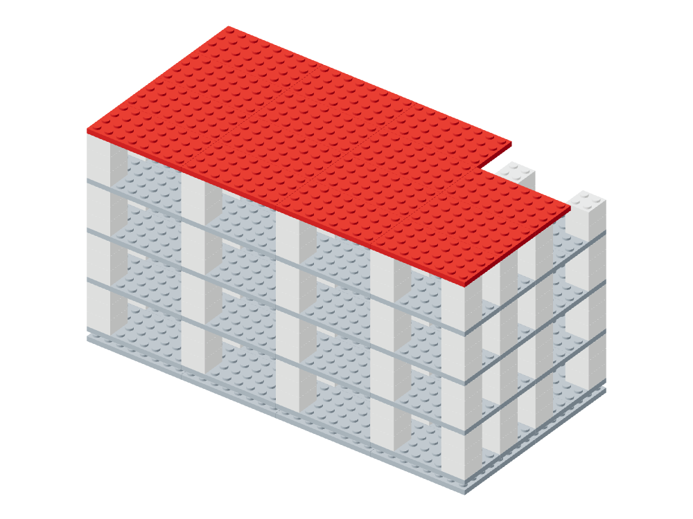 |  |

正例=1；反例=0；失败原因：`goal_survives`。
[公开题面](four-storey-archive-minimal-intervention-public.json) · [完整答案及评分](four-storey-archive-minimal-intervention-review.json)

```json
{
  "positiveMetrics": {
    "removals": 2,
    "optimum": 2
  },
  "negative": {
    "removeIds": [],
    "cascadeIds": []
  }
}
```

### 库存受限等体积替代

| 正确参考 | 构造错误 |
|---|---|
|  | 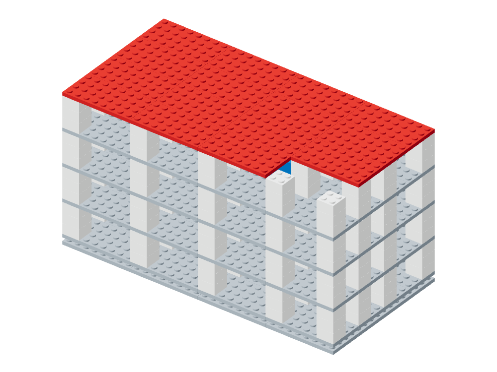 |

正例=1；反例=0；失败原因：`uncovered`。
[公开题面](four-storey-archive-inventory-cover-public.json) · [完整答案及评分](four-storey-archive-inventory-cover-review.json)

```json
{
  "positiveMetrics": {
    "coverage": 1,
    "tiles": 7,
    "lowerBound": 7
  },
  "negative": {
    "tiles": [
      {
        "partId": "3022",
        "x": 0,
        "z": 2,
        "turn": 0
      },
      {
        "partId": "3022",
        "x": 2,
        "z": 2,
        "turn": 0
      },
      {
        "partId": "3022",
        "x": 4,
        "z": 0,
        "turn": 0
      },
      {
        "partId": "3022",
        "x": 6,
        "z": 0,
        "turn": 0
      },
      {
        "partId": "3022",
        "x": 4,
        "z": 2,
        "turn": 0
      },
      {
        "partId": "3022",
        "x": 6,
        "z": 2,
        "turn": 0
      }
    ]
  }
}
```

### 隐藏接缝的可行解集合

| 正确参考 | 构造错误 |
|---|---|
|  |  |

正例=1；反例=0；失败原因：`admissible_set`。
[公开题面](four-storey-archive-ambiguity-set-public.json) · [完整答案及评分](four-storey-archive-ambiguity-set-review.json)

```json
{
  "positiveMetrics": {
    "admissible": 4,
    "falseCertainty": 0
  },
  "negative": {
    "possibleIds": [
      "h0"
    ]
  }
}
```

### 预算内条件查询策略

| 正确参考 | 构造错误 |
|---|---|
|  |  |

正例=1；反例=0；失败原因：`policy_coverage_or_budget`。
[公开题面](four-storey-archive-inspection-policy-public.json) · [完整答案及评分](four-storey-archive-inspection-policy-review.json)

```json
{
  "positiveMetrics": {
    "worldCoverage": 1,
    "worstCost": 6
  },
  "negative": {
    "hypothesisId": "h0"
  }
}
```

### 跨区域混合故障修复

| 正确参考 | 构造错误 |
|---|---|
| 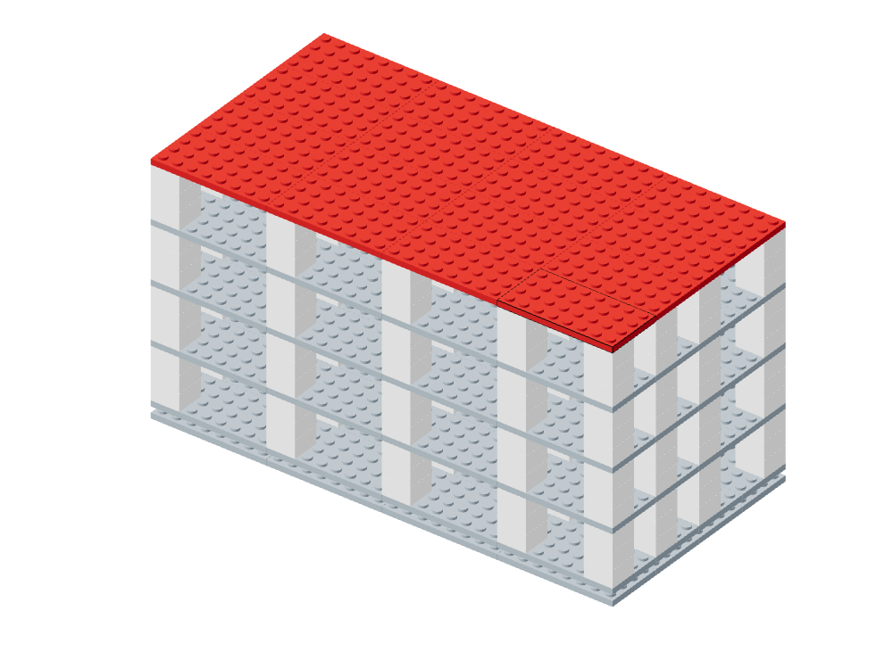 | 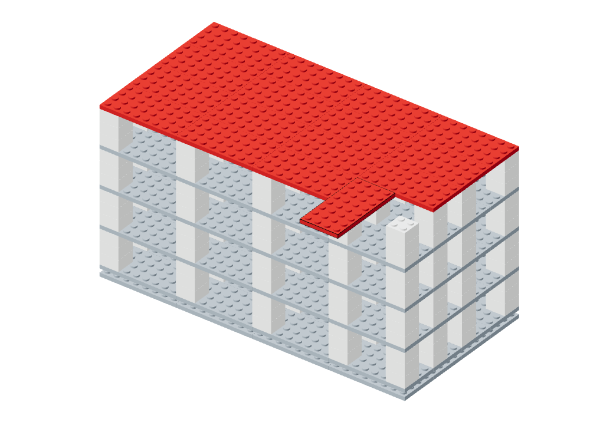 |

正例=1；反例=0；失败原因：`fault_set`。
[公开题面](four-storey-archive-distributed-repair-public.json) · [完整答案及评分](four-storey-archive-distributed-repair-review.json)

```json
{
  "positiveMetrics": {
    "finalExact": 1,
    "changedRecall": 1
  },
  "negative": {
    "faultIds": [],
    "replacements": []
  }
}
```
