# 全部模型与正反案例

18 个设计模型，36 个构造对照。PASS/FAIL 是裁判自测，不是模型成绩。

[打开全部模型图集](index.html) · [打开全部 5,120 个程序模型](procedural-001.html)

## 1. Garden Bench

[逐例浏览与 JSON](model-1.html)

### plan

按给定目标提交合法装配顺序；不重排。

| 输入 / 上下文 | 正确参考 | 构造错误 |
|---|---|---|
|  | 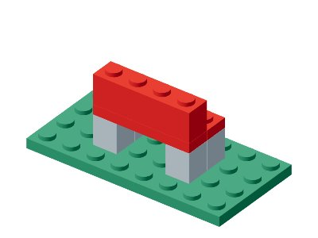 |  |

正例 success=1；负例 success=0；失败原因：`unsupported, incomplete`。
[完整评分 JSON](case-01.json)

### repair

对照完整符号参考修复颜色，报告错误当前 ID。

| 输入 / 上下文 | 正确参考 | 构造错误 |
|---|---|---|
| 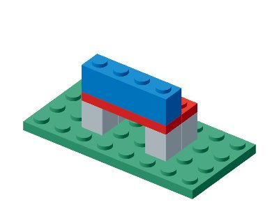 |  |  |

正例 success=1；负例 success=0；失败原因：`target_mismatch`。
[完整评分 JSON](case-02.json)

## 2. Four-Step Staircase

[逐例浏览与 JSON](model-2.html)

### plan

按给定目标提交合法装配顺序；不重排。

| 输入 / 上下文 | 正确参考 | 构造错误 |
|---|---|---|
|  | 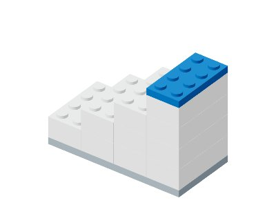 |  |

正例 success=1；负例 success=0；失败原因：`unsupported, incomplete`。
[完整评分 JSON](case-03.json)

### repair

对照完整符号参考修复颜色，报告错误当前 ID。

| 输入 / 上下文 | 正确参考 | 构造错误 |
|---|---|---|
|  |  | 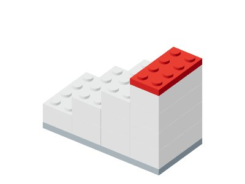 |

正例 success=1；负例 success=0；失败原因：`target_mismatch`。
[完整评分 JSON](case-04.json)

## 3. Garden Gate

[逐例浏览与 JSON](model-3.html)

### plan

按给定目标提交合法装配顺序；不重排。

| 输入 / 上下文 | 正确参考 | 构造错误 |
|---|---|---|
|  |  |  |

正例 success=1；负例 success=0；失败原因：`unsupported, incomplete`。
[完整评分 JSON](case-05.json)

### repair

对照完整符号参考修复颜色，报告错误当前 ID。

| 输入 / 上下文 | 正确参考 | 构造错误 |
|---|---|---|
|  | 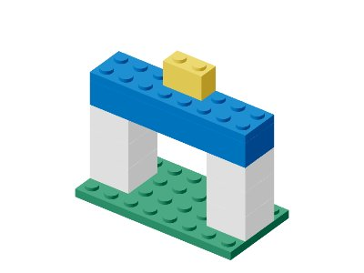 | 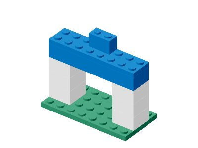 |

正例 success=1；负例 success=0；失败原因：`target_mismatch`。
[完整评分 JSON](case-06.json)

## 4. Picnic Table

[逐例浏览与 JSON](model-4.html)

### plan

按给定目标提交合法装配顺序；不重排。

| 输入 / 上下文 | 正确参考 | 构造错误 |
|---|---|---|
|  |  |  |

正例 success=1；负例 success=0；失败原因：`unsupported, incomplete`。
[完整评分 JSON](case-07.json)

### repair

对照完整符号参考修复颜色，报告错误当前 ID。

| 输入 / 上下文 | 正确参考 | 构造错误 |
|---|---|---|
| 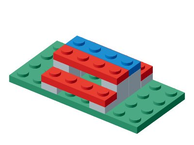 | 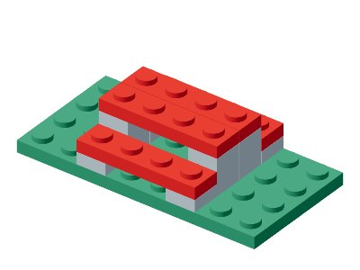 |  |

正例 success=1；负例 success=0；失败原因：`target_mismatch`。
[完整评分 JSON](case-08.json)

## 5. Canal Bridge

[逐例浏览与 JSON](model-5.html)

### plan

按给定目标提交合法装配顺序；不重排。

| 输入 / 上下文 | 正确参考 | 构造错误 |
|---|---|---|
|  | 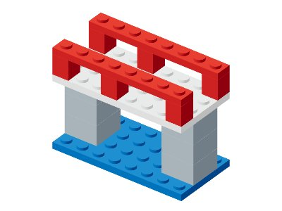 |  |

正例 success=1；负例 success=0；失败原因：`unsupported, incomplete`。
[完整评分 JSON](case-09.json)

### repair

对照完整符号参考修复颜色，报告错误当前 ID。

| 输入 / 上下文 | 正确参考 | 构造错误 |
|---|---|---|
| 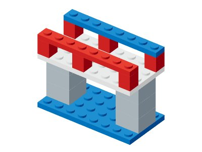 |  |  |

正例 success=1；负例 success=0；失败原因：`target_mismatch`。
[完整评分 JSON](case-10.json)

## 6. Park Pavilion

[逐例浏览与 JSON](model-6.html)

### plan

按给定目标提交合法装配顺序；不重排。

| 输入 / 上下文 | 正确参考 | 构造错误 |
|---|---|---|
|  | 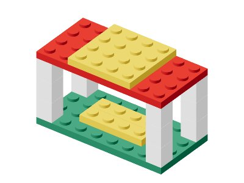 |  |

正例 success=1；负例 success=0；失败原因：`unsupported, incomplete`。
[完整评分 JSON](case-11.json)

### repair

对照完整符号参考修复颜色，报告错误当前 ID。

| 输入 / 上下文 | 正确参考 | 构造错误 |
|---|---|---|
|  |  | 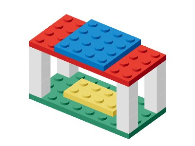 |

正例 success=1；负例 success=0；失败原因：`target_mismatch`。
[完整评分 JSON](case-12.json)

## 7. Townhouse

[逐例浏览与 JSON](model-7.html)

### plan

按给定目标提交合法装配顺序；不重排。

| 输入 / 上下文 | 正确参考 | 构造错误 |
|---|---|---|
| 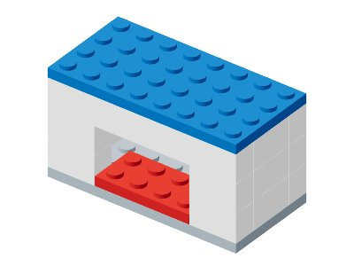 |  |  |

正例 success=1；负例 success=0；失败原因：`unsupported, incomplete`。
[完整评分 JSON](case-13.json)

### repair

对照完整符号参考修复颜色，报告错误当前 ID。

| 输入 / 上下文 | 正确参考 | 构造错误 |
|---|---|---|
|  |  | 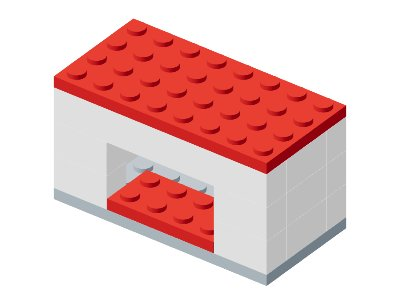 |

正例 success=1；负例 success=0；失败原因：`target_mismatch`。
[完整评分 JSON](case-14.json)

## 8. Watchtower

[逐例浏览与 JSON](model-8.html)

### plan

按给定目标提交合法装配顺序；不重排。

| 输入 / 上下文 | 正确参考 | 构造错误 |
|---|---|---|
|  |  |  |

正例 success=1；负例 success=0；失败原因：`unsupported, incomplete`。
[完整评分 JSON](case-15.json)

### repair

对照完整符号参考修复颜色，报告错误当前 ID。

| 输入 / 上下文 | 正确参考 | 构造错误 |
|---|---|---|
|  | 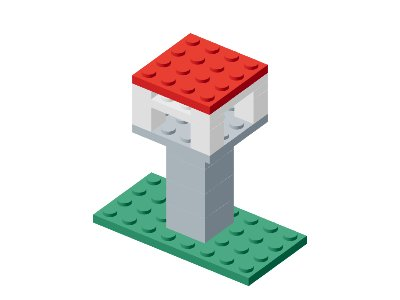 | 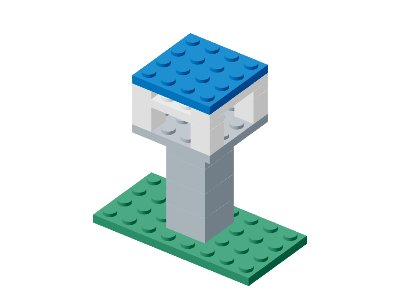 |

正例 success=1；负例 success=0；失败原因：`target_mismatch`。
[完整评分 JSON](case-16.json)

## 9. Double-Span Bridge

[逐例浏览与 JSON](model-9.html)

### plan

按给定目标提交合法装配顺序；不重排。

| 输入 / 上下文 | 正确参考 | 构造错误 |
|---|---|---|
|  | 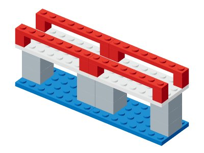 |  |

正例 success=1；负例 success=0；失败原因：`unsupported, incomplete`。
[完整评分 JSON](case-17.json)

### repair

对照完整符号参考修复颜色，报告错误当前 ID。

| 输入 / 上下文 | 正确参考 | 构造错误 |
|---|---|---|
| 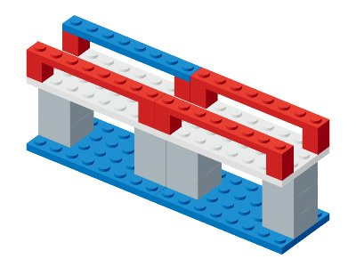 |  |  |

正例 success=1；负例 success=0；失败原因：`target_mismatch`。
[完整评分 JSON](case-18.json)

## 10. Lighthouse

[逐例浏览与 JSON](model-10.html)

### plan

按给定目标提交合法装配顺序；不重排。

| 输入 / 上下文 | 正确参考 | 构造错误 |
|---|---|---|
|  | 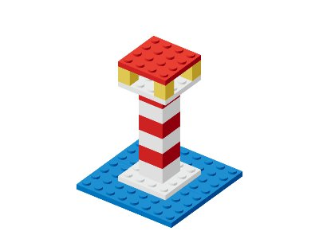 |  |

正例 success=1；负例 success=0；失败原因：`unsupported, incomplete`。
[完整评分 JSON](case-19.json)

### repair

对照完整符号参考修复颜色，报告错误当前 ID。

| 输入 / 上下文 | 正确参考 | 构造错误 |
|---|---|---|
|  |  | 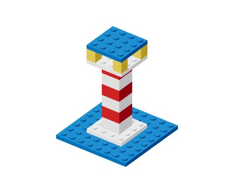 |

正例 success=1；负例 success=0；失败原因：`target_mismatch`。
[完整评分 JSON](case-20.json)

## 11. Railway Station

[逐例浏览与 JSON](model-11.html)

### plan

按给定目标提交合法装配顺序；不重排。

| 输入 / 上下文 | 正确参考 | 构造错误 |
|---|---|---|
| 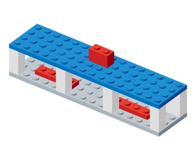 |  |  |

正例 success=1；负例 success=0；失败原因：`unsupported, incomplete`。
[完整评分 JSON](case-21.json)

### repair

对照完整符号参考修复颜色，报告错误当前 ID。

| 输入 / 上下文 | 正确参考 | 构造错误 |
|---|---|---|
|  |  | 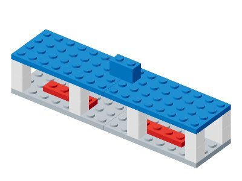 |

正例 success=1；负例 success=0；失败原因：`target_mismatch`。
[完整评分 JSON](case-22.json)

## 12. Two-Tier Pagoda

[逐例浏览与 JSON](model-12.html)

### plan

按给定目标提交合法装配顺序；不重排。

| 输入 / 上下文 | 正确参考 | 构造错误 |
|---|---|---|
|  |  |  |

正例 success=1；负例 success=0；失败原因：`unsupported, incomplete`。
[完整评分 JSON](case-23.json)

### repair

对照完整符号参考修复颜色，报告错误当前 ID。

| 输入 / 上下文 | 正确参考 | 构造错误 |
|---|---|---|
|  | 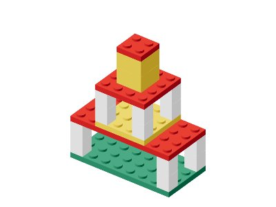 | 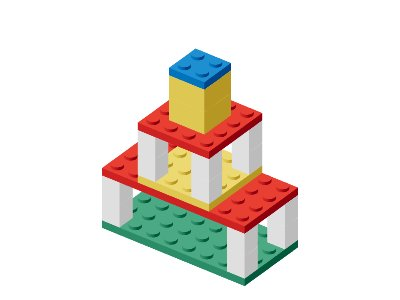 |

正例 success=1；负例 success=0；失败原因：`target_mismatch`。
[完整评分 JSON](case-24.json)

## 13. Three-Span Truss Bridge

[逐例浏览与 JSON](model-13.html)

### recovery-plan

Recover from a legal but blocked deck-first state. Return remove/place actions that reach the complete target without reordering by the evaluator.

| 输入 / 上下文 | 正确参考 | 构造错误 |
|---|---|---|
|  | 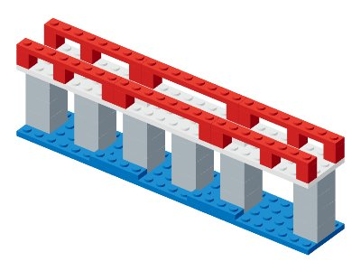 | 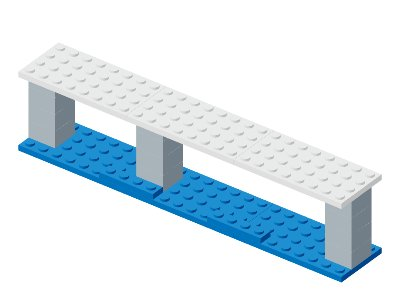 |

正例 success=1；负例 success=0；失败原因：`illegal_action`。
[完整评分 JSON](case-25.json)

### support-counterfactual

If the declared two support columns disappear simultaneously, report every additional piece removed by iterative loss of direct stud support.

| 输入 / 上下文 | 正确参考 | 构造错误 |
|---|---|---|
|  | 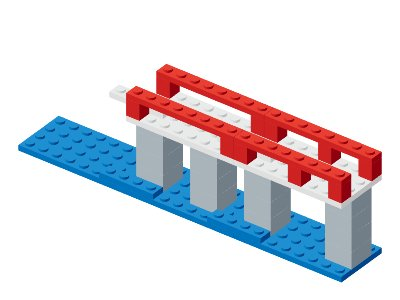 | 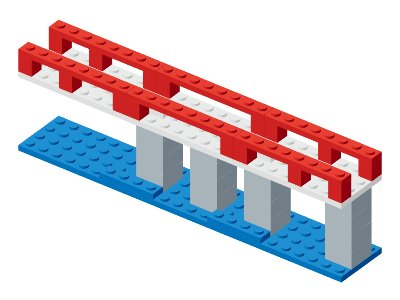 |

正例 success=1；负例 success=0；失败原因：`set_mismatch`。
[完整评分 JSON](case-26.json)

## 14. Grand Railway Terminal

[逐例浏览与 JSON](model-14.html)

### compound-edit

Apply all clauses atomically: recolor the blue canopy red, remove bench-2 and bench-4, add the two specified yellow roof lights, and preserve every other part.

| 输入 / 上下文 | 正确参考 | 构造错误 |
|---|---|---|
| 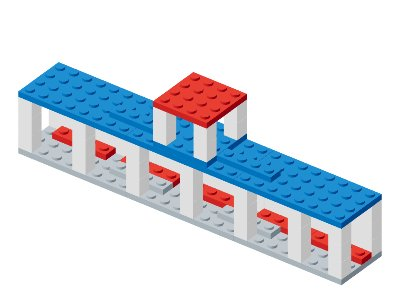 | 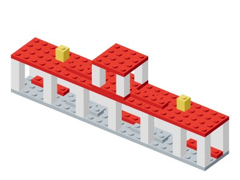 | 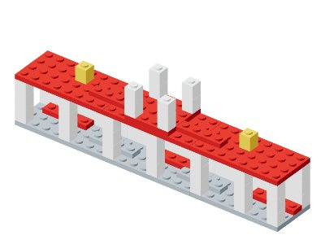 |

正例 success=1；负例 success=0；失败原因：`target_mismatch`。
[完整评分 JSON](case-27.json)

### multi-fault-repair

Repair three simultaneous faults: one recolor, one shifted part, and one extra part. Return the corrected structure and all wrong CURRENT IDs. Layer disclosure is supplied: recover complete geometry up to piece yaw symmetry, not exterior RGB alone.

| 输入 / 上下文 | 正确参考 | 构造错误 |
|---|---|---|
| 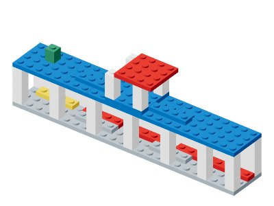 |  |  |

正例 success=1；负例 success=0；失败原因：`target_mismatch, fault_mismatch`。
[完整评分 JSON](case-28.json)

## 15. Fortress Gatehouse

[逐例浏览与 JSON](model-15.html)

### active-inspection

Select a query, read its returned observation, then report how many parallel rows the white gate beams occupy. Each row can contain multiple beam parts. Success requires a layer-disclosing query; cost is scored separately, not an optimality proof.

| 输入 / 上下文 | 正确参考 | 构造错误 |
|---|---|---|
|  | 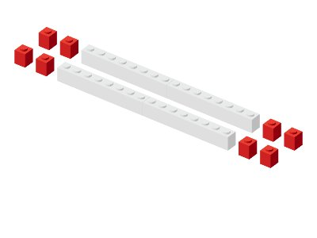 | 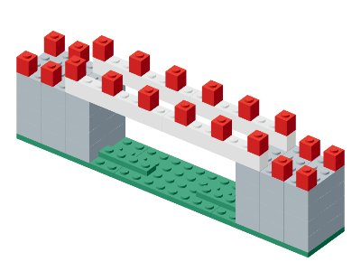 |

正例 success=1；负例 success=0；失败原因：`answer_mismatch`。
[完整评分 JSON](case-29.json)

### graph-reasoning

Return the shortest stud-contact path length between the queried merlons and every articulation piece in the full contact graph.

| 输入 / 上下文 | 正确参考 | 构造错误 |
|---|---|---|
|  |  |  |

正例 success=1；负例 success=0；失败原因：`answer_mismatch`。
[完整评分 JSON](case-30.json)

## 16. Stepped Temple Complex

[逐例浏览与 JSON](model-16.html)

### distributed-completion

Restore eight missing columns distributed across both tiers. Preserve every supplied part exactly; the missing region is not a suffix. Layer disclosure is supplied: recover complete geometry up to piece yaw symmetry, not exterior RGB alone.

| 输入 / 上下文 | 正确参考 | 构造错误 |
|---|---|---|
| 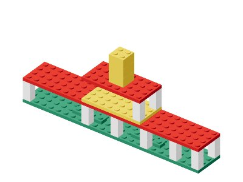 | 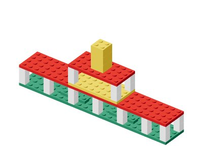 | 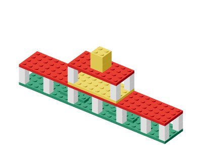 |

正例 success=1；负例 success=0；失败原因：`target_mismatch`。
[完整评分 JSON](case-31.json)

### module-transplant

Move the complete upper pavilion four studs toward +X as a rigid module. Preserve its internal layout and every lower-tier part.

| 输入 / 上下文 | 正确参考 | 构造错误 |
|---|---|---|
|  | 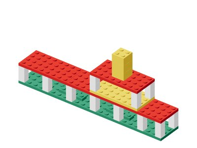 | 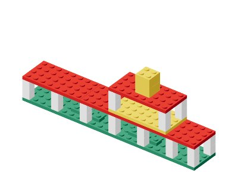 |

正例 success=1；负例 success=0；失败原因：`target_mismatch`。
[完整评分 JSON](case-32.json)

## 17. Double-Deck Aqueduct

[逐例浏览与 JSON](model-17.html)

### step-selection

Select every candidate that can legally be inserted next into the current partial aqueduct. Do not use the target order as an answer.

| 输入 / 上下文 | 正确参考 | 构造错误 |
|---|---|---|
| 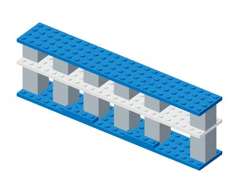 | 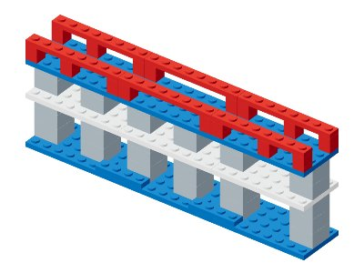 |  |

正例 success=1；负例 success=0；失败原因：`selection_mismatch`。
[完整评分 JSON](case-33.json)

### pose-estimation

Place the selected parapet post into its target pose from the current state and reference views; accept equivalent yaw for its footprint.

| 输入 / 上下文 | 正确参考 | 构造错误 |
|---|---|---|
| 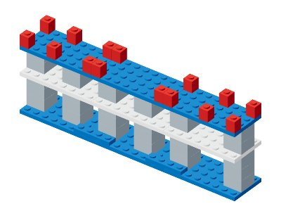 |  | 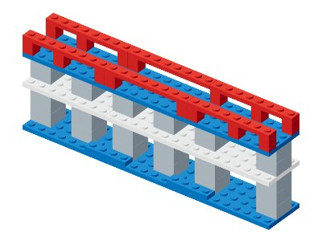 |

正例 success=1；负例 success=0；失败原因：`answer_mismatch`。
[完整评分 JSON](case-34.json)

## 18. Covered Market Hall

[逐例浏览与 JSON](model-18.html)

### scene-reconstruction

Reconstruct the complete 53-part market from four views and its bill of materials. Repeated columns and signs remain distinct instances. Layer disclosure is supplied: recover complete geometry up to piece yaw symmetry, not exterior RGB alone.

| 输入 / 上下文 | 正确参考 | 构造错误 |
|---|---|---|
|  | 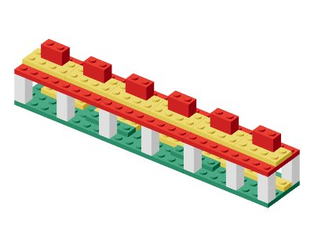 |  |

正例 success=1；负例 success=0；失败原因：`target_mismatch`。
[完整评分 JSON](case-35.json)

### constrained-redesign

Design any connected grid structure preserving the foundation, within inventory and exact extent, with at least four colors and minRoofCells occupied 3D cells among parts whose bottom Y>=7. This measures a volume proxy, not semantic roof coverage.

| 输入 / 上下文 | 正确参考 | 构造错误 |
|---|---|---|
| 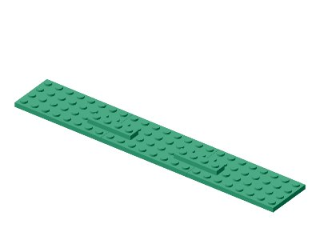 |  | 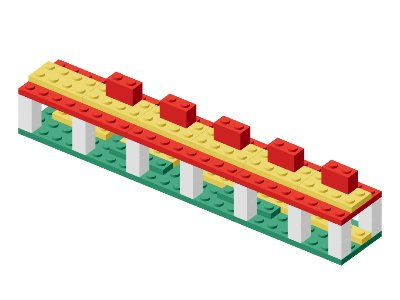 |

正例 success=1；负例 success=0；失败原因：`roofCoverage`。
[完整评分 JSON](case-36.json)
