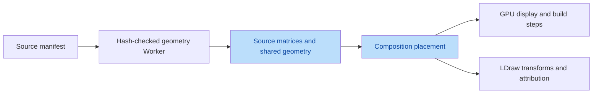
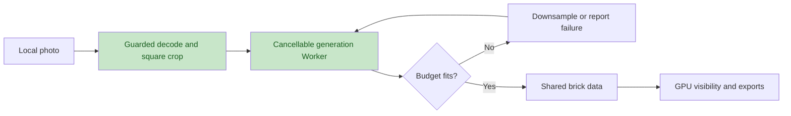

# Engineering Audit - 2026-09-10

## Scope and Evidence

Reviewed the six workspaces (Landing, Explore, Build, Create, Compose, Free DIY), domain models, local persistence, image ingestion, Web Workers, geometry loading, LDraw/PDF exports, asset build scripts, and dependencies. There is **no API server, database, authentication service, or deployed backend** in this repository. Server-side coverage therefore means the Node asset pipeline and static application delivery, not invented service tests.

The intent is to retain the existing desktop workflow while removing data-loss, geometry-fidelity and rendering correctness defects. Two independent read-only validators checked the ten grouped findings against baseline `7b2dced`; confirmed defects were fixed. The assertion that basic 1xN LDraw bricks run along Z was rejected after inspecting the checked-in part definitions: these parts run along X. Unnecessary Compose rebuilds were confirmed, but the claim that the caller failed to invalidate rendering was rejected because its subsequent setters invalidate the scene.

## Confirmed Defects and Changes

| Area | Defect | Resolution |
|---|---|---|
| Compose fidelity | Source models were replaced by clamped boxes with incorrect mm/stud conversion and lost rotations | Reuse checksum-verified source geometry, retain source matrices, use 8 mm/stud and preserve per-brick shader offsets |
| Compose data loss | Changing the base silently dropped items and reset identifiers/rotation | Base changes preserve the complete scene or reject the change |
| Compose library | Characters and animals were filtered but never rendered | Show their Add controls alongside base presets |
| Compose concurrency | Async asset additions validated against a stale project | Serialize asset loading and validate against current project state |
| Compose persistence | Malformed records and storage exceptions could crash rendering | Validate nested records and guard reads/writes; show save failures |
| Compose collision | Different levels bypassed overlap checks even inside tall models | Compare vertical extents; reject nonfinite/out-of-range input |
| Rendering | Backward steps changed CPU counts without uploading visibility matrices | Explicit matrix-dirty state, verified against actual GPU matrix/texture values |
| Rendering performance | Selecting, renaming and switching modes rebuilt all geometry | Separate metadata, geometry and playback effects; verify unchanged build revision |
| Rendering resources | Per-frame vector allocations, unreleased instanced buffers, unbounded 3x DPR | Reuse vectors, dispose instances, cap drawing dimensions and pixel area |
| Create color/bond | Final quantization ignored the color cap; divisible runs kept identical seams | Enforce one final palette and explicit alternating offsets |
| Create budget | Minimum-resolution over-budget results were presented as fitting | Continue downsampling, then report an explicit failure instead of claiming success |
| Create responsiveness | Image fusion ran synchronously on the UI thread | Move generation to a cancellable Worker |
| Create input | Decode failures escaped, stale uploads could win, re-uploading the same file failed | Per-view request versions, guarded decoding, input reset and file/pixel limits |
| Crop preview | Portrait images were squashed by the height cap | Constrain width and preserve aspect ratio; test square on-screen crops |
| Export | Wrong brick height/origin and 32x32 baseplates emitted for 4x4 patches | Correct top-face origins and LDU transforms; use 3031 4x4 plates and preserve source attribution |
| PDF | Long part lists overflowed the sheet and highlight legend was outdated | Continue part lists on additional sheets and correct legend |
| Explore | X-Ray setter disabled line transparency/depth behavior | Preserve line material flags through toggles |
| Build persistence | Reset did not clear stored step progress | Persist reset and updater changes consistently |
| Asset Worker | Decompression limit was checked after allocating the entire output | Enforce the limit incrementally while reading |
| Dependencies | Three moderate development dependency audit findings | Vitest 4.1.11; replace extraction-capable ZIP dependency with bounded read-only yauzl access |
| Desktop layout | Compose mode tabs clipped at 1180px; Create stayed narrow at 4K | Shrinkable title area, nonshrinking mode controls, full-width Create workspace |

## Data Flow

## Verification

- `npm run check`: 15 model asset checks, hierarchical source comparison, 48 unit tests, TypeScript and production build.
- Chrome-only E2E: 44 tests, including all 15 source models, checksum failure/recovery, actual GPU visibility, source fidelity, DIY library/effects, stale/corrupt input and existing workflows.
- Visual inspection: screenshots and nonblank canvas-pixel checks for all six workspaces at 1180, 1440 and 3840 px widths. Build screenshots include a populated step; DIY includes its Technic category. Screenshots are attached to the Playwright report under `test-results/`.
- Axe WCAG 2 A/AA and 2.1 AA checks on Landing, Create, Compose, Explore and selected-part detail.
- Complete dependency audit (including development dependencies): zero known vulnerabilities after remediation.
- ZIP pipeline: rebuilt 31028 without asset changes and compared streamed 3004 bytes against the locked part.
- `npm ci --dry-run --ignore-scripts`: lockfile installation validation. The old bundled npm resolver crashed during the upgrade; npm 11 resolved the same declared peer dependencies without force/legacy-peer-deps.
- Production benchmark: 9 samples across four models. Tower Bridge: 4,281 instances; approximately 60 FPS assembled rotation, 1.90 s to expanded layout/camera settle, 3.1 ms sampled inventory render-call P95. See `assets-built/performance-report.json`.

The render-call samples measure CPU submission, **not GPU timer-query duration**. The small per-model sample count is a local smoke baseline, not a statistically robust performance SLA. No Firefox/WebKit matrix was rerun.

## Remaining Product Boundaries

- Compose is still a scene editor, not a connection solver. Footprint/vertical checks do not prove stud/tube compatibility, structural stability, legal support or collision-free mechanical insertion.
- Catalog components now use real source geometry. Character/animal presets and procedural loose parts remain simplified representations, not independently certified physical designs.
- Compose playback currently places one component per step. Full internal build sequences, per-brick picking, PDF guides, undo/redo and JSON re-import are not yet at parity with the model workspace.
- Source geometry is cached per model; very large numbers of duplicated components will still increase draw calls and memory. No unlimited-complexity guarantee is made.
- Multi-view generation intersects silhouettes, not AI reconstruction of unseen geometry. Reinforcement options are packing patterns, not engineering strength guarantees.
- Old saved source components are rehydrated from canonical manifests without changing IDs or placement. Existing positions from the incorrect scale can overlap after correction; base switching rejects invalid scenes instead of dropping them.
- PDF overflow handling and LDraw transforms have code-level/unit coverage; external LeoCAD/LDView and physical assembly verification remain outstanding.
- No production HTTPS deployment, real-device matrix, backend load test or third-party penetration test was performed.
