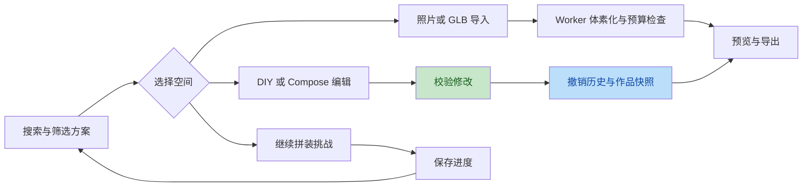
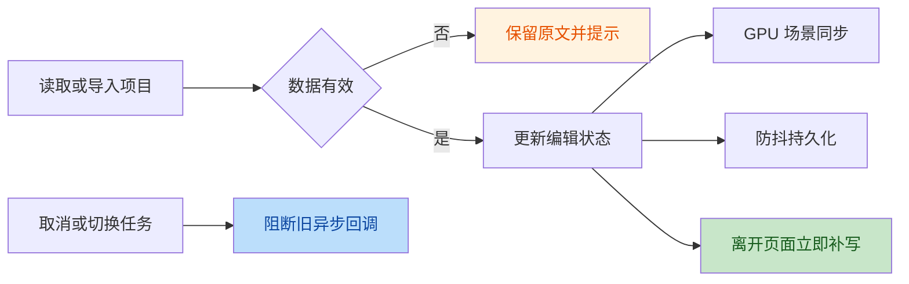

# Brick Atlas 全空间升级

本轮目标：让用户能找到合适的积木方案、进入不同空间自由游玩，并能安全地编辑、撤销、保存、恢复和导出作品。保留原有真实 LDraw 几何、拼装审核及 GPU 合批，不用替代盒子冒充原始模型。

## 1. 空间大厅与模型库

- 首页第一行显示左右各占一半的逐步拼装/三维拆分动画；第二行显示自主 Assemble 的选件吸附过程和 DIY 彩色作品逐块搭建。
- 第二行动画在滚动进入视口后才加载，离开视口后暂停更新，避免四个 WebGL 场景同时争抢资源。
- 首页逐步拼装的单步运动时长按切步间隔动态匹配，确保当前零件完成入位后再进入下一步。
- 模型库新增名称/编号/主题搜索、分类、五级难度、收藏/进行中/已完成筛选，以及难度、名称、年份排序。
- 收藏持久保存；大厅按最近更新时间展示未完成的拼装，直接继续上次进度。
- 已完成模型显示成果入口，不再把打开已完成存档误称为立即重新挑战。
- 页面底层加入 1×N、2×2、薄板、圆件、斜坡和 Technic 等半透明漂浮积木；内容层保持半透明且不拦截操作。
- 模型统计由构建脚本生成 2,405 字节的 `public/models/catalog.json`，不再下载合计 6,607,604 字节的 15 份完整实例清单来显示统计。

## 2. Explore 模型探索

- 新增当前模型到手动拼装挑战的直接入口，保留来源、材料、搜索、隔离、展开和导出。
- 渲染质量、背景、边线和参考网格设置跨页面保存。
- 持久化步骤只接受有效整数；非法类型、负数、过大数值不会进入可见性计算。
- 窄屏默认折叠左右面板，按需打开，模型不再被固定宽度压到屏幕之外。

## 3. Build 拼装说明

- 增加 0.5x、1x、1.5x、2x 播放速度。
- 手动调整步骤时暂停自动播放，避免刚退回就被计时器推到下一步。
- 保留默认不追随步骤的稳定镜头、可选跟随、高清静态入位图及 PDF。
- 修正控制区域排布，桌面保持左上工具，窄屏将步骤控制放到下方，与视角工具分离。
- 按模型恢复有效步骤，与 Explore 和 Assemble 保持直接导航。

## 4. Assemble 拼装游戏

- 挑战目录共用搜索、难度和游玩状态筛选，并显示已完成步骤。
- 保留现有自由定位、旋转、真实零件预览、目标幽灵和逐步审核。
- 新增当前步骤中撤回最后一块，允许纠正操作，不必重置整个模型。
- 完整子装配既能拖放，也能先选择再点击画布安装。
- 重新开始前必须确认；保存失败显示真实错误，不再提示假成功。
- 恢复时以有效已完成步骤数决定通关，拒绝零步通关、超范围步骤等矛盾数据；去重并过滤放置数据。
- 指导动画从 7 帧约 2.38 FPS 提升到 24 帧 24 FPS；换帧隔离在图片组件内，避免整页跟随重渲染。
- 指导动画可以暂停，并尊重系统减弱动态效果设置。
- 清理原工作区遗留的 `localhost:7777` 调试上报，发布代码不再持续请求调试服务。

## 5. DIY 自由拼搭

- 新增选中积木 X/Y/Z 精确移动和附近合法位置复制。
- 移动、复制和旋转都通过相同碰撞及支撑检查；移动承重积木不能使上方积木失去支撑。
- 延续无限底板、78 个零件、18 种颜色、12 个小组件、50 步撤销和 5,000 块上限。
- 自动保存仍然防抖，但离开页面或切后台会立即补写待保存修改。
- 增加独立作品快照库：最多 8 份，恢复前确认，可撤销恢复；容量不足时明确失败，不自动删除旧快照。
- JSON/LDraw/BOM/图片导出保留，损坏输入和存储不可用不影响继续编辑。

## 6. Compose 场景组建

- 新增 50 步撤销/重做、组件搜索、JSON 导入、BOM CSV 和独立作品快照库。
- 导入先校验完整项目，再确认替换；可以撤销打开另一份项目。
- 统一总容量为 5,000 块（含底板）及 200 个组件；校验整数坐标、层高、旋转、真实占用范围、整体碰撞和底板边界。
- 自动找位扫描每一格，不再跳过奇数格留下的可用位置。
- 损坏本地项目只显示错误及空工作区，未主动编辑/保存前不会覆盖原始存档。
- 原始模型重建后再次校验位置与预算；失败时不把无效恢复结果写回存档。
- 保留真实源几何、旋转矩阵、来源署名、组建步骤、展开和导出。

## 7. Create 照片与网格创作

- 新增本地 GLB 导入，无需调用公共 AI 服务即可执行网格到体素到积木的流程。
- 没有照片时用中性灰配色；有照片时使用现有照片采样配色。没有伪称完整恢复 GLB 材质或背面纹理。
- 网格预览支持旋转开关和缩放；可下载中间 GLB、最终积木 JSON、BOM 和 LDraw。
- 云任务进度、错误和结束回调检查任务身份；取消、换图片、切本地后，旧任务不能覆盖新状态。
- 图片身份包含上传实例，不再仅凭文件名和大小复用上一张的深度结果。
- 本地深度 Worker 超过 30 秒会终止并进入明确标注的几何回退。
- GLB 检查版本、文件长度、资源大小与外部依赖；只接受资源内嵌的 GLB，避免导入时意外联网。
- 提取三角面保留节点/实例变换，拒绝未烘焙蒙皮与活动形变；解析完成后释放图像、材质和几何资源。
- 未显示的网格预览不持续渲染；切到后台的图像积木视图减少无效循环工作。

## 实现与验证

- 路由按需加载 Create、Compose、DIY、Assemble；主入口脚本从约 556 KB 减少到约 341 KB（压缩前构建文件，不是全站总资源）。
- 新增共享的项目历史、自动保存和快照能力；不增加后端依赖，不存储访问令牌。
- 桌面保留密集的三栏工作区；390px 手机和 820px 平板使用画布优先的布局。
- 新增数据边界、编辑规则、快照、GLB 安全和用户流程测试。最终执行结果见本文件的验证记录。
- 继续使用 `http://127.0.0.1:5173`，复用已有服务，不给用户增加网页端口。

## 边界与未覆盖项

- 这是本地/静态部署应用。本轮没有引入账户、云端作品同步或多人协作。
- Compose 检查占用体积和边界，不是完整的凸点连接、机械插入或承重求解器。
- DIY 的网格碰撞与下方连接检查不能证明现实结构强度，Technic/夹件没有完整横向连接模拟。
- 自动生成的积木模型和编辑式说明不等同于经过实物拼装认证的设计。
- 公共照片到网格服务的排队、额度及模型质量由第三方决定。本轮离线 GLB 路径独立验证，不以一次网络请求保证所有照片的重建质量。
- 本地存储和快照受浏览器配额限制；JSON 文件备份仍是迁移作品的可靠方式。
- 手机/平板验证采用 Chrome 视口，不代表完成真实触屏设备、Firefox、WebKit 或外部 LDraw 查看器认证。

## 验证记录

验证时间：2026-09-11；本机 macOS、Chrome，开发服务复用 5173。

| 检查 | 结果 |
|---|---|
| `npm run check` | 15 个资产校验、源模型变换/边界对照、66 项单元测试、TypeScript 与生产构建全部通过 |
| `playwright test --project=desktop-chrome` | 60 项通过，0 失败、0 跳过、0 flaky，约 252 秒 |
| 桌面与窄屏 | 390 / 820 / 1180 / 1440 / 3840px 截图和画布像素检查，无页面横向溢出 |
| 首页四动画 | 两行画布桌面严格等宽、手机上下排列；第二行 Assemble/DIY 进入视口才加载，实测均约 60 FPS |
| 无障碍 | Chrome 中 WCAG 2 A/AA、2.1 AA 扫描通过 |
| 塔桥旋转 | 4,281 实例，约 60.01 FPS，515 draw calls；本机短时开发构建样本，不是跨设备性能保证 |
| GLB 离线流程 | 本地四面体 GLB 完整转换、网格预览像素与缩放、损坏文件保留旧结果通过 |
| `npm audit` | 含开发依赖，0 个已知漏洞 |
| `git diff --check` | 通过 |

最新 Chrome 结构化结果位于运行机器的 `/tmp/brick-atlas-four-showcases-e2e.json`；截图在 `test-results/`。不覆盖本轮开始前已有的 `assets-built/e2e-report.json`。
